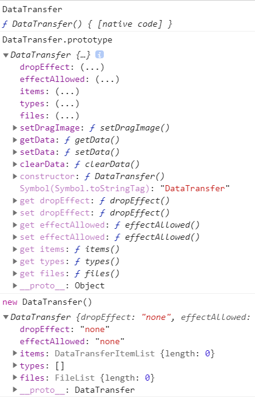

[TOC]
### DataTransfer 接口

drag 事件中用于传递数据

```
addEventListener('dragStart', event => {
	event.transfer.setData(type, data)
} 
```
接受两个参数type, data，都是字符串。
1. type为MIME类型, 常用type为`text/plain`, 当然也可以自定义type
2. data一般为了让浏览器识别, 转成字符串传递
3. 如果指定类型的数据在`dataTransfer`属性不存在，那么这些数据将被加入，否则原有的数据将被新数据替换。
4. 如果是拖拉文本框或者拖拉选中的文本，会默认将对应的文本数据，添加到`dataTransfer`属性，不用手动指定。 如果手动指定则会替换指定的字符串替换拖拽的文本作为data
5. 可以一次提供多种格式的数据。

```
addEventListener('drop' event => {
	event.transfer.getData(type)
}
```

1. 取出对应类型的数据


#### 谷歌浏览器DataTransfer接口

​	

##### 属性

[`DataTransfer.dropEffect`](https://developer.mozilla.org/en-US/docs/Web/API/DataTransfer/dropEffect)

Gets the type of drag-and-drop operation currently selected or sets the operation to a new type. 
获取当前选定的拖放操作的类型或将操作设置为新的类型。
The value must be `none`, `copy`, `link` or `move`.

[`DataTransfer.effectAllowed`](https://developer.mozilla.org/en-US/docs/Web/API/DataTransfer/effectAllowed)

DataTransfer.effectAllowed属性指定拖动操作允许的效果。 复制操作用于指示被拖动的数据将从其当前位置复制到放置位置。 移动操作用于指示将拖动的数据将被移动，而链接操作用于指示将在源位置和放置位置之间创建某种形式的关系或连接。

Provides all of the types of operations that are possible. 
Must be one of `none`, `copy`, `copyLink`, `copyMove`, `link`, `linkMove`, `move`, `all` or `uninitialized`.

[`DataTransfer.files`](https://developer.mozilla.org/en-US/docs/Web/API/DataTransfer/files)

Contains a list of all the local files available on the data transfer. If the drag operation doesn't involve dragging files, this property is an empty list.
包含数据传输中可用的所有本地文件的列表。 如果拖动操作不涉及拖动文件，则此属性为空列表。

[`DataTransfer.items`](https://developer.mozilla.org/en-US/docs/Web/API/DataTransfer/items) Read only

Gives a [`DataTransferItemList`](https://developer.mozilla.org/en-US/docs/Web/API/DataTransferItemList) object which is a list of all of the drag data.
给出[`DataTransferItemList`]对象，该对象是所有拖动数据的列表。

[`DataTransfer.types`](https://developer.mozilla.org/en-US/docs/Web/API/DataTransfer/types) Read only

An array of [`strings`](https://developer.mozilla.org/en-US/docs/Web/API/DOMString) giving the formats that were set in the `dragstart` event.


##### 方法

[`DataTransfer.clearData()`](https://developer.mozilla.org/en-US/docs/Web/API/DataTransfer/clearData)

Remove the data associated with a given type. The type argument is optional. If the type is empty or not specified, the data associated with all types is removed. If data for the specified type does not exist, or the data transfer contains no data, this method will have no effect.

[`DataTransfer.getData()`](https://developer.mozilla.org/en-US/docs/Web/API/DataTransfer/getData)

Retrieves the data for a given type, or an empty string if data for that type does not exist or the data transfer contains no data.

[`DataTransfer.setData(format, data)`](https://developer.mozilla.org/en-US/docs/Web/API/DataTransfer/setData)

Set the data for a given type. If data for the type does not exist, it is added at the end, such that the last item in the types list will be the new format. If data for the type already exists, the existing data is replaced in the same position.
DataTransfer.setData方法将拖动操作的拖动数据设置为指定的数据和类型。 如果给定类型的数据不存在，则将其添加到拖动数据存储区的末尾，这样类型列表中的最后一项将是新类型。 如果给定类型的数据已经存在，则将现有数据替换在相同位置。 即，当替换相同类型的数据时，类型列表的顺序不会改变。


[`DataTransfer.setDragImage()`](https://developer.mozilla.org/en-US/docs/Web/API/DataTransfer/setDragImage)

Set the image to be used for dragging if a custom one is desired.
