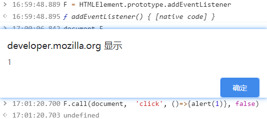

[TOC]

#### Vue.$mount

template 挂载到DOM上

``` javascript
new Vue({el: "#app"})
new Vue().$mount('#app')
var vm = new  Vue().$mount();
document.getElementById('app').appendChild(component.$el)
```

   

#### 有没有办法获取DOM上addEventListener绑定的事件回调?

DOM可以是一个文档上的元素 [`Element`](https://developer.mozilla.org/zh-CN/docs/Web/API/Element),[`Document`](https://developer.mozilla.org/zh-CN/docs/Web/API/Document)和[`Window`](https://developer.mozilla.org/zh-CN/docs/Web/API/Window)或者任何其他支持事件的对象 (比如 `XMLHttpRequest`)`。`

```javascript
DOM.addEventListener('click', listener1, {capture, once, passive})
...
DOM.addEventListener('click', listenerN, {capture, once, passive})
```

有没有方式能拿到所有绑定的fn,

1. `addEventListener()`的工作原理是将实现[`EventListener`](https://developer.mozilla.org/zh-CN/docs/Web/API/EventListener)的函数或对象添加到调用它的[`EventTarget`](https://developer.mozilla.org/zh-CN/docs/Web/API/EventTarget)上的指定事件类型的事件侦听器列表中。

2. 考虑覆盖addEventListener, 使用闭包变量缓存相应的 event-Array`<function>`的关系表, 

3. ```js
   const ORIGINAL_addEventListener = HTMLElement.prototype.addEventListener
   HTMLElement.prototype.addEventListener = 
   function (eventType, listener, options) {
   	function getListeners(eventType) {}
   	function setListeners(eventType, listeners) {}
   	function createHash(target, eventType, listener) {
   		let eventHash = this.eventHash = {}
   		let listeners = getListeners(eventType)
   		listeners.push(listener)
   		setListeners(eventType, listeners)
   	}
   	
   	createHash(this, eventType, listener)
   	//call real addEventListener
   	ORIGINAL_addEventListener.call(this, eventType, listener, options)
   }
   ```

4. 

   