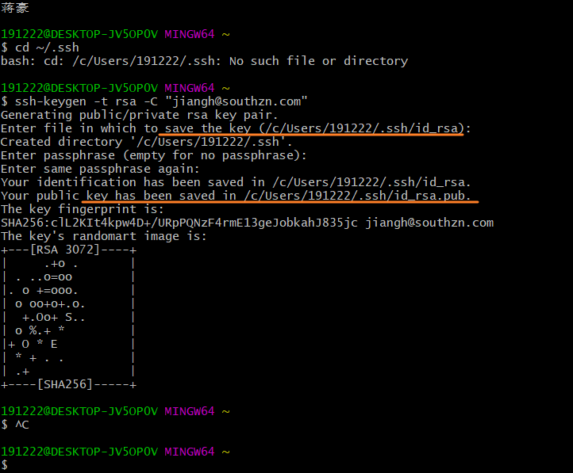
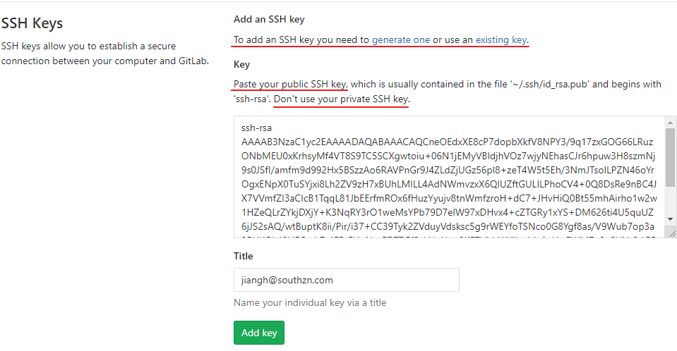

[TOC]

### git 常用命令

1. git clone
2. git checkout -b branchName
3. git add
4. git commit
5. (git commit -am " commit msg ")
6. git merge branchName (需要先切换分支)
7. git push (推送到远程仓库)
8. git pull


### 关联机器

 1.  配置username&email

 ```bash
     $ git config --global user.name/email
 ```

 2.  关联SSH
 ```bash
     $ ssh-keygen -t rsa -C "jiangh@southzn.com" 
     (关联自己登陆gitlab的邮箱)
 ```

 3.   
 生成key在对应的路径下, 拷贝key到gitlab SSH中即可, 

 4. 

    把生成的ssh公       钥拷贝到gitlen的ssh, 不要拷贝私钥

    有时候提交的时候被提示权限问题可能就是需要更新公钥


### 在 vscode 中使用git提交

 	1. 在源代码管理页中可以看到修改的文件
      	1. U-> Untracked, 需要使用 "+" -> git add 添加身份标记
      	2. M->Modified,  此时可以使用 "√" -> git commit 提交到本地
      	3. 本地修改提交完毕可以使用"..."中的"推送"-> git push 推送修改到远程仓库
 	2. 可以使用show git commit template插件编辑一个简单的commit message, 根据团队规范来提交更加清晰的信息
 	3. 文件修改后编辑器会以颜色标记来提示, 蓝色为modify, 红色为delete


#### 在vscode 中同步远程仓库代码

1. 拉取
2. 拉取自远程仓库的某个分支

