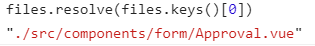

[TOC]
### webpack 打包多页面配置方式

1. entry 写成对象模式
2. output 需要使用替换变量 `[name].js`
3. 使用html-webpack-plugin时要使用到chunk加载相应的js文件, plguins中添加两个插件实例, 传入相应的options, chunks用来过滤需要使用的打包后的文件, `{chunks: [ 'entry1', 'entry2'], filename: 输出不同的名字}`


### require.context

1. 返回一个函数fn, 表示引入当前路径下模块的一个方法

   ```js
   const files = require.context('../components', false, /(\.vue|\.js)$/)
   ```

   

2. 

3. fn.id 表示fn的函数id

4. fn.keys : function : Array`<String>`, 执行返回当前路径下所有文件的相对路径

5. fn.resolve: function (filepath: String) : String, 解析一个模块相当于根目录的路径
    

4. 这里可以做的处理是针对所有的模块统一额外添加导出的数据
	1. 
    2. 如, 为路径下的vue组件统一注入mixin
    3. 


#### 子组件通过v-model修改父组件的data, 经过watch就不报警告了吗?

#### Vue 中使用 $set 更改父组件传入的prop也不报警告吗?

- 不报警告的原因是修改data: { a: {b:1} }   b的数据被修改不会报警告, 因为在js中所持对象的引用没有改变,

- 只有把组件接受的props显示的prop值改变了才报警告, 即为 props 修改前后值不同就会报警告

