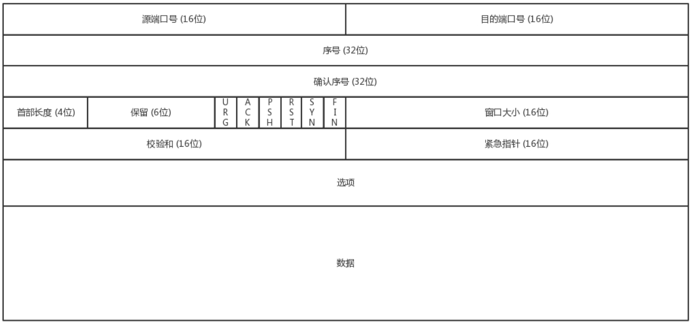
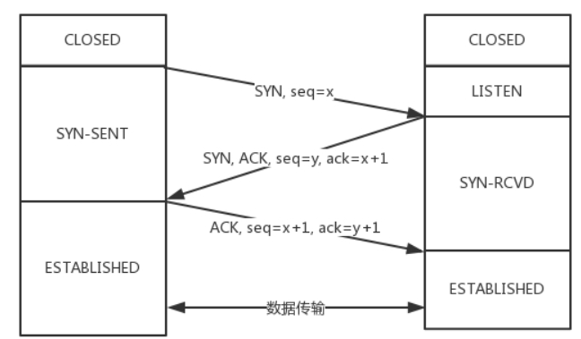
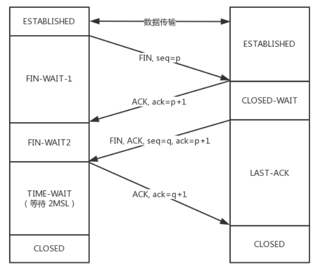
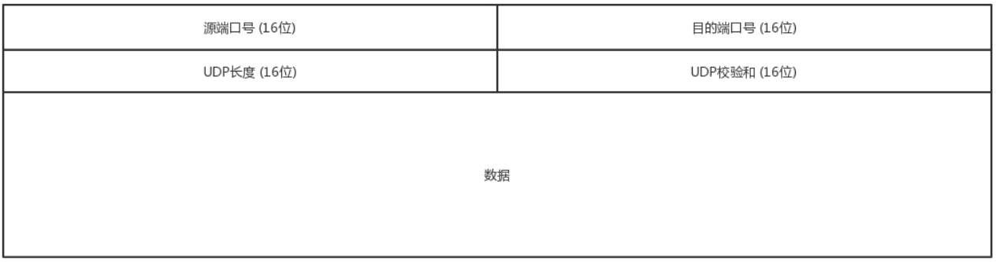

[TOC]

### HTTP

### TCP

TCP是面向连接的

1. **TCP提供可靠交付**。通过TCP连接传输的数据，无差错、不丢失、不重复、并且按序到达。

2. **TCP是面向字节流的**。发送的时候发的是一个流，没头没尾。之所以变成了流，这也是TCP自己的状态维护做的事情。
3. **TCP是可以有拥塞控制的**。它意识到包丢弃了或者网络的环境不好了，就会根据情况调整自己的行为，看看是不是发快了，要不要发慢点。
4. **TCP其实是一个有状态服务**，通俗地讲就是有脑子的，里面精确地记着发送了没有，接收到没有，发送到哪个了，应该接收哪个了，错一点儿都不行。

**所谓的建立连接，是为了在客户端和服务端维护连接，而建立一定的数据结构来维护双方交互的状态，用这样的数据结构来保证所谓的面向连接的特性。**

#### 报文格式

1. 端口号表示数据发送起始的应用没有这两个端口号。数据就不知道应该发给哪个应用。
2. 序号 & 确认号 保证报文的顺序即解决不丢包问题; 没有收到就应该重新发送，直到送达。
3. tcp flags **状态位** 标记 tcp 报文的状态, TCP 是 **面向连接**的，因而双方要维护连接的状态，这些带状态位的包的发送，会引起双方的状态变更。
4. 窗口大小 **流量控制**，通信双方各声明一个窗口，标识自己当前能够的处理能力; 指出了现在允许对方发送的数据量，它告诉对方本端的 TCP 接收缓冲区还能容纳多少字节的数据，这样对方就可以控制发送数据的速度。
5. TCP 还会做 **拥塞控制**也即控制发送的速度

通过对 TCP 头的解析，我们知道要掌握 TCP 协议，重点应该关注以下几个问题：

+ 顺序问题 ，稳重不乱；
+ 丢包问题，承诺靠谱；
+ 连接维护，有始有终；
+ 流量控制，把握分寸；
+ 拥塞控制，知进知退。

#### TCP三次握手

​	“请求 -> 应答 -> 应答之应答”的三个回合, 为什么要三次，而不是两次？按说两个人打招呼，一来一回就可以了啊？

​    考虑网络环境不好丢包的情况需要双方都确认对方

 A发包一直到B, 如果

#### TCP四次挥手

​	B: ->  晚安

​    S: -> 好, 晚安

​    S: ->  我睡了

​    B: (稍等一会没有消息) ->  好, 我也睡了	

  

​	

### UDP

UDP是面向无连接的

1. **UDP继承了IP包的特性，不保证不丢失，不保证按顺序到达。**
2. **UDP继承了IP的特性，基于数据报的，一个一个地发，一个一个地收。**
3. **UDP就不会拥塞控制，应用让我发，我就发，管它洪水滔天。**
4. **UDP则是无状态服务,**通俗地说是没脑子的，天真无邪的，发出去就发出去了。

报文格式

有源端口号和目标端口号。因为是两端通信嘛，这很好理解。但是你还会发现，UDP除了端口号，再没有其他的了。

#### UDP的三大特点

UDP就像小孩子一样，有以下这些特点：

第一，**沟通简单**，不需要一肚子花花肠子（大量的数据结构、处理逻辑、包头字段）。前提是它相信网络世界是美好的，秉承性善论，相信网络通路默认就是很容易送达的，不容易被丢弃的。

第二，**轻信他人**。它不会建立连接，虽然有端口号，但是监听在这个地方，谁都可以传给他数据，他也可以传给任何人数据，甚至可以同时传给多个人数据。

第三，**愣头青，做事不懂权变**。不知道什么时候该坚持，什么时候该退让。它不会根据网络的情况进行发包的拥塞控制，无论网络丢包丢成啥样了，它该怎么发还怎么发。

#### UDP的三大使用场景

第一，**需要资源少，在网络情况比较好的内网，或者对于丢包不敏感的应用**。

第二，**不需要一对一沟通，建立连接，而是可以广播的应用**。

第三，**需要处理速度快，时延低，可以容忍少数丢包，但是要求即便网络拥塞，也毫不退缩，一往无前的时候**。

### 总结一下TCP&UDP

- 如果将TCP比作成熟的社会人，UDP则是头脑简单的小朋友。
  - TCP复杂，UDP简单；
  - TCP维护连接，UDP谁都相信；
  - TCP会坚持知进退；UDP愣头青一个，勇往直前；
- UDP虽然简单，但它有简单的用法。它可以用在环境简单、需要多播、应用层自己控制传输的地方。例如DHCP、VXLAN、QUIC等。

### HTTPS

### 自动化部署--Jenkins+Docker自动化部署vue项目

### 轻量化自动部署----`node-ssh`、`archiver`可以满足我们的需求

### CSS制造波浪效果

### CSS为什么放在script之前的意义?

#### smartForm 新增表单并保存后表单内容失效

1. FormCreate 中使用 tabs 组件, tab-pane组件绑定数据, 其中key绑定在name属性上, pane中使用组件form-design-main;

2. 保存后会根据后台返回的一个字符串重置name属性, 导致pane无法复用, 考虑使用index作为key, 来复用form-design-main保证组件不被丢失

