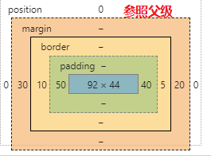
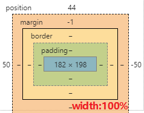

[TOC]

## git规范

 1.  分支命名规范

     不规范的命名如果推送到远程仓库需要重命名

     git push origin --delete branchname

     git push origin newbranchname

 2.  提交信息规范

     [TYPE]: Message

 3.  "上游"和"下游"

     基于分支创建子分支

     git chekout  -b newbranch oldbranch

 4.  


## 绝对定位元素的百分比定位属性

相当于与"定位父级"的 contentBox / paddingBox / borderBox



182 = 92 + 50 + 40 ~ 参照于 paddingBox

### 笔试题

1. position的属性值
2. 属性值之间的区别
3. 绝对定位时, 百分比单位的参照对象


## 描述项目

​	项目介绍，项目技术栈，项目的业务深度，项目的难点，项目的业务数据，项目的横向和纵向贡献，项目角色等等

1. 写自己负责的。 

2. 写值得问的。
3. 写有技术难度的，前提你得懂。
4. 写项目架构。
5.  写商业价值。

面试官要问的不是难点是什么，而是应聘者的解决问题的思路，方法


## Vue自定义指令

Vue.directive( id, [definition])

- **参数**：

  - `{string} id`
  - `{Function | Object} [definition]`

- **用法**：

  注册或获取全局指令。

  ```
  // 注册
  Vue.directive('my-directive', {
    bind: function () {},
    inserted: function () {},
    update: function () {},
    componentUpdated: function () {},
    unbind: function () {}
  })
  
  // 注册 (指令函数)
  Vue.directive('my-directive', function () {
    // 这里将会被 `bind` 和 `update` 调用
  })
  
  // getter，返回已注册的指令
  var myDirective = Vue.directive('my-directive')
  ```

- **参考**：[自定义指令](https://cn.vuejs.org/v2/guide/custom-directive.html)


## [钩子函数](https://cn.vuejs.org/v2/guide/custom-directive.html#钩子函数)

一个指令定义对象可以提供如下几个钩子函数 (均为可选)：

- `bind`：只调用一次，指令第一次**绑定到元素时调用**。在这里可以进行一次性的初始化设置。
- `inserted`：被绑定元素**插入父节点时调用** (仅保证父节点存在，但不一定已被插入文档中)。
- `update`：所在组件的 VNode **更新时调用**，**但是可能发生在其子 VNode 更新之前**。指令的值可能发生了改变，也可能没有。但是你可以通过比较更新前后的值来忽略不必要的模板更新 (详细的钩子函数参数见下)。

- `componentUpdated`：指令所在组件的 VNode **及其子 VNode** **全部更新后调用**。
- `unbind`：只调用一次，指令**与元素解绑时**调用。

接下来我们来看一下钩子函数的参数 (即 `el`、`binding`、`vnode` 和 `oldVnode`)。

## [钩子函数参数](https://cn.vuejs.org/v2/guide/custom-directive.html#钩子函数参数)

**指令钩子函数**会被传入以下参数：

- `el`：指令所绑定的元素，可以用来直接操作 DOM。

- binding ：一个对象，包含以下 property：

  - `name`：指令名，不包括 `v-` 前缀。
  - `value`：指令的绑定值，例如：`v-my-directive="1 + 1"` 中，绑定值为 `2`。
  - `oldValue`：指令绑定的前一个值，仅在 `update` 和 `componentUpdated` 钩子中可用。无论值是否改变都可用。
  - `expression`：字符串形式的指令表达式。例如 `v-my-directive="1 + 1"` 中，表达式为 `"1 + 1"`。
  - `arg`：传给指令的参数，可选。例如 `v-my-directive:foo` 中，参数为 `"foo"`。
  - `modifiers`：一个包含修饰符的对象。例如：`v-my-directive.foo.bar` 中，修饰符对象为 `{ foo: true, bar: true }`。

- `vnode`：Vue 编译生成的**虚拟节点**。移步 [VNode API](https://cn.vuejs.org/v2/api/#VNode-接口) 来了解更多详情。 应该是这个Node 编译生成的VNode

- `oldVnode`：上一个虚拟节点，仅在 `update` 和 `componentUpdated` 钩子中可用。

除了 `el` 之外，其它参数都应该是只读的，切勿进行修改。如果需要在钩子之间共享数据，建议通过元素的 [`dataset`](https://developer.mozilla.org/zh-CN/docs/Web/API/HTMLElement/dataset) 来进行。


自定义钩子样例：

```js
<div id="hook-arguments-example" v-demo:foo.a.b="message"></div>

Vue.directive('demo', {
  bind: function (el, binding, vnode) {
    var s = JSON.stringify
    el.innerHTML =
      'name: '       + s(binding.name) + '<br>' +
      'value: '      + s(binding.value) + '<br>' +
      'expression: ' + s(binding.expression) + '<br>' +
      'argument: '   + s(binding.arg) + '<br>' +
      'modifiers: '  + s(binding.modifiers) + '<br>' +
      'vnode keys: ' + Object.keys(vnode).join(', ')
  }
})

new Vue({
  el: '#hook-arguments-example',
  data: {
    message: 'hello!'
  }
})
```


```js
name: "demo"
value: "hello!"
expression: "message"
argument: "foo"
modifiers: {"a":true,"b":true}
vnode keys: tag, data, children, text, elm, ns, context, fnContext, fnOptions, fnScopeId, key, componentOptions, componentInstance, parent, raw, isStatic, isRootInsert, isComment, isCloned, isOnce, asyncFactory, asyncMeta, isAsyncPlaceholder
```


## echart 基础api

 1.  ```javascript
     echartsInstance = echart.init(dom, theme, options)
     创建一个 ECharts 实例，返回 echartsInstance，不能在单个容器上初始化多个 ECharts 实例。
     
     dom ---- 实例容器，一般是一个具有高宽的div元素。
     注：如果div是隐藏的，ECharts 可能会获取不到div的高宽导致初始化失败，这时候可以明确指定div的style.width和style.height，或者在div显示后手动调用 echartsInstance.resize 调整尺寸。
     theme ---- 应用的主题。
     可以是一个主题的配置对象，也可以是使用已经通过 echarts.registerTheme 注册的主题名称。
     
     opts ---- 附加参数。有下面几个可选项：
     devicePixelRatio -- 设备像素比，默认取浏览器的值window.devicePixelRatio。
     renderer -- 渲染器，支持 'canvas' 或者 'svg'。参见 使用 Canvas 或者 SVG 渲染。
     
     width -- 可显式指定实例宽度，单位为像素。如果传入值为 null/undefined/'auto'，则表示自动取 dom（实例容器）的宽度。
     height -- 可显式指定实例高度，单位为像素。如果传入值为 null/undefined/'auto'，则表示自动取 dom（实例容器）的高度。```
     ```


 2.  ```javascript
     echartsInstance.setOption
     (option: Object, notMerge?: boolean, lazyUpdate?: boolean)
     or
     (option: Object, opts?: Object)
     设置图表实例的配置项以及数据，万能接口，所有参数和数据的修改都可以通过 setOption 完成，ECharts 会合并新的参数和数据，然后刷新图表。
     如果开启动画的话，ECharts 找到两组数据之间的差异然后通过合适的动画去表现数据的变化
     
     option -- 图表的配置项和数据，具体见配置项手册。
     notMerge -- 可选，是否不跟之前设置的 option 进行合并，默认为 false，即合并。
     lazyUpdate -- 可选，在设置完 option 后是否不立即更新图表，默认为 false，即立即更新。
     silent -- 可选，阻止调用 setOption 时抛出事件，默认为 false，即抛出事件。
     ```

 3.  

