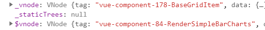
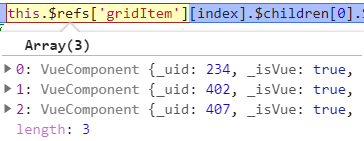
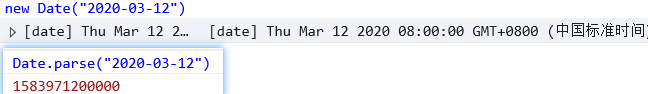
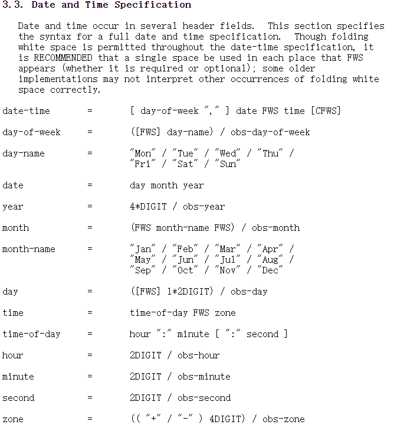
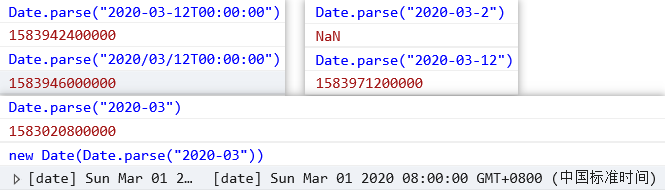
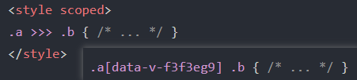

[TOC]


## 自动化测试

​	1. 工具 Mocha


## Vue实例中 _vnode 和 $vnode




## Vue组件中自定子组件相同的ref属性

​	


## Date构造函数传递参数

1. undefined

2. timeStamp

3. DateString

   1. 如果只有一个参数，并且是字符串，那么它会被自动解析。该算法与 `Date.parse` 所使用的算法相同
   2. 
   3. 

4. 参数列表 **new Date(year, month, date, hours, minutes, seconds, ms)**

   使用当前时区中的给定组件创建日期。只有前两个参数是必须的。

   1. `year` 必须是四位数：`2013` 是合法的，`98` 是不合法的。
   2. `month` 计数从 `0`（一月）开始，到 `11`（十二月）结束。
   3. `date` 是当月的具体某一天，如果缺失，则为默认值 `1`。
   4. 如果 `hours/minutes/seconds/ms` 缺失，则均为默认值 `0`。

5. 


## Date.parse

​	1. [Date.parse(str)](https://developer.mozilla.org/zh/docs/Web/JavaScript/Reference/Global_Objects/Date/parse) 方法可以从一个字符串中读取日期。

2. Str : 一个符合 [RFC2822](http://tools.ietf.org/html/rfc2822#page-14) 或 ISO 8601 日期格式的字符串（其他格式也许也支持，但结果可能与预期不符）。

3. 日期和时间出现在几个标题字段中。 本节规定完整日期和时间规范的语法。 虽然折叠在整个日期时间规范中都允许使用空格，建议在FWS的每个位置使用一个空格出现（无论是必需的还是可选的； 一些老实现可能无法解释折叠白的其他情况正确间隔。

4. 

5. 字符串的格式应该为：`YYYY-MM-DDTHH:mm:ss.sssZ`

6. 简短形式也是可以的，比如 `YYYY-MM-DD` 或 `YYYY-MM`，甚至可以是 `YYYY`

   1. `YYYY-MM-DD` —— 日期：年-月-日。
   2. 字符 `"T"` 是一个分隔符。
   3. `HH:mm:ss.sss` —— 时间：小时，分钟，秒，毫秒。
   4. 可选字符 `'Z'` 为 `+-hh:mm` 格式的时区。单个字符 `Z` 代表 UTC+0 时区。

   `Date.parse(str)` 调用会解析给定格式的字符串，并返回时间戳。

   如果给定字符串的格式不正确，则返回 `NaN`。

7. 

​	


## Vue的深度作用选择器  >>>

1. 是vue-loader起作用, 可能会在 less/scss 中不起作用, 需要调整使用 /deep/
2. 


## git 操作

 1.  上下游设置

 2.  取消commit, 取消多次commit记录,

 3.  ```bash
     git reset --soft HEAD~4
     !慎用...
     ```

#### git 简单规范

 	1. 修改原有代码 ---- Style
      	1. 部分功能逻辑的修改
      	2. 样式调整
 	2. 增加某些功能 ---- Feature
 	3. 修复某些问题 ---- Fix

#### 可以考虑的git实践方案

	1. 新增功能开启新的分支 feature-XxxX or feature-v0.1.0@SSA_1.1, 测试无误后可以合并到dev分支, 合并后及时删除掉分支, 并在dev分支上同步代码
 	2. 普通的bug修复也可以在dev分支上直接修改
 	3. 切换分支前需要的操作
 	4. 官方文档有句话“切换分支的时候最好保持一个清洁的工作区域。“<br>：一个本地的git repo只有一个工作区和暂存区，但是有多个分支的提交区（本地仓库有多个分支，不同分支保存不同的代码），而我们的checkout只是将HEAD指针从一个分支切换到另一个分支。<br>所以，当工作区有修改时，将这些修改先提交到本地仓库的对应分支里（即：commit）或是将改动保存起来（即stash）。<br><br>有如下几种处理方式：<br>
     1. add并且commit，再checkout，提交到当前分支<br>
     2. add但不commit，可以stash，然后checkout回来之后stash apply，在commit，提交到当前分支<br>
     3. add但不commit，也不stash，直接checkout，然后再commit的话，记录就在切换分支下面。<br>

