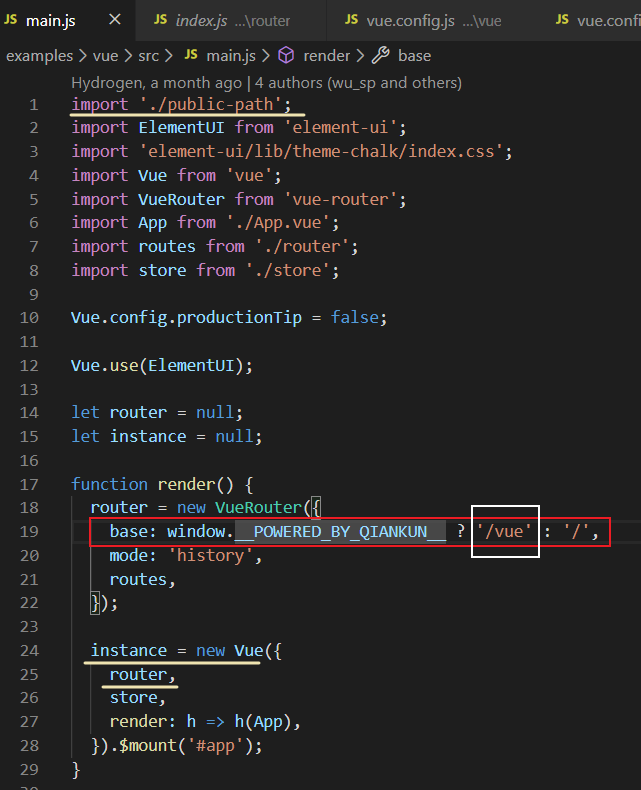
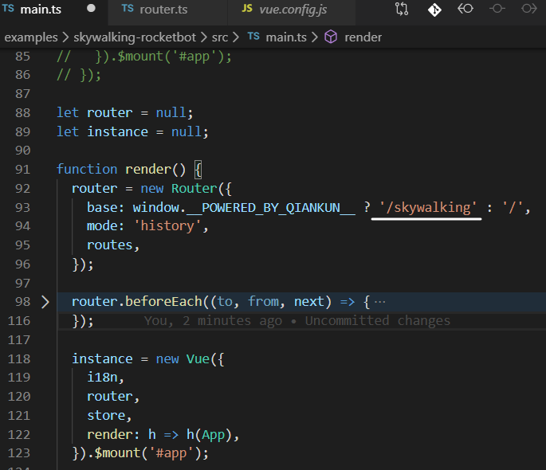
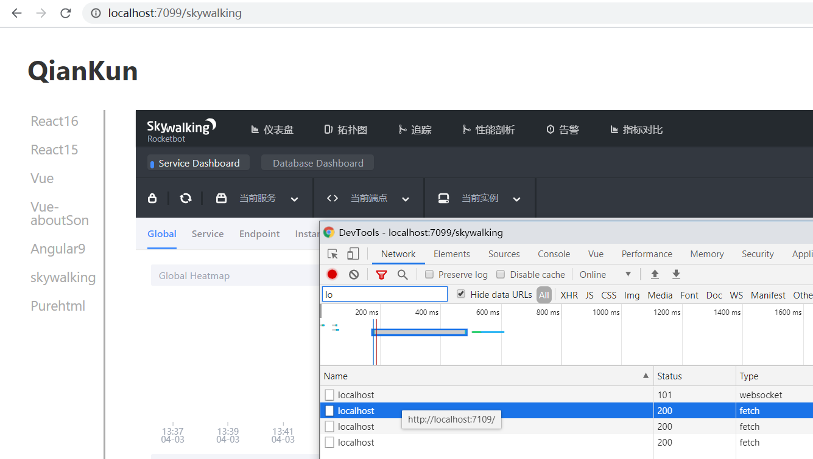

[TOC]

#### Vue slot 应用

1. 一般考虑如果有些组件需要不需要使用当前的状态, 则可以用slot将别的组件插入进来, 
2. 如果是组件内部状态处理的则最好写在一起


##### webpack构建优化

1. 构建优化 MonacoWebpackPlugin
2. 2


##### 微前端


##### 微前端实践方案 ---- qiankun


### 具体的操作步骤

#### 针对子应用的修改----以examples中的vue项目为参照

##### 入口文件的修改 



 1.  引入文件public-path.js到子工程的src目录

     ```js
     if (window.__POWERED_BY_QIANKUN__) {
       // eslint-disable-next-line no-undef
       __webpack_public_path__ = window.__INJECTED_PUBLIC_PATH_BY_QIANKUN__;
     }
     ```

     

 2.  路由的配置要更改base, 其中三元运算符 **?** 后面的值要与跟**主应用中的注册的路由**相同, 也就是说这个是**匹配子工程的路由**, router也可以分开配置, 需要调整base设置

 3.  构造render函数

 4.  导出生命周期函数 bootstrap, mount, unmount

      1. bootstrap 只会**在子应用初始化的时候调用**一次，下次子应用重新进入时会直接调用 mount 钩子，不会再重复触发 bootstrap。通常我们可以在这里做一些全局变量的初始化，比如不会在 unmount 阶段被销毁的应用级别的缓存等
      2. mount 应用每次**进入**都会调用 mount 方法，通常我们在这里触发应用的渲染方法
      3. unmount 应用每次 **切出/卸载** 会调用的方法，通常在这里我们会卸载子应用的应用实例

 ```js
 // main.ts
 if (!window.__POWERED_BY_QIANKUN__) {
 	render();
 }

export async function bootstrap() {
	console.log('[vue] vue app bootstraped');
}

export async function mount(props) {
	console.log('[vue] props from main framework', props);
	render();
}

export async function unmount() {
	instance.$destroy();
	instance = null;
	router = null;
}
 ```


##### vue.config.js 修改

 1. 需要固定子应用的端口并提供给主工程访问, 所以在devServer中配置了端口

  2. 按照文档需要给webpack传入相应的配置对象, 把子应用打包成 umd 库格式

  3. ```javascript
     const port = 7109;
     module.exports.devServer.port = port;
     module.exports.configureWebpack.output = {
         // 把子应用打包成 umd 库格式
         library: `${name}-[name]`,
         libraryTarget: 'umd',
         jsonpFunction: `webpackJsonp_${name}`,
     }
     ```

  4. 


#### 针对主应用的修改 ---- 以example中的main为参照

1. 需要注册把子应用的路由注册到主应用中

```javascript
// main/index.js
registerMicroApps(
    [...,{
    //添加子应用路由, 核准name和entry
    name: 'skywalking',
    entry: '//localhost:7109',
    render,
    activeRule: genActiveRule('/skywalking'),
}]
```
2. 如果项目比较庞大, 可以添加到预加载选项中

 ```js
main/index.js
/**
* Step3 设置默认进入的子应用
*/
setDefaultMountApp('/skywalking');
/** 
*  Step4 启动应用
*/
start({
    prefetch: ['react16', 'vue', 'skywalking'],  //预加载, 其余为懒加载
    jsSandbox: true,
    singular: false,
});
 ```

#### 针对qiankun项目package.json命令修改

```json
//因为install和start命令会执行所有的 'install: *' 和 'start: *', 所以添加的命令也需要按照指定的格式来添加 
scripts: {
    "examples:install": "npm-run-all --serial build install:*",
    "examples:start": "npm-run-all --parallel start:*", 
	"install:skywalking": "cd examples/skywalking-rocketbot && yarn",
    "start:skywalking": "cd examples/skywalking-rocketbot && yarn start",
}
```
上面的**start:skywalking**表示执行相应路径下package.json中的start命令, 由于新增的子应用基于vue-cli 3.x版本, 只有serve命令, 没有start命令, 那么可以把 **yarn start** 更换为 **yarn serve**, 或者也可以在package.json中增加一个start命令去启动子应用
为了保持统一使用了yarn命令, 其实也可以使用npm命令来进行下载和安装


#### 最终结果




刷新时会有三个localhost的请求发出, 分别指向三个预加载的项目的地址


#### 使用体验

1. 简直惊叹这种蚂蚁金服神奇的技术, 简直就是公司遗产项目的福音, 可以不考虑技术栈, 不考虑相应的运行环境(包括node.js的版本, 不同的打包工具和不同的版本)把项目都集成起来, 从一个入口做访问, 而且使用的体验也是相当的不错, 欢迎大家来体验使用
2. 笔者是在已有的demo里面做的一个简单的增删子应用操作, 还没有以依赖的方式集成到项目中
3. 执行安装依赖命令的时候安装比较久(可能是最近网络都不太行的原因), 也可以考虑在子应用中单独使用镜像地址来安装node_modules速度会比较快, 执行install命令时如果控制台提示已经是最新的依赖则没有问题


#### 参考链接

[可能是你见过最完善的微前端解决方案](https://juejin.im/post/5d560292e51d4561a60d9dd9)

[github](https://github.com/umijs/qiankun)

[qiankun文档](https://qiankun.umijs.org/zh/guide)


