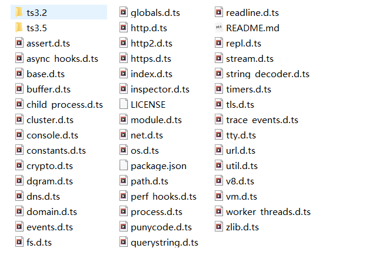
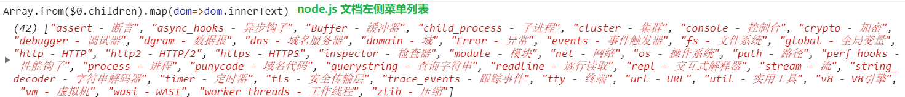
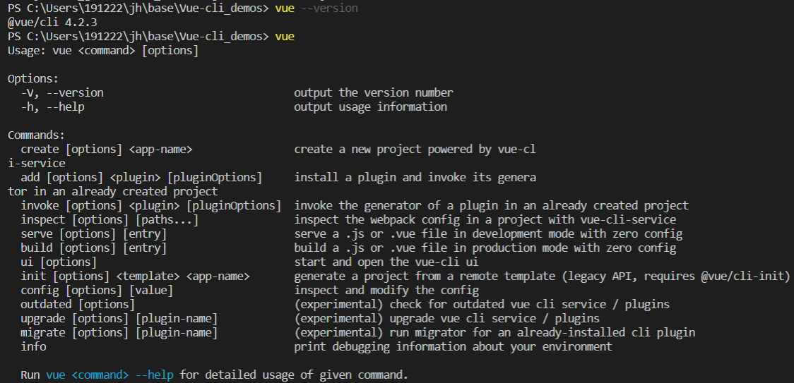
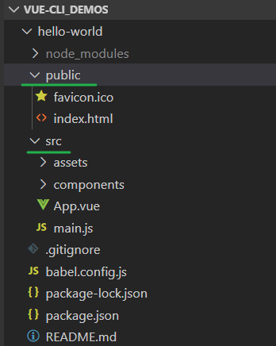
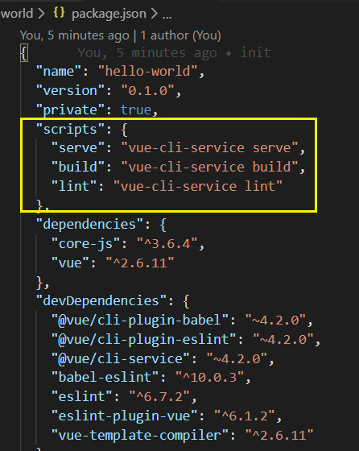
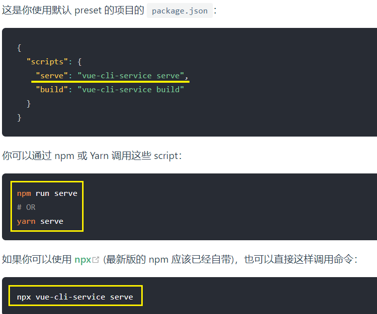
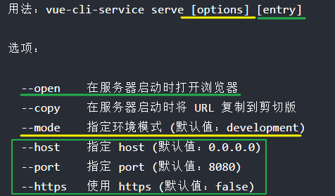
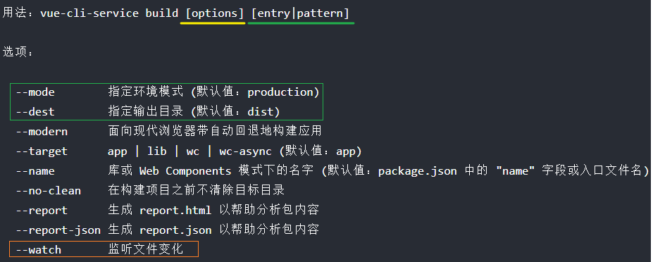
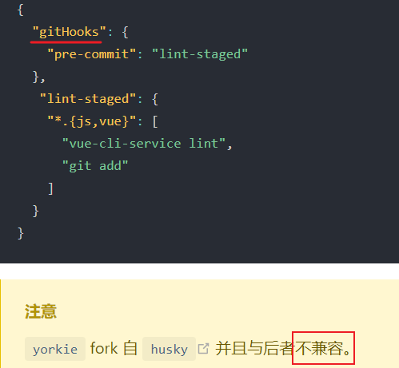
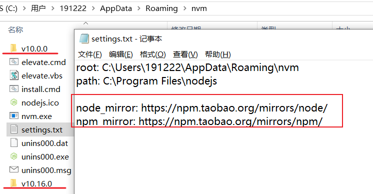

[TOC]


# Node.js模块






## Vue-cli

全局安装@vue/cli (可能需要管理员权限安装)



命令：

| 命令                                        | 功能                                                |
| ------------------------------------------- | --------------------------------------------------- |
| create [options] `<app-name>`               | 创建一个由vue-cli-service支持的新项目               |
| add [options] `<plugin>` [pluginOptions]    | 安装插件并在已创建的项目中调用其生成器              |
| invoke [options] `<plugin>` [pluginOptions] | 在已创建的项目中调用插件的生成器                    |
| inspect [options] [paths...]                | 使用vue-cli-service检查项目中的Webpack配置          |
| serve [options] [entry]                     | 在开发模式下以零配置提供.js或.vue文件               |
| build [options] [entry]                     | 以零配置在生产模式下生成.js或.vue文件               |
| ui [options]                                | 启动并打开vue-cli ui                                |
| init [options] `<template>` `<app-name>`    | 从远程模板生成项目（旧版API，需要@ vue / cli-init） |
| config [options] [value]                    | 检查并修改配置                                      |
| outdated [options]                          | （实验性）检查过时的vue cli服务/插件                |
| upgrade [options] [plugin-name]             | （实验性）升级vue cli服务/插件                      |
| migrate [options] [plugin-name]             | （实验性）为已安装的cli插件运行migrator             |
| info                                        | 打印有关的环境的调试信息                            |

  

### 快速创建项目

1. 命令行执行 `vue create hello-world`
2. 选择默认配置
3. `npm run serve` 运行项目


### 项目目录



没有以往的 webpack.js 文件了, 

package.json 中的主要字段



使用的是 vue-cli-service (vue-cli 服务)




## vue-cli-service 命令

1. ##### vue-cli-service serve

   1. `vue-cli-service serve` 命令会启动一个开发服务器 (基于 [webpack-dev-server](https://github.com/webpack/webpack-dev-server)) 并附带开箱即用的模块热重载 (Hot-Module-Replacement)。
   2. 除了通过命令行参数，你也可以使用 `vue.config.js` 里的 [devServer](https://cli.vuejs.org/zh/config/#devserver) 字段配置开发服务器。
   3. 命令行参数 `[entry]` 将被指定为唯一入口，而非额外的追加入口。尝试使用 `[entry]` 覆盖 `config.pages` 中的 `entry` 将可能引发错误。
   4. 

2. ##### vue-cli-service build

   1. `vue-cli-service build` 会在 `dist/` 目录产生一个可用于生产环境的包，带有 JS/CSS/HTML 的压缩，和为更好的缓存而做的自动的 vendor chunk splitting。它的 chunk manifest 会内联在 HTML 里。
   2. 这里还有一些有用的命令参数：
      - `--modern` 使用[现代模式](https://cli.vuejs.org/zh/guide/browser-compatibility.html#现代模式)构建应用，为现代浏览器交付原生支持的 ES2015 代码，并生成一个兼容老浏览器的包用来自动回退。
      - `--target` 允许你将项目中的任何组件以一个库或 Web Components 组件的方式进行构建。更多细节请查阅[构建目标](https://cli.vuejs.org/zh/guide/build-targets.html)。
      - `--report` 和 `--report-json` 会根据构建统计生成报告，它会帮助你分析包中包含的模块们的大小。
   3. 

3. ##### vue-cli-service inspect

   1. 使用 `vue-cli-service inspect` 来审查一个 Vue CLI 项目的 webpack config。
   2. 也可以直接使用 `vue  inspect > webpack_config.js`导出一个webpack配置对象。输出的并不是一个有效的 webpack 配置文件，而是一个用于审查的被序列化的格式。
   3. 更多细节请查阅[审查 webpack config](https://cli.vuejs.org/zh/guide/webpack.html#审查项目的-webpack-config)。
   
4. ##### vue-cli-service lint

## 缓存和并行处理

- `cache-loader` 会默认为 Vue/Babel/TypeScript 编译开启。文件会缓存在 `node_modules/.cache` 中——如果你遇到了编译方面的问题，记得先删掉缓存目录之后再试试看。
- `thread-loader` 会在多核 CPU 的机器上为 Babel/TypeScript 转译开启。


## Git Hook

在安装之后，`@vue/cli-service` 也会安装 [yorkie](https://github.com/yyx990803/yorkie)，它会让你在 `package.json` 的 `gitHooks` 字段中方便地指定 Git hook




## vue-cli 内置了多种插件  **可以单独配置**

###### Vue + webpack整体理解和细节体验

vue.config.js

1. Vue-cli 配置多页面应用
2. 配置传入给webpack的配置


## 使用ts来写Vue项目 skyWalking-rocketbot-ui 

### `典型的Vue全家桶套餐项目`

`learn how to use Vue, Vuex, Vue-Router,  and so on...`

Use **Vue.use, Vue.filter ~ 使用插件和过滤器** 

### moment.js

### 国际化 I18n


## ts 写 Vue 的语法可以支持装饰器 [vue-class-component](https://github.com/vuejs/vue-class-component)

1. 在声明组件时可以基于类的 API
2. 也可以使用Vue支持的语法 Vue.extend 拓展子类


## Vue的单元测试


## 自定义run执行的脚本[vue-cli/scripts]


## NVM工具

卸载node.js

安装nvm

修改配置, 添加淘宝镜像



安装node.js对应的版本, 安装的node在相应的版本号文件夹内

```bash
nvm install 10.16.0
```

查看安装的版本

```
nvm list
```


切换版本

```
nvm use 10.16.0
```


使用策略 ---- 使用 latest 作为默认node.js环境, 遇到版本不兼容的工具则做降级处理
