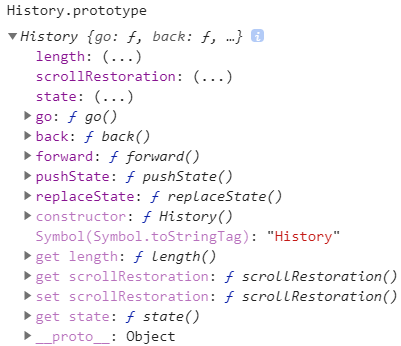

[TOC]

# axios的请求拦截

## 拦截器 interceptor

请求拦截 & 返回拦截

```javascript
// 添加请求拦截器
axios.interceptors.request.use(function (config) {
    // 在发送请求之前做些什么
    return config;
}, function (error) {
    // 对请求错误做些什么
    return Promise.reject(error);
});

// 添加响应拦截器
axios.interceptors.response.use(function (response) {
    // 对响应数据做点什么
    return response;
}, function (error) {
    // 对响应错误做点什么
    return Promise.reject(error);
});
```


# router的跳转拦截

`vue-router` 提供的导航守卫主要用来通过跳转或取消的方式守卫导航。

记住**参数或查询的改变并不会触发进入/离开的导航守卫**。你可以通过[观察 `$route` 对象](https://router.vuejs.org/zh/guide/essentials/dynamic-matching.html#响应路由参数的变化)来应对这些变化，或使用 `beforeRouteUpdate` 的组件内守卫。

## 全局前置守卫

使用 `router.beforeEach` 注册一个全局前置守卫：

```js
router.beforeEach((to, from, next) => {
  // ... 必须调用 `next`
})
```

当一个导航触发时，全局前置守卫按照创建顺序调用。守卫是异步解析执行，此时导航在所有守卫 resolve 完之前一直处于 **pending**。**确保要调用 `next` 方法，否则钩子就不会被 resolved。**

每个守卫方法接收三个参数：

- **`to: Route`**: 即将要进入的目标 [路由对象](https://router.vuejs.org/zh/api/#路由对象)

- **`from: Route`**: 当前导航正要离开的路由

- **`next: Function`**: 一定要调用该方法来 **resolve** 这个钩子。执行效果依赖 `next` 方法的调用参数。

  - **`next()`**: 进行管道中的下一个钩子。如果全部钩子执行完了，则导航的状态就是 **confirmed** (确认的)。

  - **`next(false)`**: 中断当前的导航。如果浏览器的 URL 改变了 (可能是用户手动或者浏览器后退按钮)，那么 URL 地址会重置到 `from` 路由对应的地址。

  - **`next('/')` 或者 `next({ path: '/' })`**: 跳转到一个不同的地址。当前的导航被中断，然后进行一个新的导航。你可以向 `next` 传递任意位置对象，且允许设置诸如 `replace: true`、`name: 'home'` 之类的选项以及任何用在 [`router-link` 的 `to` prop](https://router.vuejs.org/zh/api/#to) 或 [`router.push`](https://router.vuejs.org/zh/api/#router-push) 中的选项。

  - **`next(error)`**: (2.4.0+) 如果传入 `next` 的参数是一个 `Error` 实例，则导航会被终止且该错误会被传递给 [`router.onError()`](https://router.vuejs.org/zh/api/#router-onerror) 注册过的回调。

    

```js
/* 可以根据对应的路由来执行相应的跳转动作 */
if (to.meta.login && (token === null || token === 'guest')) {
    next();
} else if (token === null || token === 'guest') {
    next('/login');
} else if (to.meta.login) {
    next(from.path);
} else {
    next();
}

// to / from
{
    name: undefined
    meta: {}
    path: "/"
    hash: ""
    query: {}
    params: {}
    fullPath: "/"
    matched: (2) [{…}, {…}]
}
```


## 完整的导航解析流程

1. 导航被触发。
2. 在失活的组件里调用离开守卫。
3. 调用全局的 `beforeEach` 守卫。
4. 在重用的组件里调用 `beforeRouteUpdate` 守卫 (2.2+)。
5. 在路由配置里调用 `beforeEnter`。
6. 解析异步路由组件。
7. 在被激活的组件里调用 `beforeRouteEnter`。
8. 调用全局的 `beforeResolve` 守卫 (2.5+)。
9. 导航被确认。
10. 调用全局的 `afterEach` 钩子。
11. 触发 DOM 更新。
12. 用创建好的实例调用 `beforeRouteEnter` 守卫中传给 `next` 的回调函数。


# History




# TS

### 	泛型

**泛型（Generics）**是指在定义函数、接口或类的时候，不预先指定具体的类型，而在使用的时候再指定类型的一种特性。泛型就是指定一个表示类型的变量，用它来**代替某个实际的类型用于编程**，而后通过实际调用时传入或推导的类型来对其进行替换，以达到一段使用泛型程序可以实际适应不同类型的目的。

TypeScript 为 JavaScriopt 带来了强类型特性，这就意味着限制了类型的自由度。同一段程序，为了适应不同的类型，就可能需要写不同的处理函数——而且这些处理函数中所有逻辑完全相同，**唯一不同的就是类型——这严重违反抽象和复用代码的原则。**

如果不使用泛型, 为了适应不同的类型能采取的做法是

1. 使用any, 这个办法可以检查通过。但它的问题在于内部失去了类型检查，简单的说，是有**“假装”**没问题。
2. 重新定义多个类型函数


### 泛型类


todo


## 什么是微前端 ---- [qiankun](https://qiankun.umijs.org/zh/guide/#什么是微前端)

> Techniques, strategies and recipes for building a **modern web app** with **multiple teams** that can **ship features independently**. -- [Micro Frontends](https://micro-frontends.org/)
>
> 微前端是一种多个团队通过独立发布功能的方式来共同构建现代化 web 应用的技术手段及方法策略。

微前端架构具备以下几个核心价值：

- 技术栈无关
  主框架不限制接入应用的技术栈，子应用具备完全自主权

- 独立开发、独立部署
  子应用仓库独立，前后端可独立开发，部署完成后主框架自动完成同步更新

- 增量升级

  在面对各种复杂场景时，我们通常很难对一个已经存在的系统做全量的技术栈升级或重构，而微前端是一种非常好的实施渐进式重构的手段和策略

- 独立运行时
  每个子应用之间状态隔离，运行时状态不共享

微前端架构旨在解决单体应用在一个相对长的时间跨度下，由于参与的人员、团队的增多、变迁，从一个普通应用演变成一个巨石应用([Frontend Monolith](https://www.youtube.com/watch?v=pU1gXA0rfwc))后，随之而来的应用不可维护的问题。这类问题在企业级 Web 应用中尤其常见。

更多关于微前端的相关介绍，推荐大家可以去看这几篇文章：

- [Micro Frontends](https://micro-frontends.org/)

- [Micro Frontends from martinfowler.com](https://martinfowler.com/articles/micro-frontends.html)

- [可能是你见过最完善的微前端解决方案](https://zhuanlan.zhihu.com/p/78362028)

- [微前端的核心价值](https://zhuanlan.zhihu.com/p/95085796)

  

### qiankun 的核心设计理念

#### 🥄 简单

由于主应用子应用都能做到技术栈无关，qiankun 对于用户而言只是一个类似 jQuery 的库，你需要调用几个 qiankun 的 API 即可完成应用的微前端改造。同时由于 qiankun 的 HTML entry 及沙箱的设计，使得子应用的接入像使用 iframe 一样简单。

#### 🍡 解耦/技术栈无关

微前端的核心目标是将巨石应用拆解成若干可以自治的松耦合微应用，而 qiankun 的诸多设计均是秉持这一原则，如 HTML entry、沙箱、应用间通信等。这样才能确保子应用真正具备 独立开发、独立运行 的能力


# Why Not Iframe

为什么不用 iframe，这几乎是所有微前端方案第一个会被 challenge 的问题。但是大部分微前端方案又不约而同放弃了 iframe 方案，自然是有原因的，并不是为了 "炫技" 或者刻意追求 "特立独行"。

*如果不考虑体验问题，iframe 几乎是最完美的微前端解决方案了。*

iframe 最大的特性就是提供了浏览器原生的硬隔离方案，不论是样式隔离、js 隔离这类问题统统都能被完美解决。但他的最大问题也在于他的隔离性无法被突破，导致应用间上下文无法被共享，随之带来的开发体验、产品体验的问题。

*其实这个问题之前[这篇](https://yuque.antfin-inc.com/youzhi.lk/onex/titx2c)也提到过，这里再单独拿出来回顾一下好了。*

1. url 不同步。浏览器刷新 iframe url 状态丢失、后退前进按钮无法使用。
2. UI 不同步，DOM 结构不共享。想象一下屏幕右下角 1/4 的 iframe 里来一个带遮罩层的弹框，同时我们要求这个弹框要浏览器居中显示，还要浏览器 resize 时自动居中..
3. 全局上下文完全隔离，内存变量不共享。iframe 内外系统的通信、数据同步等需求，主应用的 cookie 要透传到根域名都不同的子应用中实现免登效果。
4. 慢。每次子应用进入都是一次浏览器上下文重建、资源重新加载的过程。

其中有的问题比较好解决(问题1)，有的问题我们可以睁一只眼闭一只眼(问题4)，但有的问题我们则很难解决(问题3)甚至无法解决(问题2)，而这些无法解决的问题恰恰又会给产品带来非常严重的体验问题， 最终导致我们舍弃了 iframe 方案。


qiankun 在install的时候回清掉dist,lib和es目录, 是否能做一个缓存呢?

因为安装似乎是一次性安装的,后续不再安装


# yarn & npm


# 前端埋点的设计和实现

1. 简单记录用户交互的表单元素/按钮, 可以用自定义属性标记然后添加相应的监听事件

2. ```html
   //常用代码埋点类型分两类
   //命令式
   $('button').click(()=>{
       record(data);
   });
   //声明式
   <button data-record = '{key:"recordTest",data:"recordData"}'>记录</button>
   ```
   1. 命令式埋点：在一些事件操作的回调函数中进行埋点，埋点的数据和方法可能多种多样的，比如图片上带数据，ajax发送数据等。
   2. 声明式埋点：将埋点信息封装在自定义属性中，通过sdk识别自定义属性然后获取埋点数据。

3. 无埋点 ---- 前端自动采集全部事件并上报埋点数据，在后端数据计算时过滤出有用数据，代表方案是国内的GrowingIO

4. 美团点评对于前端埋点的要求很高，总结起来主要有三点需求：

   1. 数据的准确性和及时性，数据质量的好坏将直接影响依赖埋点数据的后端策略服务、与合作伙伴结算、以及运营数据报表等等。
   2. 埋点的效率，埋点的复杂度往往与业务需求相关，埋点效率会影响版本迭代的速度。
   3. 动态部署与修复埋点的能力，本质上这也是提升埋点效率的一种手段，并且使埋点不再依赖于客户端发版。

5. 


# 配置嵌套路由

父级需要有一个子路由挂载节点 `<router-view>`


# Parcel

## pacel的入口 & webpack的入口


#### 如何标记一个树, 节点标记为(n,m) 第n层中的第m个
