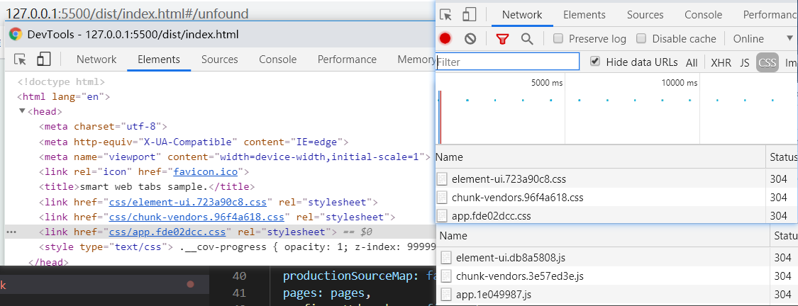
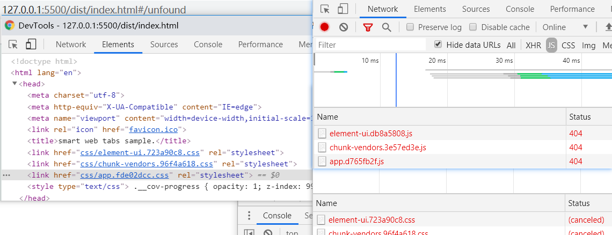
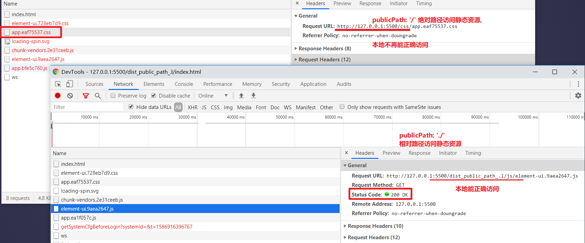

[TOC]

# Vue中使用jsx语法


# React的jsx


# jsx中使用class, decorator


# 打包请求地址为相对路径的包

webpack 配置出口 publicPath 为 './' 测试index.html能否正确加载js和css, 200成功, 304 走缓存;



 

不正确的publicPath (设置为/)设置会导致无法通过相对路径访问静态资源, 使用VSCode插件 live server测试

部分图片被处理成了base64字符串嵌在文档中


# 打包绝对路径



## 一般情况下，通过webpack+vuecli默认打包的css、js等资源，路径都是绝对的。

### 默认配置为

```json
module.exports = {
    ...
    output: {
    path: 'C:\\Users\\191222\\jh\\base\\Vue-cli_demos\\hello-world\\dist',
    filename: 'js/[name].js',
    publicPath: '/',
    chunkFilename: 'js/[name].js'
  },
}
```

```html
dist/index.html
<script src=/js/chunk-vendors.6c3c68e4.js></script>
<script src=/js/app.ca846110.js></script>
live-server src指向js的路径, "/" 是根路径
Request URL: http://127.0.0.1:5501/js/app.ca846110.js ---- 不可正确下载
```

### 修改为相对路径

```js
//vue.config.js
module.exports = {
	publicPath: './'
    //写 output.publicPath 会报错
}
```
```html
dist/index.html
<script src=js/chunk-vendors.6c3c68e4.js></script>
<script src=js/app.51dbc6af.js></script>
live-server src指向js的路径, ''是相对路径
Request URL: http://127.0.0.1:5501/hello-world/dist_publicPath_.l/js/app.51dbc6af.js
前面关联上了文件夹名称后本地可以正确下载对应的js
**本地也可直接打开 html 文件, 正确下载静态资源**
```


# output.publicPath & publicPath

Configuration Error: Avoid modifying webpack output.publicPath directly. Use the "publicPath" option instead. ---- vue-cli 报错

部署应用包时的基本 URL。用法和 webpack 本身的 `output.publicPath` 一致，但是 Vue CLI 在一些其他地方也需要用到这个值，所以**请始终使用 `publicPath` 而不要直接修改 webpack 的 `output.publicPath`**。 ---- [cli 配置文档](https://cli.vuejs.org/zh/config/#publicpath)

默认情况下，Vue CLI 会假设你的应用是被部署在一个**域名的根路径**上，例如 `https://www.my-app.com/`。

如果应用被**部署在一个子路径**上，你就需要用这个选项**指定这个子路径**。例如，如果你的应用被部署在 `https://www.my-app.com/my-app/`，则设置 `publicPath` 为 `/my-app/`。

这个值也可以被设置为空字符串 (`''`) 或是相对路径 (`'./'`)，这样**所有的资源都会被链接为相对路径**，这样打出来的包可以被部署在任意路径，也可以用在类似 Cordova hybrid 应用的文件系统中。


# webpack publicPath -- 公共路径

webpack 提供一个非常有用的配置，该配置能帮助你为项目中的所有资源指定一个基础路径。它被称为`公共路径(publicPath)`。

### 在构建项目时设置路径值

在开发模式中，我们通常有一个 `assets/` 文件夹，它往往存放在和首页一个级别的目录下。这样是挺方便；但是如果在生产环境下，你想把这些静态文件统一使用CDN加载，那该怎么办？

想要解决这个问题，你可以使用有着悠久历史的环境变量。比如说，我们设置了一个名为 `ASSET_PATH` 的变量：

```js
import webpack from 'webpack';

// 如果预先定义过环境变量，就将其赋值给`ASSET_PATH`变量，否则赋值为根目录
const ASSET_PATH = process.env.ASSET_PATH || '/';

export default {
  output: {
    publicPath: ASSET_PATH
  },

  plugins: [
    // 该插件帮助我们安心地使用环境变量
    new webpack.DefinePlugin({
      'process.env.ASSET_PATH': JSON.stringify(ASSET_PATH)
    })
  ]
};
```

### 即时设定路径值

另一个可能出现的情况是，我们需要即时设置公共路径。webpack 提供一个全局变量供你设置，它名叫 `__webpack_public_path__`。所以在你的项目入口，你可以简单地设置如下：

```js
__webpack_public_path__ = process.env.ASSET_PATH;
```

一切设置完成。因为我们已经在我们的配置项中使用了`DefinePlugin`， `process.env.ASSET_PATH` 就已经被定义了， 所以让我们能够安心地使用它了。

------

说实话上面[webpack](https://www.webpackjs.com/guides/public-path/)的文档有点懵逼, 其实还注意到output里面也有一个publicPath, 不知道是不是同一个东西

