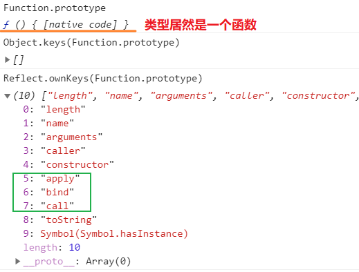
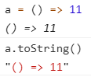

[TOC]


# deepClone

```js
function deepClone(origin, target) {
    
    return target
}
```

作为常考点的原因

	1. 引用值的指针引用
 	2. 递归, 重复引用
 	3. 数据类型, [], Set, Map,  {}(还需要考虑构造函数原型?)
 	4. 完整性思维


# Function.prototype





`call、apply、bind` 本质都是改变 `this` 的指向，

不同点 

- `call、apply` 是直接调用函数，`bind` 是返回一个新的函数。

- `call` 跟 `apply` 就只有参数上不同。

## .call

```js
function.call(thisArg, arg1, arg2, ...)
```

thisArg ---- 可选。在 *`function`* 函数运行时使用的 `this` 值。请注意，`this`可能不是该方法看到的实际值：如果这个函数处于[非严格模式](https://developer.mozilla.org/zh-CN/docs/Web/JavaScript/Reference/Strict_mode)下，则指定为 `null` 或 `undefined` 时会**自动替换为指向全局对象**，**原始值会被包装**

**注意：** 如果没有传递第一个参数，`this` 的值将会被绑定为全局对象。在严格模式下，`this` 的值将会是 `undefined`。

```js
var sData = 'Wisen';

function display() {
  console.log('sData value is %s ', this.sData);
}

display.call();  // sData value is Wisen
// 传入 undefined, null 则 this -> window / undefined
// 如果传入 非 Object 类型, 不报错, 如原始值则会调用包装类后绑定context执行

var length = 10

function display() {
  console.log('length is %s ', this.length);
}

display.call("1");  // length is 1 
```
```js
Function.prototype.mycall = function(thisArg) {
    // 声明一个 Symbol 属性，防止 fn 被占用
    const fn = Symbol('fn')
    const args = [...arguments].slice(1);
    thisArg = thisArg || window;
    // 将调用call函数的对象添加到thisArg的属性中
    thisArg[fn] = this;
    // 执行该属性
    const result = thisArg[fn](...args);	//作为对象方法执行绑定context
    // 删除该属性
    delete thisArg[fn];
    // 返回函数执行结果
    return result;
}

// 考虑包装类
Function.prototype.mycall2 = function(thisArg) {
    const is_null_or_undefined = val => val === null || val === undefined   
    // 声明一个 Symbol 属性，防止 fn 被占用
    const fn = Symbol('fn')
    const args = [...arguments].slice(1);
    if(is_null_or_undefined(thisArg)) {
        thisArg = window
    }else{
        thisArg = Object(thisArg)
    }

    // 将调用call函数的对象添加到thisArg的属性中
    thisArg[fn] = this;
    // 执行该属性
    const result = thisArg[fn](...args);	//作为对象方法执行绑定context
    // 删除该属性
    delete thisArg[fn];
    // 返回函数执行结果
    return result;
}
```


## .apply

fn.apply(context, [arg1, arg2) : fn. returnValue

## .bind

`bind()` 方法创建一个新的函数，在 `bind()` 被调用时，这个新函数的 `this` 被指定为 `bind()` 的第一个参数，而其余参数将作为**新函数的参数，供调用时使用**。

### 语法

```
function.bind(thisArg[, arg1[, arg2[, ...]]])
```

### 参数

- `thisArg`

  调用绑定函数时作为 `this` 参数传递给目标函数的值。 如果使用[`new`](https://developer.mozilla.org/zh-CN/docs/Web/JavaScript/Reference/Operators/new)运算符构造绑定函数，则忽略该值。当使用 `bind` 在 `setTimeout` 中创建一个函数（作为回调提供）时，作为 `thisArg` 传递的任何原始值都将转换为 `object`。如果 `bind` 函数的参数列表为空，执行作用域的 `this` 将被视为新函数的 `thisArg`。

- `arg1, arg2, ...`

  当目标函数被调用时，被预置入绑定函数的参数列表中的参数。

### 返回值

返回一个原函数的拷贝，并拥有指定的 **`this`** 值和**初始参数**。

### Polyfill

```js
// Does not work with `new funcA.bind(thisArg, args)`
if (!Function.prototype.bind) (function(){
  var slice = Array.prototype.slice;
  Function.prototype.bind = function() {
    var thatFunc = this, thatArg = arguments[0];
      // thatArg 可以使用Object包装下第一个参数以支持原始类型的值， 
      // 但是要排除 null & undefined
    var args = slice.call(arguments, 1);	//初始参数
    if (typeof thatFunc !== 'function') {
      // closest thing possible to the ECMAScript 5
      // internal IsCallable function
      throw new TypeError('Function.prototype.bind - ' +
             'what is trying to be bound is not callable');
    }
    return function(){
      var funcArgs = args.concat(slice.call(arguments))	//初始参数与新函数调用参数合并
      return thatFunc.apply(thatArg, funcArgs);
    };
  };
})();
```


### 创建绑定函数

`bind()` 最简单的用法是创建一个函数，不论怎么调用，这个函数都有同样的 **`this`** 值。JavaScript新手经常犯的一个错误是将一个方法从对象中拿出来，然后再调用，期望方法中的 `this` 是原来的对象（比如在回调中传入这个方法）。如果不做特殊处理的话，一般会丢失原来的对象。基于这个函数，**用原始的对象创建一个绑定函数**，巧妙地解决了这个问题：

```js
this.x = 9;    // 在浏览器中，this 指向全局的 "window" 对象
var module = {
  x: 81,
  getX: function() { return this.x; }
};

module.getX(); // 81

var retrieveX = module.getX;
retrieveX();   
// 返回 9 - 因为函数是在全局作用域中调用的

// 创建一个新函数，把 'this' 绑定到 module 对象
// 新手可能会将全局变量 x 与 module 的属性 x 混淆
var boundGetX = retrieveX.bind(module);
boundGetX(); // 81
```

### 偏函数

`bind()` 的另一个最简单的用法是使一个函数拥有**预设的初始参数**。只要将这些参数（如果有的话）作为 `bind()` 的参数写在 `this` 后面。当绑定函数被调用时，这些参数会被插入到目标函数的参数列表的开始位置，传递给绑定函数的参数会跟在它们后面。

```js
function list() {
  return Array.prototype.slice.call(arguments);
}
function addArguments(arg1, arg2) {
    return arg1 + arg2
}

// 创建一个函数，它拥有预设参数列表。
var leadingThirtysevenList = list.bind(null, 37);
var addThirtySeven = addArguments.bind(null, 37); 

var list2 = leadingThirtysevenList(); // [37]
var list3 = leadingThirtysevenList(1, 2, 3); // [37, 1, 2, 3]

var result2 = addThirtySeven(5); // 37 + 5 = 42 
var result3 = addThirtySeven(5, 10);// 37 + 5 = 42 ，第二个参数被忽略
```


### 配合 `setTimeout`

在默认情况下，使用 [`window.setTimeout()`](https://developer.mozilla.org/zh-CN/docs/Web/API/Window/setTimeout) 时，`this` 关键字会指向 [`window`](https://developer.mozilla.org/zh-CN/docs/Web/API/Window) （或 `global`）对象。当类的方法中需要 `this` 指向类的实例时，你可能需要显式地把 `this` 绑定到回调函数，就不会丢失该实例的引用。

```js
function LateBloomer() {
  this.petalCount = Math.ceil(Math.random() * 12) + 1;
}

// 在 1 秒钟后声明 bloom
LateBloomer.prototype.bloom = function() {
  window.setTimeout(this.declare.bind(this), 1000);
};

LateBloomer.prototype.declare = function() {
  console.log('I am a beautiful flower with ' +
    this.petalCount + ' petals!');
};

var flower = new LateBloomer();
flower.bloom();  // 一秒钟后, 调用 'declare' 方法 -- I am a beautiful flower with 10 petals!
```


### 作为构造函数使用的绑定函数

**警告** :这部分演示了 JavaScript 的能力并且记录了 `bind()` 的超前用法。以下展示的方法并不是最佳的解决方案，且可能不应该用在任何生产环境中。

绑定函数自动适应于使用 [`new`](https://developer.mozilla.org/zh-CN/docs/Web/JavaScript/Reference/Operators/new) 操作符去构造一个由目标函数创建的新实例。当一个绑定函数是用来构建一个值的，原来提供的 `this` 就会被忽略。不过提供的参数列表仍然会插入到构造函数调用时的参数列表之前。

```js
function Point(x, y) {
  this.x = x;
  this.y = y;
}

Point.prototype.toString = function() { 
  return this.x + ',' + this.y; 
};

var p = new Point(1, 2);
p.toString(); // '1,2'

var emptyObj = {};
var YAxisPoint = Point.bind(emptyObj, 0/*x*/);

// 本页上方的 polyfill 不支持运行这行代码，
// 但使用原生的 bind 方法运行是没问题的：

var YAxisPoint = Point.bind(null, 0/*x*/);

/*（译注：polyfill 的 bind 方法中，如果把 bind 的第一个参数加上，
即对新绑定的 this 执行 Object(this)，包装为对象，
因为 Object(null) 是 {}，所以也可以支持）*/

var axisPoint = new YAxisPoint(5);
axisPoint.toString(); // '0,5'

axisPoint instanceof Point; // true
axisPoint instanceof YAxisPoint; // true
new YAxisPoint(17, 42) instanceof Point; // true
```


bind + addEventListener

```js
const obj = {
    age: 10
}
const clickF = (cb, event) => {
    // 有预设参数, MouseEvent 传入第二个参数
    console.log(this)
    console.log(event)
    cb(this.age)
}
window.addEventListener('click', clickF.bind(obj, function (inject){	
    // 该匿名函数为 clickF 的预设参数, 
    console.log('this.bind(obj) ->',this)
	console.log(inject)
}), false);

`上面的输出
Window {parent: Window, opener: global, top: Window, length: 0, frames: Window, …}
MouseEvent {isTrusted: true, screenX: 104, screenY: 474, clientX: 104, clientY: 371, …}
this.bind(obj) -> Window {parent: Window, opener: global, top: Window, length: 0, frames: Window, …}
VM349:13 undefined
this -> window 是因为clickF使用了箭头函数, 其内部的this始终指向了外部的window
匿名函数cb中的this指向window, 是因为其调用方式是默认调用的
`

const obj = {
    age: 10
}
const clickF = function (cb, event) {debugger
    // 有预设参数, MouseEvent 传入第二个参数
    console.log(this)
    console.log(event)
    cb(this.age)
}
window.addEventListener('click', clickF.bind(obj, function (inject){	debugger
    // 该匿名函数为 clickF 的预设参数,
    console.log('this.bind(obj) ->',this)
	console.log(inject)
}), false);

`
{age: 10}
MouseEvent {isTrusted: true, screenX: 74, screenY: 442, clientX: 74, clientY: 339, …}
this.bind(obj) -> Window {parent: Window, opener: null, top: Window, length: 0, frames: Window, …}
10
`
```

