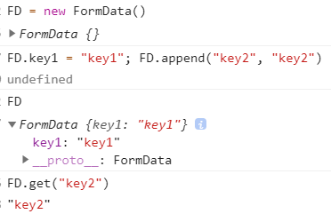

[toc]

# FormData

 1.  **`FormData`** 接口提供了一种表示表单数据的键值对的构造方式，经过它的数据可以使用 [`XMLHttpRequest.send()`](https://developer.mozilla.org/zh-CN/docs/Web/API/XMLHttpRequest/send) 方法送出，本接口和此方法都相当简单直接。如果送出时的编码类型被设为 `"multipart/form-data"`，它会使用和表单一样的格式。

 2.  如果你想构建一个简单的`GET`请求，并且通过[``](https://developer.mozilla.org/zh-CN/docs/Web/HTML/Element/form)的形式带有查询参数，可以将它直接传递给[`URLSearchParams`](https://developer.mozilla.org/zh-CN/docs/Web/API/URLSearchParams)。

     实现了 `FormData` 接口的对象可以直接在[`for...of`](https://developer.mozilla.org/zh-CN/docs/Web/JavaScript/Reference/Statements/for...of)结构中使用，而不需要调用[`entries()`](https://developer.mozilla.org/zh-CN/docs/Web/API/FormData/entries) : `for (var p of myFormData)` 的作用和 `for (var p of myFormData.entries())` 是相同的。

 3.  普通的 . 运算符只能把属性普通的挂载在obj中, 并不能传入到formData中

 4.  FormData 接口

     ```JS
     FormData.prototype = {
         append: ƒ append()
         delete: ƒ delete()
         get: ƒ ()
         getAll: ƒ getAll()
         has: ƒ has()
         set: ƒ ()
         keys: ƒ keys()
         values: ƒ values()
         forEach: ƒ forEach()
         entries: ƒ entries()
         constructor: ƒ FormData()
         Symbol(Symbol.toStringTag): "FormData"
         Symbol(Symbol.iterator): ƒ entries()
         __proto__: Object
     }
     ```


# Vue中的extends & mixins 的区别


# Axios 拦截器

1. params
2. data


# vue-cli3 如何使用插件

调整 webpack 配置最简单的方式就是在 `vue.config.js` 中的 `configureWebpack` 选项提供一个对象：

```js
// vue.config.js
module.exports = {
  configureWebpack: {
    plugins: [
      new MyAwesomeWebpackPlugin()
    ]
  }
}
```

该对象将会被 [webpack-merge](https://github.com/survivejs/webpack-merge) 合并入最终的 webpack 配置。


如果你需要基于环境有条件地配置行为，或者想要直接修改配置，那就换成一个函数 (该函数会在环境变量被设置之后懒执行)。该方法的第一个参数会收到已经解析好的配置。在函数内，你可以直接修改配置，或者返回一个将会被合并的对象：

```js
// vue.config.js
module.exports = {
  configureWebpack: config => {
    if (process.env.NODE_ENV === 'production') {
      // 为生产环境修改配置...
    } else {
      // 为开发环境修改配置...
    }
  }
}
```
