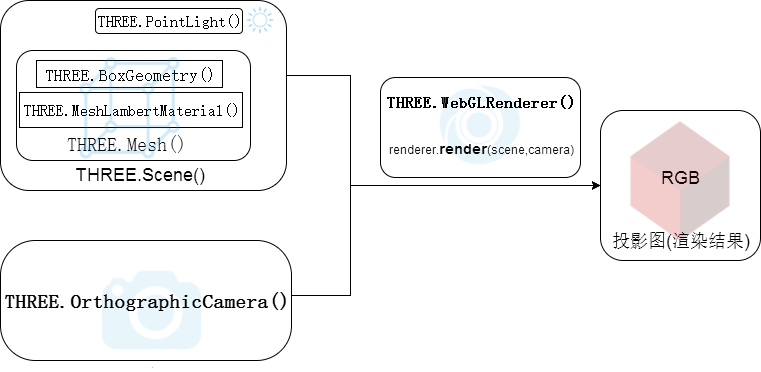
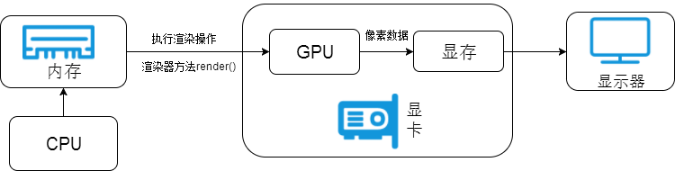

[toc]

# three.js

了解Three.js ---- [链接](http://www.yanhuangxueyuan.com/Three.js/)

Three.js是基于原生WebGL封装运行的三维引擎，在所有WebGL引擎中，Three.js是国内文资料最多、使用最广泛的三维引擎。基于Three.js引擎可以开发Web3D应用

- 物联网(Internet of Things, IoT)3D可视化
- 产品720在线预览
- 数据可视化
  - 海量超大数据的可视化
  - 3D相关的数据可视化
- H5/微信小游戏
- 科教领域
- 机械领域
- WebVR
- 家装室内设计相关
- 三维模型在线预览平台
- 室内逆向全景漫游平台


## three.js demo




# WebGL封装

从WebGL的角度来看，three.js提供的构造函数基本是对原生WebGL的封装，如果你有了WebGL的基础，在学习three.js的很多对象、方法和属性是很容易理解的。在three.js入门教程中不会去过多讲解WebGL的基础知识， 但是为了大家更好的理解three.js的很多命令，与three.js相关的WebGL API知识、GPU渲染管线的知识。图形学可能很多人会觉得比较难，其实主要是算法部分，大家先可以学习一些基本的WebGL知识，初学的时候尽量不关注算法，主要了解顶点数据处理的过程，GPU渲染管线的基本功能单元。实际的工作中如果不是开发3D引擎可能不会使用原生WebGL API，但是学习了这些之后，对于three.js的深度开发学习很有好处，如果你了解你WebGL知识，可以联系绘制函数`drawArrays()`来理解渲染器的渲染操作方法`render()`。




### 场景——相机——渲染器

​	从实际生活中拍照角度或是使用三维渲染软件角度理解本节课的案例代码，立方体网格模型和光照组成了一个虚拟的三维场景,相机对象就像你生活中使用的相机一样可以拍照，

只不过一个是拍摄真实的景物，一个是拍摄虚拟的景物，拍摄一个物体的时候**相机的位置和角度需要设置**，虚拟的**相机还需要设置投影方式**，当你创建好一个三维**场景**，**相机**也设置好，就差一个动作“咔”，**通过渲染器就可以执行拍照动作**。


案例源码分别使用构造函数`THREE.Scene()`、`THREE.OrthographicCamera()`、`THREE.WebGLRenderer()`创建了场景、相机、渲染器三个最顶层的总对象，然后通过总对象的子对象、方法和属性进行设置， 

**相机对象和渲染对象相对简单，最复杂的是*场景对象***，

`new THREE.Mesh(box,material);`使用构造函数`Mesh()`创建了一个**网格模型对象**，该对象把上面两行含有顶点位置信息的**几何体对象**和含有颜色信息的**材质对象** **作为参数**，
网格模型创建好之后， 需要使用**场景对象**的方法`.add()`把**三维场景的子对象添加到场景中**，
`new THREE.PointLight(0xffffff);`、`new THREE.AmbientLight(0x444444);`定义了两个点光源、环境光对象，然后作为场景的子对象插入场景中。
 场景、相机、渲染器设置完成后，设置代码`renderer.render(scene,camera)`把**场景、相机对象**作为渲染器对象方法`render()`的参数，这句代码的意义相当于告诉浏览器根据相机的放置方式*拍摄*已经创建好的三维场景对象。


# requestAnimationFrame

为了更好的利用浏览器渲染，可以使用函数`requestAnimationFrame()`代替`setInterval()`函数，兼容性好

`requestAnimationFrame()`参数是将要被调用函数的函数名，`requestAnimationFrame()`调用一个函数不是立即调用而是向浏览器发起一个执行某函数的请求， 什么时候会执行由浏览器决定，一般默认保持60FPS的频率，大约每16.7ms调用一次`requestAnimationFrame()`方法指定的函数，60FPS是理想的情况下，如果渲染的场景比较复杂或者说硬件性能有限可能会低于这个频率。

**`window.requestAnimationFrame()`** 告诉浏览器——你希望执行一个动画，并且要求**浏览器在下次重绘之前**调用指定的回调函数更新动画。该方法需要传入一个回调函数作为参数，该回调函数会在浏览器下一次重绘之前执行

**注意：若你想在浏览器下次重绘之前继续更新下一帧动画，那么回调函数自身必须再次调用`window.requestAnimationFrame()`**

回调函数执行次数通常是每秒60次，但在大多数遵循W3C建议的浏览器中，回调函数执行次数通常与浏览器屏幕刷新次数相匹配。为了提高性能和电池寿命，因此在大多数浏览器里，当`requestAnimationFrame()` 运行在后台标签页或者隐藏的[`iframe`](https://developer.mozilla.org/zh-CN/docs/Web/HTML/Element/iframe) 里时，`requestAnimationFrame()` 会被暂停调用以提升性能和电池寿命。

```js
int counter = window.requestAnimationFrame(callback);
```

callback ---- 下一次重绘之前更新动画帧所调用的函数(即上面所说的回调函数)。该回调函数**会被传入[`DOMHighResTimeStamp`](https://developer.mozilla.org/zh-CN/docs/Web/API/DOMHighResTimeStamp)参数**，该参数与[`performance.now()`](https://developer.mozilla.org/zh-CN/docs/Web/API/Performance/now)的返回值相同，它表示`requestAnimationFrame()` 开始去**执行回调函数的时刻**。

返回值counter, 可以传入给 [`window.cancelAnimationFrame()`](https://developer.mozilla.org/zh-CN/docs/Web/API/Window/cancelAnimationFrame) 以取消回调函数。

在实际执行程序的时候，可能`requestAnimationFrame(render)`请求的函数并**不一定能按照理想的60FPS频率执行**，两次执行渲染函数的时间间隔也不一定相同，


Some Words

​		Scene 				场景

​		Geometry 	 	几何

​		Mesh			网格

​		Light		光源

​		Ambient  	周围

​		Ray			射线

​		cast			投射 

​		Raycaster	光线投射

​		tile			瓦

​		Texture		质地

​		Curve		曲线

​		vertices		顶点
