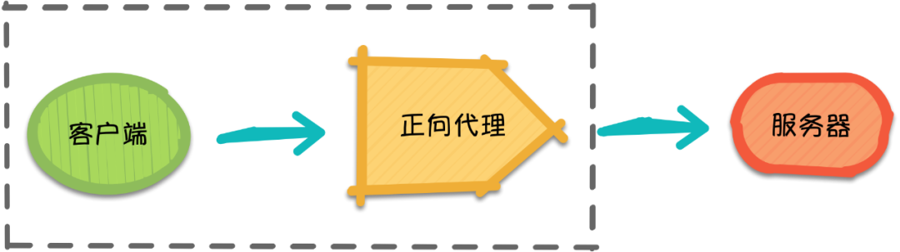
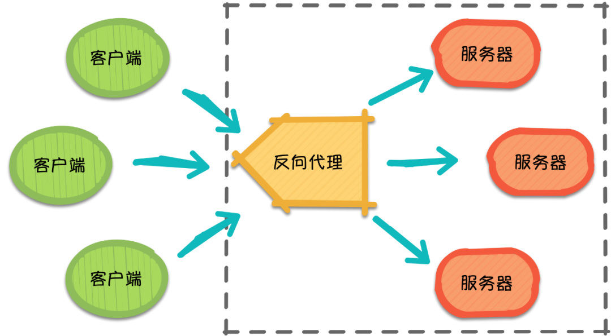

[toc]

# 负载均衡

负载均衡（Load Balance），它在网络现有结构之上可以提供一种廉价、有效、透明的方法来扩展网络设备和服务器的带宽，并可以在一定程度上增加吞吐量、加强网络数据处理能力、提高网络的灵活性和可用性等。用官网的话说，它充当着网络流中“交通指挥官”的角色，“站在”服务器前处理所有服务器端和客户端之间的请求，从而最大程度地提高响应速率和容量利用率，同时确保任何服务器都没有超负荷工作。如果单个服务器出现故障，负载均衡的方法会将流量重定向到其余的集群服务器，以保证服务的稳定性。当新的服务器添加到服务器组后，也可通过负载均衡的方法使其开始自动处理客户端发来的请求。详情可参考：[**What Is Load Balancing?**](https://www.Nginx.com/resources/glossary/load-balancing/)

简言之，负载均衡实际上就是将大量请求进行分布式处理的策略

## nginx负载均衡 [政采云](https://mp.weixin.qq.com/s?__biz=MzI0MzIyMDM5Ng==&mid=2649826790&idx=1&sn=0149616b68e7cb7ebd35290a87c55a18&chksm=f175ef25c60266331f499e95b1fff9bb58948873678e7073bf59a2c9a92dfd882128bdb05a49&mpshare=1&scene=1&srcid=&sharer_sharetime=1587519293924&sharer_shareid=28111eed9c6e4b12f49acffd2992703e&key=adf57a600876c22c8c16000f69d8618c0d7e23d87d57ce47b85913c14cbbcd59dd6b96a23fd76454f580aee234dac87724d024703a1f81c4c99635b53748496f23b9278ba639e5a07188e99e00707fe3&ascene=1&uin=MTgzNDQ0NjEyNw%3D%3D&devicetype=Windows+10&version=62080085&lang=zh_CN&exportkey=A6aAB%2BRB5w07UPsv63rnMhE%3D&pass_ticket=s5Yrd%2BSBpiB9naTEsPfafTTQvk9bcZikTJGYW4Yi85i7z9G3AxLLQqzpZ4pH3M9f)

Nginx 又是什么呢？Nginx 如何实现负载均衡？这就要从正向代理和反向代理说起了。

### 正向代理

正向代理（Forward Proxy）最大的特点是，客户端非常明确要访问的服务器地址，它代理客户端，替客户端发出请求

- 假设客户端想要访问 Google，它明确知道待访问的服务器地址是 https://www.google.com/，但由于条件限制，它找来了一个能够访问到 Google 的”朋友”：代理服务器。
- 客户端把请求发给代理服务器，由代理服务器代替它请求 Google，最终再将响应返回给客户端。这便是一次正向代理的过程，该过程中服务器并不知道真正发出请求的是谁。
- 客户端把请求发给代理服务器，**由代理服务器代替它请求 Google**，最终再将响应返回给客户端。
  - 这个过程有点像前端的devServer的开发代理
- 这便是一次正向代理的过程，该过程中服务器并不知道真正发出请求的是谁。

### 反向代理

随着请求量的爆发式增长，服务器觉得自己一个人始终是应付不过来，需要兄弟服务器们帮忙，于是它喊来了自己的兄弟以及代理服务器朋友。此时，来自**不同客户端的所有请求实际上都发到了代理服务器处**，再由**代理服务器按照一定的规则将请求分发给各个服务器**。

这就是反向代理（Reverse Proxy），反向代理隐藏了服务器的信息，它代理的是服务器端，代其接收请求。换句话说，反向代理的过程中，客户端并不知道具体是哪台服务器处理了自己的请求。如此一来，既提高了访问速度，又为安全性提供了保证。

反向代理需要考虑的问题是，如何进行均衡分工，控制流量，避免出现局部节点负载过大的问题。通俗的讲，就是如何为每台服务器合理的分配请求，使其整体具有更高的工作效率和资源利用率。

### nginx

Nginx 作为一个基于 C 实现的高性能 **Web 服务器**，可以通过系列算法**解决上述的负载均衡问题**。并且由于它具有高并发、高可靠性、高扩展性、开源等特点，成为开发人员常用的反向代理工具。

## 负载均衡常用算法

### **轮询 （round-robin）**

### **加权轮询**

###  **IP 哈希（IP hash）**

### **其他算法**

	- URL hash
	- 最小连接数（Least Connections）

