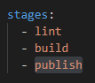
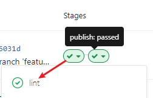

[TOC]

# Reflect

reflect仅仅是把一些操作做了一个整合


# 为什么要有Reflect


# CI:[Gitlab-ci: 从零开始的前端自动化部署](https://mp.weixin.qq.com/s?__biz=MzI0MzIyMDM5Ng==&mid=2649829782&idx=1&sn=966123aa26a2c76c349e8aae40e61513&chksm=f175fb55c602724324c781549371e2fea1605fcf5718225e3d6c10c3b4d69acfcbb00a201b6a&scene=126&sessionid=1599466004&key=46b8c66d5abbe49cc669ac31dedf65085e33f78d2b28c0c97027d336b1bdbc3f6a734f75e3f7618ca17114d932face9e8fb2b042a026f85f83b7fb2576558bc3871b30590d11b22298614f7cb2eeab1c67026ad8d8494729778f8ec8ea7b0872525d82a529a6f3d85cab49e877761074fe88f6d8873da8ae87b53e596d264f83&ascene=1&uin=MTgzNDQ0NjEyNw%3D%3D&devicetype=Windows+10+x64&version=62090529&lang=zh_CN&exportkey=A3XNR%2BOZBZD9sInsJpn845s%3D&pass_ticket=9XTRvdFUu9wdQPmao2ztPa8i1P8y0LZIk%2BbUk6wyvQD1rltobYJYEDEuSXxa3YyQ&wx_header=0)/DI

https://about.gitlab.com/stages-devops-lifecycle/continuous-integration/

GitLab Continuous Integration (CI) & Continuous Delivery (CD)

GitLab CI/CD pipelines build, test, deploy, and monitor your code as part of a single, integrated workflow

**Continuous Integration (持续集成)**是合并开发人员正在生产的所有代码的一种做法。 合并通常一天在共享存储库中进行几次。 从存储库或生产环境中进行构建和自动化测试，以确保没有集成问题并及早发现任何问题。

**Continuous Delivery(持续交付)**补充通常可以通过自动将更改推送到登台系统来随时将软件发布到生产环境中。
**Continuous Deployment (持续部署)**会更进一步，并自动将更改推向生产环境。


## Why your team needs a CI/CD workflow

### Continuous Integration

- **Detects errors as quickly as possible:** fix problems while fresh in developers mind
- **Reduces integration problems:** smaller problems are easier to digest
- **Avoid compounding problems:** allows teams to develop faster, with more confidence

### Continuous Delivery

- **Ensures every change is releasable:** test everything, including deployment, before calling it done
- **Lowers risk of each release:** makes releases “boring”
- **Delivers value more frequently:** reliable deployments mean more releases
- **Tight customer feedback loops:** fast and frequent customer feedback on changes


## ci配置与提现

 .gitlab-ci.yml 中配置stages的选项

 gitlab~project~CI/CD~pineline~stages


## gitlab-ci && 自动化部署工具的运行机制

以gitlab-ci为例：

(1) 通过在项目根目录下配置**.gitlab-ci.yml**文件，可以控制ci流程的不同阶段，例如install/检查/编译/部署服务器。gitlab平台会扫描.gitlab-ci.yml文件，并据此处理ci流程

```yaml
stages:
 - install
 - eslint
 - build
 - deploy
```

(2) ci流程在每次团队成员**push/merge**后之后触发。每当你push/merge一次，gitlab-ci都会检查项目下有没有.gitlab-ci.yml文件，如果有，它会执行你在里面编写的脚本，并完整地走一遍从**intall =>** **eslint检查=>编译 =>部署服务器**的流程

(3)gitlab-ci提供了指定ci运行平台的机制，它提供了一个叫**gitlab-runner**的软件，只要在对应的平台(机器或docker)上下载并运行这个命令行软件，并输入**从gitlab交互界面获取的token**,就可以把当前机器和对应的gitlab-ci流程绑定，也即：每次**跑ci都在这个平台上进行**。

(4).gitlab-ci的所有流程都是可视化的，每个流程节点的状态可以在gitlab的交互界面上看到，包括执行成功或失败。如下图所示,因为它的执行看上去就和多节管道一样，所以我们通常用“pipeLine”来称呼它

(5).不同push/merge所触发的CI流程不会互相影响，也就是说，你的一次push引发的CI流程并不会因为接下来另一位同事的push而阻断，它们是互不影响的。这一个特点方便让测试同学根据不同版本进行测试。

(6)pipeline不仅能被动触发，也是可以手动触发的。


# Performance

测试函数执行的时间空间消耗


# 正则&字符串

什么时候会获取到组匹配?

