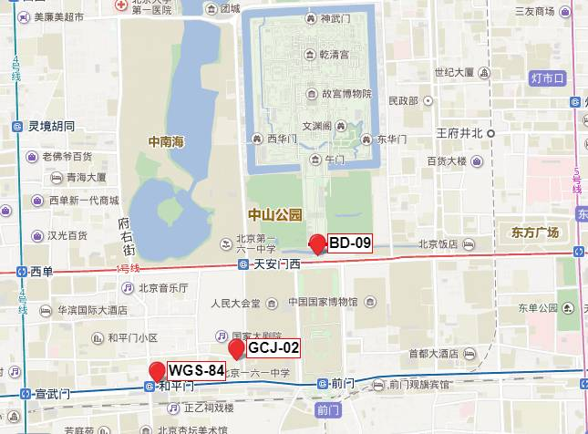

[toc]

# POI

[高德API文档](https://lbs.amap.com/api/webservice/guide/api/search)

axios 如何解决跨域问题

地理坐标系

[https://github.com/hujiulong/gcoord/wiki/%E5%9C%B0%E7%90%86%E5%9D%90%E6%A0%87%E7%B3%BB](https://github.com/hujiulong/gcoord/wiki/地理坐标系)

高德地图POI接口获取的经纬度如何转化为三维空间里面的坐标

坐标系转换

https://github.com/hujiulong/gcoord#crs

GCJ-02=》wgs84=>三维空间坐标。

转换后还是会有偏移怎么处理

## 为什么需要转换坐标系？

因为国内对地理坐标有特殊的政策，所有电子地图必须对位置做偏移处理，这导致了从底层接口得到的经纬度坐标展示在地图上会有偏移。

## 关于坐标系

我们通常用经纬度来表示一个地理位置，但是由于一些原因，我们从不同渠道得到的经纬度信息可能并不是在同一个坐标系下。

- 高德地图、腾讯地图以及谷歌中国区地图使用的是**GCJ-02**坐标系
- 百度地图使用的是**BD-09**坐标系
- 底层接口(HTML5 Geolocation或ios、安卓API)通过GPS设备获取的坐标使用的是**WGS-84**坐标系

不同的坐标系之间可能有**几十到几百米的偏移**，所以在开发基于地图的产品，或者做地理数据可视化时，我们需要**修正不同坐标系之间的偏差**。

### WGS-84 - 世界大地测量系统

WGS-84（World Geodetic System, WGS）是使用最广泛的坐标系，也是世界通用的坐标系，GPS设备得到的经纬度就是在WGS84坐标系下的经纬度。通常通过底层接口得到的定位信息都是WGS84坐标系。

### GCJ-02 - 国测局坐标

GCJ-02（G-Guojia国家，C-Cehui测绘，J-Ju局），又被称为**火星坐标系**，是一种基于WGS-84制定的大地测量系统，由中国国测局制定。此坐标系所采用的混淆算法会在经纬度中加入随机的偏移。

国家规定，**中国大陆所有公开地理数据都需要至少用GCJ-02进行加密**，也就是说我们从国内公司的产品中得到的数据，一定是经过了加密的。绝大部分国内互联网地图提供商都是使用GCJ-02坐标系，包括高德地图，谷歌地图中国区等。

### BD-09 - 百度坐标系

BD-09（Baidu, BD）是百度地图使用的地理坐标系，其在GCJ-02上多增加了一次变换，用来保护用户隐私。从百度产品中得到的坐标都是BD-09坐标系。

### 相互转换

GCJ-02和BD-09都是用来对地理数据进行加密的，所以也不会公开逆向转换的方法。理论上，GCJ-02的加密过程是不可逆的，但是可以通过一些方法来逼近接原始坐标，并且这种方式的精度很高。gcoord使用的纠偏方式达到了厘米级的精度，能满足绝大多数情况。

### CRS

CRS为坐标系，目标支持以下几种坐标系

| CRS                                                      | 坐标格式  | 说明                                                         |
| -------------------------------------------------------- | --------- | ------------------------------------------------------------ |
| gcoord.WGS84 / gcoord.WGS1984 / gcoord.EPSG4326          | [lng,lat] | WGS-84坐标系，GPS设备获取的经纬度坐标                        |
| gcoord.GCJ02 / gcoord.AMap                               | [lng,lat] | GCJ-02坐标系，google中国地图、soso地图、aliyun地图、mapabc地图和高德地图所用的经纬度坐标 |
| gcoord.BD09 / gcoord.BMap / gcoord.Baidu / gcoord.BD09LL | [lng,lat] | BD-09坐标系，百度地图采用的经纬度坐标                        |
| gcoord.BD09LL                                            | [lng,lat] | 同BD09                                                       |
| gcoord.BD09MC                                            | [x,y]     | BD-09米制坐标，百度地图采用的米制坐标，单位：米              |
| gcoord.BD09Meter                                         | [x,y]     | 同BD09MC                                                     |
| gcoord.Baidu                                             | [lng,lat] | 百度坐标系，BD-09坐标系别名，同BD-09                         |
| gcoord.BMap                                              | [lng,lat] | 百度地图，BD-09坐标系别名，同BD-09                           |
| gcoord.AMap                                              | [lng,lat] | 高德地图，同GCJ-02                                           |
| gcoord.WebMercator / gcoord.EPSG3857 / gcoord.EPSG900913 | [x,y]     | Web Mercator投影，墨卡托投影，同EPSG3857，单位：米           |
| gcoord.WGS1984                                           | [lng,lat] | WGS-84坐标系别名，同WGS-84                                   |
| gcoord.EPSG4326                                          | [lng,lat] | WGS-84坐标系别名，同WGS-84                                   |
| gcoord.EPSG3857                                          | [x,y]     | Web Mercator投影，同WebMercator，单位：米                    |
| gcoord.EPSG900913                                        | [x,y]     | Web Mercator投影，同WebMercator，单位：米                    |

| CRS                                                      | 坐标格式  | 说明                                                         |
| -------------------------------------------------------- | --------- | ------------------------------------------------------------ |
| WGS84 / WGS1984 / EPSG4326          | [lng,lat] | WGS-84坐标系，GPS设备获取的经纬度坐标                        |
| GCJ02 / AMap                               | [lng,lat] | GCJ-02坐标系，google中国地图、soso地图、aliyun地图、mapabc地图和高德地图所用的经纬度坐标 |
| BD09 / BMap / Baidu / BD09LL | [lng,lat] | BD-09坐标系，百度地图采用的经纬度坐标                        |
| BD09MC / BD09Meter                                       | [x,y]     | BD-09米制坐标，百度地图采用的米制坐标，单位：米              |
| WebMercator / EPSG3857 / EPSG900913 | [x,y]     | Web Mercator投影，墨卡托投影，同EPSG3857，单位：米           |

proj4js中使用的坐标系转换

- 'EPSG：4326'，具有以下别名
  - 'WGS84'
- 'EPSG：4269'
- 'EPSG：3857'，具有以下别名
  - 'EPSG：3785'
  - '谷歌'
  - 'EPSG：900913'
  - 'EPSG：102113'
