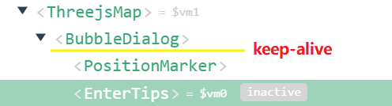

[toc]

### Vue的父组件怎么监听到子组件的mount钩子

### 什么声明阶段之后能否在 $refs 中访问子组件,

- 已知 created 钩子阶段不可访问
- 已知 mounted 钩子阶段之后可访问 ---- 之前都不可访问

### 动态组件

​	component :is="currentComponentName"

切换 is 组件会重新走一趟声明周期函数

使用keep-alive抽象组件花村状态

Vue 如何在生命钩子函数/钩子事件中传递参数给父组件呢

为什么 wheel/mousewheel 事件不能在自己上面触发回调呢?

使用capture模式就可以正确触发回调
