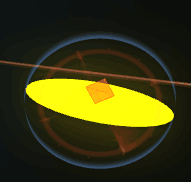

[toc]

### 图片纹理设置贴合

墙体的半径跟圆同步了
三个圆设置了半径都是相同的, 里面的纹理没有完全包裹； 

！ 是因为图片本身像素的问题， 

纹理 ~ 图片 像素对应， 图片圆圈四周有空白的像素点所以就有空隙

tweenjs 运动函数

`Quad`, `Cubic`等等都是经典的动画运动算法名称，完整列表如下：

1. **Linear**：线性匀速运动效果； （Linear.None)
2. **Quadratic**：二次方的缓动（t^2）；
3. **Cubic**：三次方的缓动（t^3）；
4. **Quartic**：四次方的缓动（t^4）；
5. **Quintic**：五次方的缓动（t^5）；
6. **Sinusoidal**：正弦曲线的缓动（sin(t)）；
7. **Exponential**：指数曲线的缓动（2^t）；
8. **Circular**：圆形曲线的缓动（sqrt(1-t^2)）；
9. **Elastic**：指数衰减的正弦曲线缓动；
10. **Back**：超过范围的三次方缓动（(s+1)*t^3 – s*t^2）；
11. **Bounce**：指数衰减的反弹缓动。

每个效果都分三个缓动方式，分别是：

- **easeIn**：从0开始加速的缓动，也就是先慢后快；
- **easeOut**：减速到0的缓动，也就是先快后慢；
- **easeInOut**：前半段从0开始加速，后半段减速到0的缓动。

使用案例

`TWEEN.Easing.Quadratic.InOut` `TWEEN.Easing.Quadratic.Out` `TWEEN.Easing.Quadratic.In`

