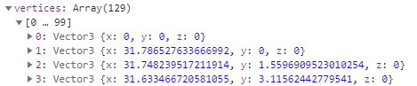

[TOC]


# geometry&bufferGeometry有什么不同

## Geometry (segments =128)


### vertices: 顶点位置数据



圆形 : 顶点数 = 圆心 + segments 

### faceVertexUvs: 顶点纹理坐标

### faces:几何体三角形信息


## BufferGeometry (segments = 128)


### attributes.position 顶点位置数据


咦, 为什么count 比segments 多二

### geometry.attributes.normal 保存模型中每个顶点处的面或顶点法向量的x, y, 和 z 分量。

#### geometry.attributes.uv保存模型中UV坐标信息. 


### geometry.index 顶点索引数据


简单的点说`BufferGeometry`和`Geometry`对象的数据结构不同，但是都可以用来描述几何体的顶点信息。 存储的数据类型也不一样, BufferGeometry数据大多都是**TypedArray 视图**.

缓冲类型几何体`BufferGeometry`相比普通几何体`Geometry`性能更好。

### 渲染过程

在执行WebGL渲染器`WebGLRenderer`渲染方法`.render()`的时候，渲染器会对场景和相机进行解析渲染，解析场景Scene自然会解析场景中模型对应的几何体对象Geometry。关于渲染器是如何解析渲染场景和相机对象的，在《Three.js进阶视频教程》中进行了介绍和讲解，有兴趣可以详细了解，这里不再展开详述，这里只说和几何体相关的内容。

Three.js渲染器在解析几何体对象的时候，如果几何体对象是普通几何体对象`Geometry`，Three.js的WebGL渲染器会把普通几何体对象`Geometry`转化为缓冲类型几何体对象`BufferGeometry`，然后再提取 `BufferGeometry`包含的顶点信息，这里可以看出来直接使用`BufferGeometry`解析的时候相对`Geometry`少了一步，自然性能更高一些。不过从开发者使用的角度来看，`Geometry`可能对程序员更友好一些。


# BufferGeometry

缓冲区类型几何体`BufferGeometry`是Three.js的核心类之一，立方体`BoxBufferGeometry`、圆柱体`CylinderBufferGeometry`、球体`SphereBufferGeometry`等几何体类的基类都是`BufferGeometry`。

`BufferGeometry`对原生WebGL中的顶点位置、顶点纹理坐标UV、顶点颜色、顶点法向量、顶点索引等顶点数据进行了封装，如果你有原生WebGL基础，你看下文档，阅读下Three.js源码其实很容易理解，如果没有原生WebGL基础建立学习下本站的WebGL视频教程，关于`BufferGeometry`的内容可以本站发布的Three.js视频教程第二章。

### `BufferGeometry`自定义一个几何体

立方体`BoxBufferGeometry`、圆柱体`CylinderBufferGeometry`、球体`SphereBufferGeometry`等几何体类都包含了特定的生成该几何体形状所有顶点数据的算法，有兴趣可以去阅读相关的源码，这里简单展示下如果通过基类`BufferGeometry`自定义一个几何体。

```JavaScript
//创建一个缓冲类型的几何体对象
var geo = new THREE.BufferGeometry();
//类型数组创建顶点数据  数组中包含6个顶点的xyz坐标数据
var verArr = new Float32Array([
  1, 2, 3,
  49, 2, 4,
  -1, 99, -1,
  1, 1, 9,
  6, 5, 108,
  48, 1, 3,
]);
//三个为一组，表示一个顶点坐标
var BufferAttribute = new THREE.BufferAttribute(verArr, 3);
// 设置几何体的顶点位置数据
geo.attributes.position = BufferAttribute;
```

上面同样一个几何体，如果你创建不同的模型，可以渲染出来不同的效果，这里之所以说着一点，也是为了让你理解顶点指的是什么。

网格模型：三角形渲染模式，没有顶点索引数据复用顶点的情况下，每个三角形包含三个顶点，上面6个顶点可以渲染两个三角形。

```JavaScript
// 三角面(网格)渲染模式
var material = new THREE.MeshPhongMaterial({
  color: 0x1111ff, //三角面颜色
  side: THREE.DoubleSide //两面可见
});
var mesh = new THREE.Mesh(geometry, material);
```

线模型：线渲染模式，两点确定一条直线

```JavaScript
// 线条渲染模式
var material=new THREE.LineBasicMaterial({color:0xff0000});
//线条模型对象
var line=new THREE.Line(geo,material);
```

点模型：点渲染模式，6个顶点渲染出来6个方形点

```JavaScript
var material = new THREE.PointsMaterial({
  color: 0xff1133,
  size: 6.0 //点对象像素尺寸
});
 //点模型对象
var points = new THREE.Points(geo, material);
```

### `.attributes`属性

three.js提供的`BufferAttribute`类用于创建一个表示一组同类顶点数据的对象，可以用`BufferAttribute`。

几何体的`.attributes`属性是除了顶点索引数据以外所有顶点数据的集合，

1. `.attributes.position` 表示顶点位置坐标数据，
2. `.attributes.uv`表示顶点纹理坐标UV数据，
3. `.attributes.normal`表示顶点法向量数据，所有的类型的顶点数据都是一一对应的。
4. `.attributes.position`、`.attributes.uv`、`.attributes.normal`的属性值都是`BufferAttribute`对象。

### `.index`属性

`.index`属性的值是**顶点索引数据构成的`BufferAttribute`对象**，如果你有一定的原生WebGL基础，应该知道顶点索引的功能是复用顶点数据，比如一定矩形有一个顶点，如果不设置顶点索引，需要至少6个顶点才能绘制**两个三角形**组合出来一个矩形，如果定义顶点索引数据，重合的两个顶点可以复用顶点数据，只需要顶点4个顶点坐标即可。

6个顶点定义一个矩形

```JavaScript
//类型数组创建顶点位置position数据
var vertices = new Float32Array([
  10, 10, 10,   //顶点1位置
  90, 10, 10,  //顶点2位置
  90, 90, 10, //顶点3位置

  10, 10, 10,   //顶点4位置   和顶点1位置相同
  90, 90, 10, //顶点5位置  和顶点3位置相同
  10, 90, 10,  //顶点6位置
]);
var attribue = new THREE.BufferAttribute(vertices, 3);
geometry.attributes.position = attribue
```

4个顶点定义一个矩形

```JavaScript
var geometry = new THREE.BufferGeometry();
var vertices = new Float32Array([
  10, 10, 10, //顶点1位置
  90, 10, 10, //顶点2位置
  90, 90, 10, //顶点3位置
  10, 90, 10, //顶点4位置
]);
var attribue = new THREE.BufferAttribute(vertices, 3);
geometry.attributes.position = attribue

// Uint16Array类型数组创建顶点索引数据,如果顶点数量更多可以使用Uint32Array来创建顶点索引数据的类型数组对象
var indexes = new Uint16Array([
  0, 1, 2, 0, 2, 3,
])
// 索引数据赋值给几何体的index属性
geometry.index = new THREE.BufferAttribute(indexes, 1);
```

### `.addAttribute()`方法

`.addAttribute()`方法执行的时候，本质上是改变的`.attributes`属性，`.attributes`属性可以直接设置`.attributes.position`、`.attributes.uv`等属性，也可以通过`.addAttribute()`方法设置。

直接设置`.attributes.position`

```JavaScript
geometry.attributes.position = new THREE.BufferAttribute(vertices, 3)
```

通过`.addAttribute()`方法设置`.attributes.position`等顶点属性值

```JavaScript
geometry.addAttribute('position',new THREE.BufferAttribute(vertices,3));
geometry.addAttribute('normal',new THREE.BufferAttribute(normals,3));
geometry.addAttribute('uv',new THREE.BufferAttribute(uvs,2));
```

### 方法`.fromGeometry()`

通过`.fromGeometry()`方法可以把一个几何体`Geometry`转化为一个缓冲类型几何体`BufferGeometry`。

```JavaScript
var box = new THREE.BoxGeometry()
var BufferBox = new THREE.BufferGeometry()
BufferBox.fromGeometry(box)
```

### Three.js渲染器解析`BufferGeometry`

Three.js渲染器在渲染场景的时候，会从缓冲类型几何体对象`BufferGeometry`中提取顶点位置、法向量、颜色、索引等数据，然后调用WebGL相关原生API创建顶点缓冲区，这样GUP可以读取顶点数据在顶点着色器中进行逐顶点计算处理。关于WebGL渲染器`WebGLRenderer`如何解析`BufferGeometry`对象的，可以查看/src/renderers/webgl目录下的`WebGLAttributes.js`、`WebGLGeometries.js`等文件。


## TypeArray 数组方法

普通数组的操作方法和属性，对 TypedArray 数组完全适用。

- `TypedArray.prototype.copyWithin(target, start[, end = this.length])`
- `TypedArray.prototype.entries()`
- `TypedArray.prototype.every(callbackfn, thisArg?)`
- `TypedArray.prototype.fill(value, start=0, end=this.length)`
- `TypedArray.prototype.filter(callbackfn, thisArg?)`
- `TypedArray.prototype.find(predicate, thisArg?)`
- `TypedArray.prototype.findIndex(predicate, thisArg?)`
- `TypedArray.prototype.forEach(callbackfn, thisArg?)`
- `TypedArray.prototype.indexOf(searchElement, fromIndex=0)`
- `TypedArray.prototype.join(separator)`
- `TypedArray.prototype.keys()`
- `TypedArray.prototype.lastIndexOf(searchElement, fromIndex?)`
- `TypedArray.prototype.map(callbackfn, thisArg?)`
- `TypedArray.prototype.reduce(callbackfn, initialValue?)`
- `TypedArray.prototype.reduceRight(callbackfn, initialValue?)`
- `TypedArray.prototype.reverse()`
- `TypedArray.prototype.slice(start=0, end=this.length)`
- `TypedArray.prototype.some(callbackfn, thisArg?)`
- `TypedArray.prototype.sort(comparefn)`
- `TypedArray.prototype.toLocaleString(reserved1?, reserved2?)`
- `TypedArray.prototype.toString()`
- `TypedArray.prototype.values()`

---- ps 没有splice, 没有`concat`方法


# 扩散圆圈的性能问题

原代码

 创建并替换原有的geometry示例

新代码


update中的代码尽量的少切不要做复杂计算,

mesh 为圆环缓冲几何体

update中更新透明度和scale

