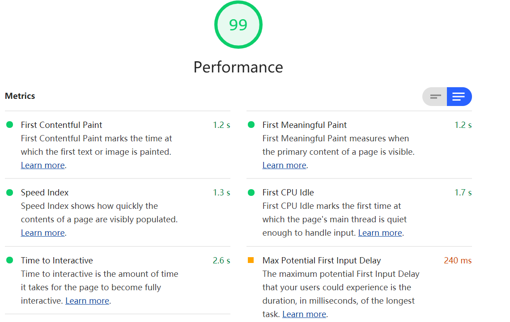

[toc]

### [性能监控](https://juejin.im/post/5ee2d28a6fb9a047942f3b17)

**Q:请教清音：类似app内嵌的h5页面，是否适用onbeforeunload？
A:也可以由jsbridge暴露离开事件供调取；**

#### 什么是JSBridge

### 类型化数组

JavaScript类型化数组是一种类似数组的对象，并提供了一种用于访问原始二进制数据的机制。 正如你可能已经知道，[`Array`](https://developer.mozilla.org/zh-CN/docs/Web/JavaScript/Reference/Array) 存储的对象能动态增多和减少，并且可以存储任何JavaScript值。JavaScript引擎会做一些内部优化，以便对数组的操作可以很快。然而，随着Web应用程序变得越来越强大，尤其一些新增加的功能例如：音频视频编辑，访问WebSockets的原始数据等，很明显有些时候如果使用JavaScript代码可以快速方便地通过类型化数组来操作原始的二进制数据将会非常有帮助。

但是，不要把类型化数组与正常数组混淆，因为在类型数组上调用  [`Array.isArray()`](https://developer.mozilla.org/zh-CN/docs/Web/JavaScript/Reference/Global_Objects/Array/isArray) 会返回`false`。此外，并不是所有可用于正常数组的方法都能被类型化数组所支持（如 push 和 pop）。

## 谷歌调试工具Lighthouse 有什么用?

test-url: https://www.mozilla.org/en-US/firefox/developer/

指标

1. First Contentful Paint

   First Contentful Paint marks the time at which the first text or image is painted. 

   第一个文本或图像的绘制时间

2. First Meaningful Paint

   First Meaningful Paint measures when the primary content of a page is visible.

   页面的主要内容何时可见

3. Speed Index
   Speed Index shows how quickly the contents of a page are visibly populated.

   页面内容的可见填充速度

4. First CPU Idle (空闲)
   First CPU Idle marks the first time at which the page's main thread is quiet enough to handle input.

   页面主线程第一次安静到足以处理输入的时间

5. Time to Interactive (交互)

   Time to interactive is the amount of time it takes for the page to become fully interactive.

6. Max Potential First Input Delay (最大潜在优先输入延迟)
   The maximum potential First Input Delay that your users could experience is the duration, in milliseconds, of the longest task.

   用户可能会遇到的最大潜在“首次输入延迟”是最长任务的持续时间（以毫秒为单位）。

   