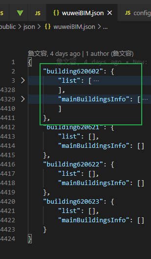
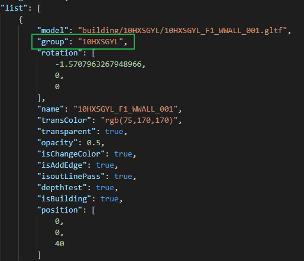
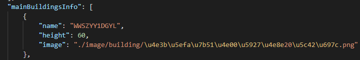

[toc]

## 请求的.obj数据如何做成模型

mounted ~ addModel

```js
LayerManager()
LayerManager().init()
	CutstomMaterial.getBuildingMaterial()
	//...filterGroupName from modelList
	LayerManager().addModel()
		MTLLoader().load(materialUrl, materials => {
            OBJLoader().setMaterials(materials)
            OBJLoader.load(objectUrl, object => {
                // warning [.WebGL-0000016CD6F44010] 
                // GL_INVALID_FRAMEBUFFER_OPERATION: Draw framebuffer is incomplete
                object.traverse(child=>{})
                LayerManager().addModel()	// 递归
            })
        })	
```


```js
// materials
{
  "baseUrl": "http://172.16.191.214:8092/WUWEIXIAOFANG/building/WWSZYY1DGYL/",
  "materialsInfo": {
    "wire_027177027": {
      "name": "wire_027177027",
      "ns": "32",
      "d": "1",
      "tr": "0",
      "tf": "1 1 1",
      "illum": "2",
      "ka": [
        0.105882,
        0.694118,
        0.105882
      ],
      "kd": [
        0.105882,
        0.694118,
        0.105882
      ],
      "ks": [
        0.35,
        0.35,
        0.35
      ]
    }
  },
  "materials": {},
  "materialsArray": [],
  "nameLookup": {},
  "side": 0,
  "wrap": 1000,
  "crossOrigin": "anonymous",
  "manager": {}
}
```


```js
// object  ~  _proto_ : Object3D
{
  "metadata": {
    "version": 4.5,
    "type": "Object",
    "generator": "Object3D.toJSON"
  },
  "geometries": [
    {
      "uuid": "EEF5D653-EDEF-4CB7-B505-8E3E78F13C35",
      "type": "BufferGeometry",
      "data": {
        "attributes": {
          "position": {
            "itemSize": 3,
            "type": "Float32Array",
            "array": [...],
            "normalized": false
          },
          "normal": {
            "itemSize": 3,
            "type": "Float32Array",
            "array": [...],
            "normalized": false
          }
        }
      }
    }
  ],
  "materials": [
    {
      "uuid": "575B51A0-6E52-4FA2-B20F-1BF003423360",
      "type": "MeshPhongMaterial",
      "name": "wire_027177027",
      "color": 1749274,
      "emissive": 0,
      "specular": 5855577,
      "shininess": 32,
      "depthFunc": 3,
      "depthTest": true,
      "depthWrite": true,
      "stencilWrite": false,
      "stencilWriteMask": 255,
      "stencilFunc": 519,
      "stencilRef": 0,
      "stencilFuncMask": 255,
      "stencilFail": 7680,
      "stencilZFail": 7680,
      "stencilZPass": 7680
    }
  ],
  "object": {
    "uuid": "BD6D0712-93D9-4871-A9A1-43B7ABB13513",
    "type": "Group",
    "layers": 1,
    "matrix": [
    ],
    "children": [
      {
        "uuid": "3B4CCD8D-FEDF-4712-BDDA-2780B67081C9",
        "type": "Mesh",
        "name": "WWSZYY1DGYL_B1_WWALL_001",
        "layers": 1,
        "matrix": [...],
        "geometry": "EEF5D653-EDEF-4CB7-B505-8E3E78F13C35",
        "material": "575B51A0-6E52-4FA2-B20F-1BF003423360"
      }
    ]
  }
}
```


## 加载 .glft 数据处理

http://172.16.191.214:8092/WUWEIXIAOFANG/building/XFS/XFS_001.gltf

```js
// 创建gltfloader并关联draco解码地址
dracoLoader = new DRACOLoader()
dracoLoader.setDecodePath(...)
gltfLoader = new GLTFLoader()
gltfLoader.setDRACOLoader(dracoLoader)
// 加载室外的gltf外墙model
LayerManager.addOutDoorModel()
	// 加载数据
	gltfLoader.load(gltfUrl, gltf => {
        gltf.scene.traverse(child=>{})
        // 递归
        LayerManager.addOutDoorModel()
    })
	
```


```js
// gltf
{
    animations: [],
    asset: {generator: "south-smart", version: "2.0"},
    cameras: []
    parser: GLTFParser,
    scene: Group
    scenes: [Group]
    userData: {}
}
```

为什么这里要写成递归呢? 普通的循环可以吗

可以得
加载数据过多可能会导致loader堵塞 (我没有验证过)
然后剩下得数据就加载不出来了
所以改成递归得,变成了加载完一个再加载下一个。

在同一个时间段同时请求load300个模型。
于是gltfloader在加载了100个模型后
剩下得没抢到先机。他们就不加载了。

要数据量足够多才能触发这个问题


```js
// gltfLoader的封装
GLTFLoader().load()
	FileLoader().load()
		XHR()
```


### obj or gltf

.gltf 的数据处理方式与 .obj 不同

[glTF](https://www.khronos.org/gltf)（gl传输格式）是一种开放格式的规范 （[open format specification](https://github.com/KhronosGroup/glTF/tree/master/specification/2.0)）， 用于更高效地传输、加载3D内容。该类文件以JSON（.glft）格式或二进制（.glb）格式提供， 外部文件存储贴图（.jpg、.png）和额外的二进制数据（.bin）。一个glTF组件可传输一个或多个场景， 包括网格、材质、贴图、蒙皮、骨架、变形目标、动画、灯光以及摄像机。


obj数据需要一次OBJLoader().load() 转为Object3D之后再能添加到Group中

gltf数据直接返回是一个Object3D模型可以直接加载到Group中; gltf需要额外的一个解码DRACOLoader 解码数据

threejs推荐使用glTF（gl传输格式）来对三维物体进行导入和导出，由于glTF这种格式专注于在程序运行时呈现三维物体，因此它的传输效率非常高，且加载速度非常快。

three.js同样也为其它广受欢迎的格式（例如FBX、Collada以及OBJ等）提供了载入工具

### 在线查看gltf数据的模型

https://sandbox.babylonjs.com/

https://gltf-viewer.donmccurdy.com/


矢量面，geojson数据


### 按照BIM加载模型数据



​	**该文件是由.py文件生成的, 可以考虑压缩后保存在本地**

buildingCODE为对应编码区域

list 为所有的墙体模型,



mainBuildingsInfo 为主建筑基础信息



mainBuildingsInfo 数组中的元素通过 name 关联 list 数组中元素的group来关联,

model 为对应的model数据, 类型为gltf


### 消防项目

### 双击进入主建筑楼栋模式的处理逻辑

enterSingleBuilding

1. 通过object获取该楼栋的name

2. 根据name筛选, 在Building中隐藏其他的Group

3. 其他类型的模型 Group, 全部隐藏 [Sprite, WhiteModel, Road, Icon, Animation, Map]

4. 通过name获取主建筑的所在Group, 更换该Group 子节点的mesh的material

5. ... 其他

   1. 获取所有楼层的name, 传给其他组件使用
   2. 添加动画

   


### 楼栋模式下双击进入单层的处理逻辑

enterSingleFloor(floorName)

1. addIndoorModel(buildingName, floorName)
   1. 添加室内结构 addIndoorStruct  ~ layerManager.addDracoGltfModel()
   2. [优化逻辑: 切换楼层会缓存Group, 退出到主场景会删除Group]
   3. 如果是已经加载过的直接使用切换楼层逻辑
2. 更新状态
3. 隐藏当前楼Group和相应的动画
4. setViewToFloor(floorName) => 
   1. 定位相机视角/定位滑轨焦点, 
   2. 拾取到mesh的中心点和半径, 
   3. 调整滑轨焦点跟相机位置&方向


### 切换楼层

this.layerManager.switchFloor(currFloor, lastFloor)

1. 室内结构模型以 `${buildingName}_NB` 加入到scene中, 包括室内结构和管线结构模型
2. 获取到该Group, 通过预设的属性获取
3. 遍历该Group的children, 隐藏lastName, 显示currName
4. addIndoorStruct(floorName)
   1. 从modelList~室内模型数据和管线结构模型数据中筛选该层对应的数据
   2. this.addDracoGltfModel() 加载数据 
   3. 缓存floorName, 标识该层的室内模型数据跟管线数据都已经加载
5. 定位到对应楼层


整体流程处理细节及优化

1.


从外部进来的模型数据。矢量数据都是要旋转x轴的


### 按区域加载对应的模型

只是对应的数据变更了而已, 整体的模型加载逻辑是没有改变的
