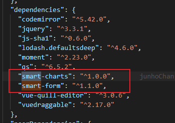
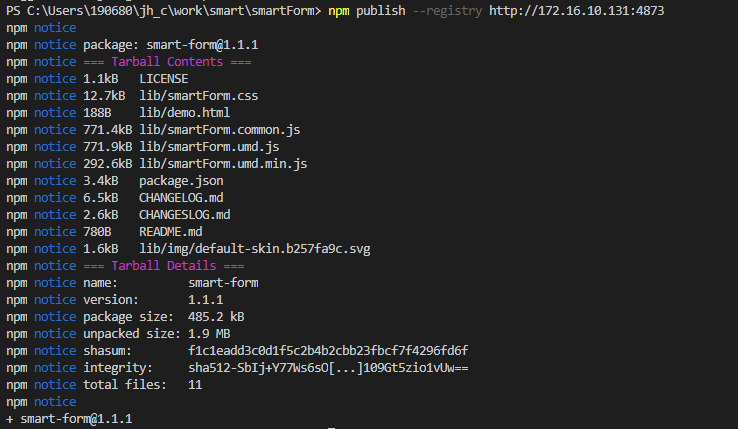
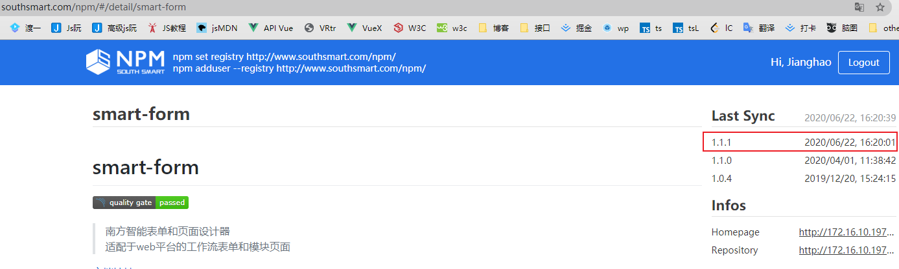
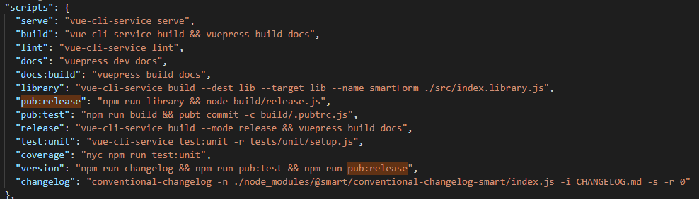
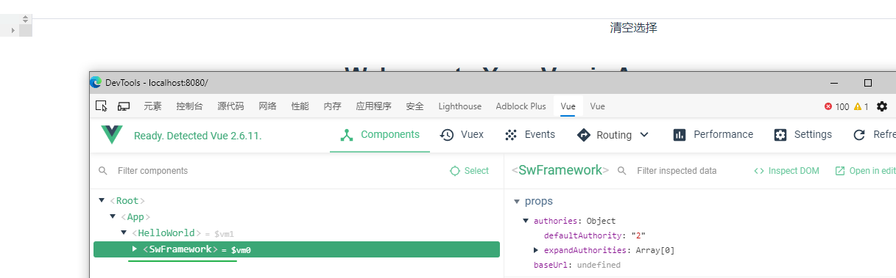

1. 更新web平台, 发布内部包
2. 1


smart-web 平台更新



我更新了smart-form, smart-charts, client需要相应的更新依赖版本

npm publish

内网npm 注册账号 [npm地址](http://www.southsmart.com/npm/#/)

```bash
npm set registry http://172.16.10.131:4873
npm adduser --registry http://172.16.10.131:4873 
// log ---- 添加完用户后之后就只需要注册了
npm login --registry http://172.16.10.131:4873 
```


发布 `npm publish --registry ...`





 


smartFom/package.json的脚本命令




rimraf 


```bash
发布第三方库到私有npm仓库的流程

npm version -h [major, minior, patch] (这里可以看到具体的版本更新commit纪录)

npm run library [打包成js] [可以查看main字段看看作为第三方库的路径] 看具体的指令, 看输出的文件

npm addUser --registry (注册)

npm login --registry (登陆 ~ 用户名+密码+邮箱)

npm publish --registry

检验: 上私有npm仓库查看版本号
测试: 添加作为本地依赖使用库测试
```





 0 0一大堆报错呢..

测试过程

1. 安装@vue/cli
2. 初始化vue原型项目
3. 安装依赖`npm install smart-form --registry http://172.16.10.131:4873` smart-web 似乎是装到了全局?

4. main.js 引入组件
5. 安装相应的依赖/loader
6. 运行项目
7. 查看是否正确加入
8. ... 似乎有很多报错呢?
9. 
