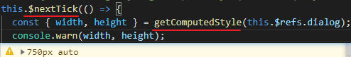
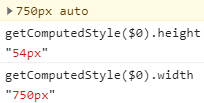
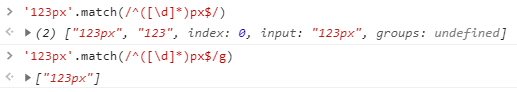

[TOC]

transform: translate(51.5px) 导致DOM变模糊


计算值不能是带小数的


Vue抽象组件 transition


Vue mounted 钩子

使用getComputedStyle 无法获取ref关联的普通DOM的计算属性



后续控制台中可以正确的访问dom



#### [mounted](https://cn.vuejs.org/v2/api/#mounted)

- **类型**：`Function`

- **详细**：

  实例被挂载后调用，这时 `el` 被新创建的 `vm.$el` 替换了。如果根实例挂载到了一个文档内的元素上，当 `mounted` 被调用时 `vm.$el` 也在文档内。

  注意 `mounted` **不会保证所有的子组件也都一起被挂载**。如果你希望等到整个视图都渲染完毕，可以在 `mounted` 内部使用 [vm.$nextTick](https://cn.vuejs.org/v2/api/#vm-nextTick)：

  ```js
  mounted: function () {
    this.$nextTick(function () {
      // Code that will run only after the
      // entire view has been rendered
    })
  }
  ```


## getComputedStyle

getComputdStyle 什么时候会获取到'auto'?

有几个事情可以导致auto的结果。

你找到了一个; display：none 。

如果元素是内联的，它也将返回auto。

**getComputedStyle 在获取display:none的元素时会渲染前的属性**

There are a couple of things that can cause a result of "auto". You found one of them; display: none. If an element is inline it will also return auto.

Essentially it must be a block or inline-block element and it must be rendered.

有几件事会导致“auto”结果。 您找到其中之一: display: none。 如果元素是内联元素，它也将返回auto。

本质上，它必须是block或inline-block元素，并且必须render它。


`getComputedStyle`的返回值是 [`resolved values`](https://developer.mozilla.org/zh-CN/docs/Web/CSS/resolved_value), 通常跟CSS2.1中的[`computed values`](https://developer.mozilla.org/zh-CN/docs/Web/CSS/computed_value)是相同的值。 但对于一些旧的属性，比如`width`, `height`, `padding `它们的值又为 [`used values`](https://developer.mozilla.org/zh-CN/docs/Web/CSS/used_value)。 最初, CSS2.0定义的计算值Computed values 就是属性的最终值。 

但是CSS2.1 重新定义了 computed values 为布局前的值， used values布局后的值。 

布局前与布局后的区别是， width 或者 height的 百分比可以代表元素的宽度，在布局后会被像素值替换.

**在某些情况下，通过浏览器会特意返回不准确的值。 特别是在避免CSS 浏览历史泄露的安全问题**， 比如，浏览者看过某个网站， 它的链接通常会变成蓝色带下划线的链接，通过判断链接的颜色（getComputedSytle(node, null).color) 是否为蓝色，就会泄露用户的浏览历史， 所以浏览器会特意返回不准确的值，保护用户隐私。可以了解更多关于css安全的链接http://blog.mozilla.com/security/2010/03/31/plugging-the-css-history-leak/ 和 http://hacks.mozilla.org/2010/03/privacy-related-changes-coming-to-css-vistited/

在CSS过渡期间，`getComputedStyle`返回Firefox中的原始属性值，但返回WebKit中的最终属性值。

在Firefox中，属性值为`auto`的会直接返回使用值，而不是`auto`。比如，你在设定了一个元素的css为`height:30px; top: auto; bottom:0;`它的父元素`height:100px;`，在请求`top`的计算样式时，Firefox会返回`'70px' = 100px - 30px;`。

注意：[`getComputedStyle()`](https://developer.mozilla.org/zh-CN/docs/Web/API/Window/getComputedStyle) DOM API 返回 [resolved value](https://developer.mozilla.org/en-US/docs/Web/CSS/resolved_value), 可能是 [computed value](https://developer.mozilla.org/en-US/docs/Web/CSS/computed_value) 或 [used value](https://developer.mozilla.org/en-US/docs/Web/CSS/used_value)其中的一个，取决于属性。


### resolved value

CSS 属性的解析值（**resolved value** ）是 [`getComputedStyle()`](https://developer.mozilla.org/zh-CN/docs/Web/API/Window/getComputedStyle)返回的值。 对于大多数属性，它是计算值[`computed value`](https://developer.mozilla.org/zh-CN/docs/Web/CSS/computed_value)，但对于一些旧属性（包括宽度和高度），它是使用值[`used value`](https://developer.mozilla.org/zh-CN/docs/Web/CSS/used_value)。 有关详细信息，请参阅下面的[规范链接CSS Object Model (CSSOM) - resolved value](https://drafts.csswg.org/cssom/#resolved-values)。

### computed value

一个CSS属性的计算值是指这个属性在**由父类转向子类的继承中的值**。它通过指定值计算出来：

- 处理特殊的值 [`inherit`](https://developer.mozilla.org/zh-CN/docs/Web/CSS/inherit)，[`initial`](https://developer.mozilla.org/zh-CN/docs/Web/CSS/initial)， [`unset`](https://developer.mozilla.org/zh-CN/docs/Web/CSS/unset)和 [`revert`](https://developer.mozilla.org/zh-CN/docs/Web/CSS/revert)。
- 进行计算，以达到属性摘要中“计算值”行中描述的值。

计算值所需要的计算通常包括**将相对值转换成绝对值**(如 em 单位或百分比)。例如，如一个元素的属性值为` font-size:16px `和` padding-top:2em`, 则` padding-top `的计算值为 `32px `(字体大小的2倍).

然而，对于有些属性(这些元素的百分比**与需要布局确定后**才能知道的值有关，如` width`,` margin-right`,` text-indent`, 和` top`)，它们的“百分比值”会转换成“百分比的计算值”。另外，line-height 属性值如是没有单位的数字，则该值就是其计算值。这些计算值中的相对值会在 [应用值](https://developer.mozilla.org/en-US/docs/CSS/used_value) 确定后转换成绝对值。

[参考规范CSS Level 2 (Revision 1) - computed value](https://www.w3.org/TR/CSS2/cascade.html#computed-value))


## 正则表达式




## sourceMap 映射错误的原因?


## travis-ci 
