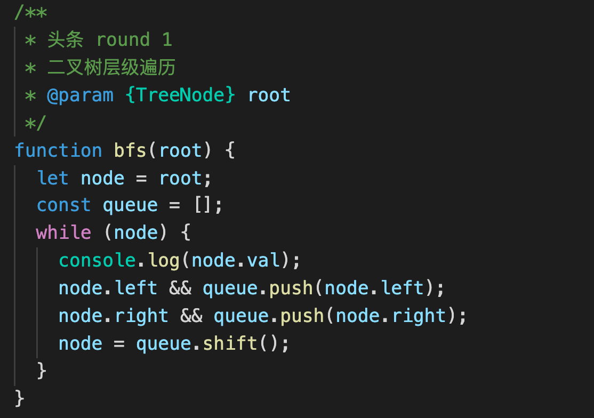
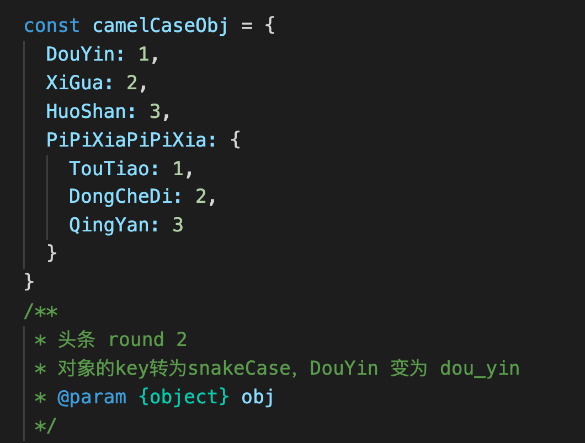

[TOC]

### Changelog

### --LGM

个人理解做gis很多时候就是可视化 具体化 形象化。如果这个逻辑去考虑原来的系统，特别是三维系统，80%的三维系统都是不需要的，二维都可以解决，或者没有二维也业务流程也跑通的。GIS系统很多是时候，核心的系统功能就几个。
没办法证明说增加了二维典型地图这个系统就增加了多少，个人理解二维电子地图接入，场景就会丰富很多。

### --TC

我们的价值之一就是让地图不仅仅只限于看，而且现有很多项目早就不再只限于看，而是实实际际解决了很多实际生产中的问题，这样的企业才有市场竞争力。退一步说，即便是看也要真的好看、赏心悦目地那种好看

### 头条面试题

1、Gitlab CI介绍

CI：持续集成，我们通常使用CI来做一些自动化工作，比如程序的打包，单元测试，部署等，这种构建方式避免了打包环境差异引起的错误，提高了工作效率。Gitlab-CI是Gitlab官方提供的持续集成服务，我们可以在仓库的根目录下新建.gitlab-ci.yml文件，自己定义持续集成流程模板，并且在Gitlab中配置runner，在之后的每次提交合并中将会触发构建，并且可以通过Gitlab的hook, 在代码提交的各个环节自动地完成一系列的构建工作，总之对于一些非复杂性的集成需求，都是可以满足的。

对象使用扩展运算符

