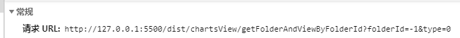
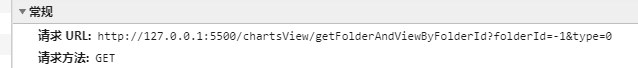
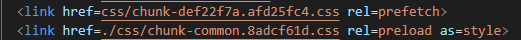

[toc]

## threejs group 进行轴上旋转会对子节点产生什么影响


### changelog 日志 版本内容被合并到下一个版本中了

1. 是因为没有正确使用 npm version 命令

   ```bash
   "version": "npm run changelog && npm run pub:test && npm run pub:release",
   "changelog": "conventional-changelog -n ./node_modules/@smart/conventional-changelog-smart/index.js -i CHANGELOG.md -s -r 0",
   "pub:test": "npm run build && pubt commit -c build/.pubtrc.js",
   "pub:release": "npm run library && node build/release.js"
   ```

2. CI/DI ?

## Vue打包路径问题

1. 绝对路径
2. 相对路径
3. 留意看请求的地址
4. 
 	5. 
 	6. 


## vue-cli

### baseUrl

从 Vue CLI 3.3 起已弃用，请使用[`publicPath`](https://cli.vuejs.org/zh/config/#publicPath)。

### [publicPath](https://cli.vuejs.org/zh/config/#publicpath)

- Type: `string`

- Default: `'/'`

  部署应用包时的基本 URL。**用法和 webpack 本身的 `output.publicPath` 一致**，但是 Vue CLI 在一些其他地方也需要用到这个值，所以**请始终使用 `publicPath` 而不要直接修改 webpack 的 `output.publicPath`**。

  默认情况下(**绝对路径**)，Vue CLI 会假设你的应用是被部署在一个域名的**根路径(默认值)**上，例如 `https://www.my-app.com/`。

  如果应用被部署在一个子路径上，你就需要用这个选项指定这个子路径。

  ​	例如，如果你的应用被部署在 `https://www.my-app.com/my-app/`，则设置 `publicPath` 为 `/my-app/` ** 更改PublicPath(公共路径) **。

  **这个值也可以被设置为空字符串 (`''`) 或是相对路径 (`'./'`)，这样所有的资源都会被链接为相对路径**，这样打出来的包可以被部署在任意路径，也可以用在类似 Cordova hybrid 应用的文件系统中。

  这个值在开发环境下同样生效。如果你想把开发服务器架设在根路径，你可以使用一个条件式的值：

```js
module.exports = {
  publicPath: process.env.NODE_ENV === 'production'
    ? '/production-sub-path/'
    : '/'
}
```


## webpack

## `output.publicPath`

string | function 

对于**按需加载**(on-demand-load)或加载**外部资源**(external resources)（如图片、文件等）来说，**output.publicPath 是很重要的选项**。如果指定了一个错误的值，则在加载这些资源时会收到 404 错误。

此选项指定在浏览器中所引用的「此输出目录对应的**公开 URL**」。

相对 URL(relative URL)会被相对于 HTML 页面（或 `` 标签）解析。相对于服务的 URL(Server-relative URL)，相对于协议的 URL(protocol-relative URL) 或绝对 URL(absolute URL) 也可是可能用到的，或者有时必须用到，例如：当将资源托管到 CDN 时。

该选项的值是以 runtime(运行时) 或 loader(载入时) 所创建的每个 URL 为前缀。因此，在多数情况下，**此选项的值都会以`/`结束**。

默认值是一个空字符串 `""`。

简单规则如下：[`output.path`](https://www.webpackjs.com/configuration/output/#output-path) 中的 URL 以 HTML 页面为基准。

```js
path: path.resolve(__dirname, "public/assets"),
publicPath: "https://cdn.example.com/assets/"
```

对于这个配置：

```js
publicPath: "/assets/",
chunkFilename: "[id].chunk.js"
```

对于一个 chunk 请求，看起来像这样 `/assets/4.chunk.js`。

对于一个输出 HTML 的 loader 可能会像这样输出：

```html
<link href="/assets/spinner.gif" />
```

或者在加载 CSS 的一个图片时：

```css
background-image: url(/assets/spinner.gif);
```

其实这里说的**所有资源的基础路径**是指项目中引用css，js，img等资源时候的一个基础路径，这个基础路径要配合具体资源中指定的路径使用，所以其实打包后资源的访问路径可以用如下公式表示：

```
静态资源最终访问路径 = output.publicPath + 资源loader或插件等配置路径
```

publicPath设置成相对路径后，相对路径是相对于build之后的index.html的，例如，如果设置publicPath: './dist/'，则打包后js的引用路径为./dist/main.js，

但是这里有一个问题，相对路径在访问本地时可以，但是如果**将静态资源托管到CDN上则访问路径显然不能使用相对路径**，但是如果将publicPath设置成/，则打包后访问路径为localhost:8080/dist/main.js，本地无法访问, 所以这里需要在上线时候手动更改`publicPath`

一般情况下**publicPath应该以'/'结尾，而其他loader或插件的配置不要以'/'开头**

**指定资源公共路径** 会影响API请求的地址吗?

影响到打包dist目录下的index.html



设为''或者为'./'则内部的html以相对路径加载css,js;


webpack-dev-server 也会默认从 `publicPath` 为基准，使用它来决定**在哪个目录下启用服务**，来访问 webpack 输出的文件。

注意，参数中的 `[hash]` 将会被替换为编译过程(compilation) 的 hash。详细信息请查看[指南 - 缓存](https://www.webpackjs.com/guides/caching)。

示例：

```js
publicPath: "https://cdn.example.com/assets/", // CDN（总是 HTTPS 协议）
publicPath: "//cdn.example.com/assets/", // CDN (协议相同)
publicPath: "/assets/", // 相对于服务(server-relative)
publicPath: "assets/", // 相对于 HTML 页面
publicPath: "../assets/", // 相对于 HTML 页面
publicPath: "", // 相对于 HTML 页面（目录相同）
```

在编译时(compile time)无法知道输出文件的 `publicPath` 的情况下，可以留空，然后在入口文件(entry file)处使用[自由变量(free variable)](https://stackoverflow.com/questions/12934929/what-are-free-variables) `__webpack_public_path__`，以便在运行时(runtime)进行动态设置。

```js
 __webpack_public_path__ = myRuntimePublicPath

// 应用程序入口的其他部分
```

有关 `__webpack_public_path__` 的更多信息，请查看[此讨论](https://github.com/webpack/webpack/issues/2776#issuecomment-233208623)。


## 断点调试 npm  命令


## npm 发布私有仓库

1. 发布
2. 取消发布重新发布来更新同一版本的仓库


## js语法 可选链

1. 可选链 ?.
2. 空值合并运算符 ?? [MDN](https://developer.mozilla.org/zh-CN/docs/Web/JavaScript/Reference/Operators/Nullish_coalescing_operator)
