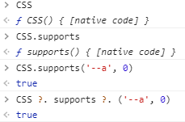
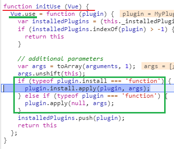

[TOC]


## 设置npm镜像地址


## css变量（CSS variable）/ CSS 自定义属性（CSS custom properties） [阮一峰教程](http://www.ruanyifeng.com/blog/2017/05/css-variables.html)


### css变量应用[张鑫旭](https://www.zhangxinxu.com/wordpress/2020/07/css-var-improve-components/)


### js检测浏览器是否支持css变量

`CSS ?. supprts ?. ('--a', 0);`



### CSS模块的侦测

一个比较普遍适用的方法是，判断元素的`style`对象的某个属性值是否为字符串。

```js
typeof element.style.animationName === 'string';
```

#### CSS 对象

​	浏览器原生提供 CSS 对象，为 JavaScript 操作 CSS 提供一些工具方法。这个对象目前有两个静态方法。

1. ### CSS.escape()

   用于转义 CSS 选择器里面的特殊字符。

   `<div id="foo#bar">`该元素的`id`属性包含一个`#`号，该字符在 CSS 选择器里面有特殊含义。不能直接写成`document.querySelector('#foo#bar')`，只能写成`document.querySelector('#foo\\#bar')`。这里必须使用双斜杠的原因是，单引号字符串本身会转义一次斜杠。

   `CSS.escape`方法就用来转义那些特殊字符。

   ```js
   document.querySelector('#' + CSS.escape('foo#bar'))
   ```

2. ### CSS.supports()

   返回一个布尔值，表示当前环境是否支持某一句 CSS 规则。

   它的参数有两种写法，

   ​	一种是第一个参数是属性名，第二个参数是属性值；

   ​	一种是整个参数就是一行完整的 CSS 语句。

   ```js
   // 第一种写法
   CSS.supports('transform-origin', '5px') // true
   // 第二种写法
   CSS.supports('display: table-cell') // true
   ```

也可以使用`@support`命令进行检测。

```css
@supports ( (--a: 0)) {
  /* supported */
}

@supports ( not (--a: 0)) {
  /* not supported */
}
```

JavaScript 操作**CSS 变量**的写法如下。

> ```javascript
> // 设置变量
> document.body.style.setProperty('--primary', '#7F583F');
> // 读取变量
> document.body.style.getPropertyValue('--primary').trim();// '#7F583F'
> // 删除变量
> document.body.style.removeProperty('--primary');
> ```

这意味着，可以把样式设置写在 CSS 变量中，让 JavaScript 读取。

所以，CSS 变量提供了 JavaScript 与 CSS 通信的一种途径。

## 伪元素的 content 属性,

 不带content属性就会移除掉这个伪元素


## 持续集成


## vue 插件

`Vue.use(MyPlugin, { someOption: true })`

Vue.js 的插件应该暴露一个 `install` 方法。这个方法的第一个参数是 `Vue` 构造器，第二个参数是一个可选的选项对象：

自定义插件可以考虑的通用功能逻辑, 因为会传Vue进去, 所以可以构造一些实例通用的属性和方法;

也可以利用Vue上的静态方法去生成一些新的通用的属性和方法来减少重复代码

```js
MyPlugin.install = function (Vue, options) {
  // 1. 添加全局方法或 property
  Vue.myGlobalMethod = function () {
    // 逻辑...
  }

  // 2. 添加全局资源
  Vue.directive('my-directive', {
    bind (el, binding, vnode, oldVnode) {
      // 逻辑...
    }
    ...
  })

  // 3. 注入组件选项
  Vue.mixin({
    created: function () {
      // 逻辑...
    }
    ...
  })

  // 4. 添加实例方法
  Vue.prototype.$myMethod = function (methodOptions) {
    // 逻辑...
  }
}
```

### 导入插件对象的方式

1. 直接export {}
2. export 一个构造函数示例
3. 一个函数 ~ 如果插件是一个函数，它会被作为 install 方法。

### 源码中的use调用方式

 

use 传递的arguments会在 install / plugin 被调用时传进去


## vue 自定义指令

// 注册一个全局自定义指令 `v-focus`


```js
 Vue.directive('focus', {  
 	// 当被绑定的元素插入到 DOM 中时……  
 	inserted: function (el) {    
 	// 聚焦元素    
 	el.focus()  
 	} 
 })

```

```js
// fullpage-vue 库注册的v-animate指令
Vue.directive('animate', {
    inserted: (el, binding, vnode)=>{
        let opts = binding || {};
        el.$animate = new Animate(el, opts, vnode);				
    }
})
```

```js
// animate.js, 给插入的el添加类名来启动animate.css的动画
const on = (el, eventName, callback, isUseCapture) => {
    el.addEventListener(eventName, callback, !!isUseCapture);
}
class Animate {
    constructor(el, binding, vnode) {
        const aminate = binding.value;

        el.style.opacity = "0";
        this.removeAnimated(el, aminate);

        on(el, "toogle.animate", ({
            value
        }) => {
            if (value) {
                this.addAnimated(el, aminate);
            }
        })
    }
    addAnimated(el, animate) {
        const delay = animate.delay || 0
        el.classList.add("animated");
        window.setTimeout(() => {
        	// el.style.animationDelay = delay +'s'
            el.style.opacity = "1";
            el.classList.add(animate.value);
        }, delay);

        
    }
}
```


## SSH 是服务器登录工具，提供密码登录和密钥登录。


VueRouter 嵌套路由


fullpage-vue animate.css 配套使用

fullpage注册了v-animate的指令, animate.css 需要加类型使用, 注意兼容性

css4.0跟3.x完全不兼容, fullpage的指令也不能一次添加多个类名

