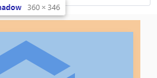

CSS3 媒体查询可视窗口尺寸


解决列表一行中首个和末尾的margin问题



尤其是一行中列数不定的情况


svg 矢量图形更改颜色, style="fill: #abcdef", 也可以是以HTML结构来使用类名/id名来标记对应的元素, 然后统一使用style标签,  使用选择器修改对应的颜色


$set / Vue.set

数组直接通过索引更改元素值 不会触发响应式


会报错还是会输出? 不确定是不是因为转义为ES5后才不报错?

 确认下来的确是因为转义为ES5, 使用var声明变量导致的变量提升

```js
const a = 1;
if (true) {
	console.log(a);
	const a = 2;
}
```

```js
const obj = {a: 1};
const {a} = obj;
if (true) {
	console.log(a);
	const a = 2;
}
```


动态设置全局变量


