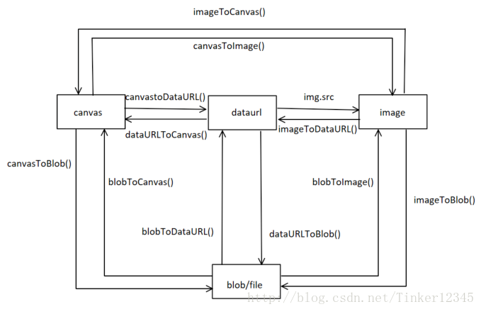

webpack

chunk

lodash.chunk -- 分块

### `_.chunk(array, [size=1])`

将数组（array）拆分成多个 `size` 长度的区块，并将这些区块组成一个新数组。 如果`array` 无法被分割成全部等长的区块，那么最后剩余的元素将组成一个区块。(引入版本 : 3.0.0)

#### 参数

1. `array` *(Array)*: 需要处理的数组
2. `[size=1]` *(number)*: 每个数组区块的长度

#### 返回

*(Array)*: 返回一个包含拆分区块的新数组（注：相当于一个二维数组）。

#### 例子

```js
_.chunk(['a', 'b', 'c', 'd'], 2);
// => [['a', 'b'], ['c', 'd']]
 
_.chunk(['a', 'b', 'c', 'd'], 3);
// => [['a', 'b', 'c'], ['d']]
```


### 下载图片

png-> 转base64 -> 转为blob

svg同理




# canvas url blob转换

1.canvas转换为dataURL (从canvas获取dataURL)

```js
var dataurl = canvas.toDataURL('image/png');
var dataurl2 = canvas.toDataURL('image/jpeg', 0.8);
```

2.File对象转换为dataURL、Blob对象转换为dataURL

```js
function readBlobAsDataURL(blob, callback) {    
    var a = new FileReader();    
    a.onload = function(e) {
        callback(e.target.result);
    };    
    a.readAsDataURL(blob);
}
//example:
readBlobAsDataURL(blob, function (dataurl){    console.log(dataurl);});
readBlobAsDataURL(file, function (dataurl){    console.log(dataurl);});
```

3.dataURL转换为Blob对象、dataURL转换为File对象

```js
function dataURLtoBlob(dataurl) {    
    var arr = dataurl.split(','), 
        mime = arr[0].match(/:(.*?);/)[1],        
        bstr = atob(arr[1]),
        n = bstr.length, 
        u8arr = new Uint8Array(n);    
    while(n--){        
        u8arr[n] = bstr.charCodeAt(n);    
    }   
    return new Blob([u8arr], {type:mime});
}
function dataURLtoFile(dataurl, filename) {    
    var arr = dataurl.split(','), 
        mime = arr[0].match(/:(.*?);/)[1],        
        bstr = atob(arr[1]), 
        n = bstr.length, 
        u8arr = new Uint8Array(n);    
    while(n--){        
        u8arr[n] = bstr.charCodeAt(n);    
    }    
    return new File([u8arr], filename, {type:mime});
}
//test:
var blob = dataURLtoBlob('data:text/plain;base64,YWFhYWFhYQ==');
var file = dataURLtoFile('data:text/plain;base64,YWFhYWFhYQ==', 'test.txt');
```

4.dataURL图片数据绘制到canvas

```js
var img = new Image();
img.onload = function(){
    canvas.drawImage(img);
};
img.src = dataurl;
```

5.File,Blob的图片文件数据绘制到canvas

```js
readBlobAsDataURL(file, function (dataurl){    
    var img = new Image();    
    img.onload = function(){        
        canvas.drawImage(img);    
    };    
    img.src = dataurl;
});
```

6.Canvas转换为Blob对象并使用Ajax发送

```js
var dataurl = canvas.toDataURL('image/png');
var blob = dataURLtoBlob(dataurl);
//使用ajax发送
var fd = new FormData();
fd.append("image", blob, "image.png");
var xhr = new XMLHttpRequest();xhr.open('POST', '/server', true);
xhr.send(fd);
```


### File接口&Blob接口

```JS
new File(bits, name[, options]);
```

### 参数

- *bits*

  一个包含[`ArrayBuffer`](https://developer.mozilla.org/zh-CN/docs/Web/JavaScript/Reference/Global_Objects/ArrayBuffer)，[`ArrayBufferView`](https://developer.mozilla.org/zh-CN/docs/Web/API/ArrayBufferView)，[`Blob`](https://developer.mozilla.org/zh-CN/docs/Web/API/Blob)，或者 [`DOMString`](https://developer.mozilla.org/zh-CN/docs/Web/API/DOMString) 对象的 [`Array`](https://developer.mozilla.org/zh-CN/docs/Web/JavaScript/Reference/Array) — 或者任何这些对象的组合。这是 UTF-8 编码的文件内容。

- *name*

  [`USVString`](https://developer.mozilla.org/zh-CN/docs/Web/API/USVString)，表示文件名称，或者文件路径。

- *options* 可选

  选项对象，包含文件的可选属性。可用的选项如下：`type`: [`DOMString`](https://developer.mozilla.org/zh-CN/docs/Web/API/DOMString)，表示将要放到文件中的内容的 MIME 类型。默认值为 `""` 。`lastModified`: 数值，表示文件最后修改时间的 Unix 时间戳（毫秒）。默认值为 [`Date.now()`](https://developer.mozilla.org/zh-CN/docs/Web/JavaScript/Reference/Global_Objects/Date/now)。

```js 
new File([xml], 'bpmn.bpmn', { type: 'application/bpmn20-xml' });
```

## 属性

`File` 接口也继承了 [`Blob`](https://developer.mozilla.org/zh-CN/docs/Web/API/Blob) 接口的属性：

- [`File.lastModified`](https://developer.mozilla.org/zh-CN/docs/Web/API/File/lastModified) 只读

  返回当前 `File` 对象所引用文件最后修改时间，自 UNIX 时间起始值（1970年1月1日 00:00:00 UTC）以来的毫秒数。

- [`File.lastModifiedDate`](https://developer.mozilla.org/zh-CN/docs/Web/API/File/lastModifiedDate) 只读 

  返回当前 `File` 对象所引用文件最后修改时间的 `Date` 对象。

- [`File.name`](https://developer.mozilla.org/zh-CN/docs/Web/API/File/name) 只读

  返回当前 `File` 对象所引用文件的名字。

- [`File.size`](https://developer.mozilla.org/zh-CN/docs/Web/API/File/size) 只读

  返回文件的大小。

- [`File.type`](https://developer.mozilla.org/zh-CN/docs/Web/API/File/type) 只读

  返回文件的 [多用途互联网邮件扩展类型（MIME Type）](https://developer.mozilla.org/en-US/docs/Web/HTTP/Basics_of_HTTP/MIME_types)

*`File` 接口没有定义任何方法，但是它从 [`Blob`](https://developer.mozilla.org/zh-CN/docs/Web/API/Blob) 接口继承了以下方法：*

- `Blob.slice([start[, end[, contentType]]])`

  返回一个新的 `Blob` 对象，它包含有源 `Blob` 对象中指定范围内的数据。

```js
// File.prototype 
{
    lastModified: (...)
    lastModifiedDate: (...)
    name: (...)
    size: (...)
    type: (...)
    webkitRelativePath: (...)
    constructor: ƒ File()
    Symbol(Symbol.toStringTag): "File"
    get lastModified: ƒ lastModified()
    get lastModifiedDate: ƒ lastModifiedDate()
    get name: ƒ name()
    get webkitRelativePath: ƒ webkitRelativePath()
    __proto__: Blob
        arrayBuffer: ƒ arrayBuffer()
        size: (...)
        slice: ƒ slice()
        stream: ƒ stream()
        text: ƒ text()
        type: (...)
        constructor: ƒ Blob()
        Symbol(Symbol.toStringTag): "Blob"
        get size: ƒ size()
        get type: ƒ type()
        __proto__: Object
}
```


`Blob` 对象表示一个不可变、原始数据的类文件对象。它的数据可以按文本或二进制的格式进行读取，也可以转换成 [`ReadableStream`](https://developer.mozilla.org/zh-CN/docs/Web/API/ReadableStream) 来用于数据操作。 

Blob 表示的不一定是JavaScript原生格式的数据。[`File`](https://developer.mozilla.org/zh-CN/docs/Web/API/File) 接口基于`Blob`，继承了 blob 的功能并将其扩展使其支持用户系统上的文件。

要从其他非blob对象和数据构造一个 `Blob`，请使用 [`Blob()`](https://developer.mozilla.org/zh-CN/docs/Web/API/Blob/Blob) 构造函数。要创建一个 blob 数据的子集 blob，请使用 [`slice()`](https://developer.mozilla.org/zh-CN/docs/Web/API/Blob/slice) 方法。

```
new Blob( array, options );
```

### 参数

- *array* 是一个由[`ArrayBuffer`](https://developer.mozilla.org/zh-CN/docs/Web/JavaScript/Reference/Global_Objects/ArrayBuffer), [`ArrayBufferView`](https://developer.mozilla.org/zh-CN/docs/Web/API/ArrayBufferView), [`Blob`](https://developer.mozilla.org/zh-CN/docs/Web/API/Blob), [`DOMString`](https://developer.mozilla.org/zh-CN/docs/Web/API/DOMString) 等对象构成的 [`Array`](https://developer.mozilla.org/zh-CN/docs/Web/JavaScript/Reference/Array) ，或者其他类似对象的混合体，它将会被放进 [`Blob`](https://developer.mozilla.org/zh-CN/docs/Web/API/Blob)。DOMStrings会被编码为UTF-8。

- options是一个可选的`BlobPropertyBag`字典，它可能会指定如下两个属性：

  - `type`，默认值为 `""`，它代表了将会被放入到blob中的**数组内容的MIME类型**。
- `endings`，默认值为`"transparent"`，用于指定包含行结束符`\n`的字符串如何被写入。 它是以下两个值中的一个： `"native"`，代表行结束符会被更改为适合宿主操作系统文件系统的换行符，或者 `"transparent"`，代表会保持blob中保存的结束符不变 

### 属性

- [`Blob.size`](https://developer.mozilla.org/zh-CN/docs/Web/API/Blob/size) 只读

  `Blob` 对象中所包含数据的大小（字节）。

- [`Blob.type`](https://developer.mozilla.org/zh-CN/docs/Web/API/Blob/type) 只读

  一个字符串，表明该 `Blob` 对象所包含数据的 MIME 类型。如果类型未知，则该值为空字符串。

### 方法

- `Blob.slice([start[, end[, contentType]]])`

  返回一个新的 `Blob` 对象，包含了源 `Blob` 对象中指定范围内的数据。

- [`Blob.stream()`](https://developer.mozilla.org/zh-CN/docs/Web/API/Blob/stream)

  返回一个能读取blob内容的 [`ReadableStream`](https://developer.mozilla.org/zh-CN/docs/Web/API/ReadableStream)。

- [`Blob.text()`](https://developer.mozilla.org/zh-CN/docs/Web/API/Blob/text)

  返回一个promise且包含blob所有内容的UTF-8格式的 [`USVString`](https://developer.mozilla.org/zh-CN/docs/Web/API/USVString)。

- [`Blob.arrayBuffer()`](https://developer.mozilla.org/zh-CN/docs/Web/API/Blob/arrayBuffer)

  返回一个promise且包含blob所有内容的二进制格式的 [`ArrayBuffer`](https://developer.mozilla.org/zh-CN/docs/Web/API/ArrayBuffer) 

#### 示例

```js
var aFileParts = ['<a id="a"><b id="b">hey!</b></a>']; // 一个包含DOMString的数组
var oMyBlob = new Blob(aFileParts, {type : 'text/html'}); // 得到 blob
var debug = {hello: "world"};
var blob = new Blob([JSON.stringify(debug, null, 2)], {type : 'application/json'});
let hello = new Uint8Array([72, 101, 108, 108, 111]); // 二进制格式的 "hello". 从类型化数组和字符串创建 Blob
let blob = new Blob([hello, ' ', 'semlinker'], {type: 'text/plain'});
```

### 使用 Blob 创建一个指向类型化数组的URL

```js
var typedArray = GetTheTypedArraySomehow();
var blob = new Blob([typedArray.buffer], {type: 'application/octet-stream'}); // 传入一个合适的 MIME 类型
var url = URL.createObjectURL(blob);
// 会产生一个类似 blob:d3958f5c-0777-0845-9dcf-2cb28783acaf 这样的URL字符串
// 你可以像使用普通 URL 那样使用它，比如用在 img.src 上。
```

### 从 Blob 中提取数据

一种从Blob中读取内容的方法是使用 [`FileReader`](https://developer.mozilla.org/zh-CN/docs/Web/API/FileReader)。以下代码将 Blob 的内容作为类型数组读取：

```js
var reader = new FileReader();
reader.addEventListener("loadend", function() {
   // reader.result 包含被转化为类型数组 typed array 的 blob
});
reader.readAsArrayBuffer(blob);
```

通过使用 [`FileReader`](https://developer.mozilla.org/zh-CN/docs/Web/API/FileReader) 的其它方法可以把 Blob 读取为字符串或者数据URL。


另一种读取Blob中内容的方式是使用Response对象。下述代码将Blob中的内容读取为文本：

```js
var text = await (new Response(blob)).text();
```


### Blob 使用场景 [$](https://mp.weixin.qq.com/s/lQKTCS_QB0E62SK9oXD4LA)

1. #### 分片上传

   File 对象是特殊类型的 Blob，且可以用在任意的 Blob 类型的上下文中。所以针对大文件传输的场景，我们可以使用 slice 方法对大文件进行切割，然后分片进行上传

   ```js
   const file = new File(["a".repeat(1000000)], "test.txt");
   const chunkSize = 40000;
   const url = "https://httpbin.org/post";
   
   async function chunkedUpload() {
     for (let start = 0; start < file.size; start += chunkSize) {
         const chunk = file.slice(start, start + chunkSize + 1); // 根据chunk和索引切割
         const fd = new FormData();
         fd.append("data", chunk);
   
         await fetch(url, { method: "post", body: fd }).then((res) =>
           res.text()
         );
     }
   }
   ```

   

2. #### Blob 用作 URL

   **Blob URL/Object URL 是一种伪协议**，允许 Blob 和 File 对象用作图像，下载二进制数据链接等的 URL 源。在浏览器中，我们使用 `URL.createObjectURL` 方法来创建 Blob URL，该方法接收一个 `Blob` 对象，并为其创建一个唯一的 URL，其形式为 `blob:/`

   浏览器内部为每个通过 `URL.createObjectURL` 生成的 URL 存储了一个 URL → Blob 映射。因此，此类 URL 较短，但可以访问 `Blob`。生成的 URL 仅在当前文档打开的状态下才有效。它允许引用 ``、`` 中的 `Blob`，但如果你访问的 Blob URL 不再存在，则会从浏览器中收到 404 错误。

   存储了 URL → Blob 的映射，但 Blob 本身仍驻留在内存中，浏览器无法释放它。映射在文档卸载时自动清除，因此 Blob 对象随后被释放。调用 `URL.revokeObjectURL(url)` 方法，从内部映射中删除引用，从而允许删除 Blob（如果没有其他引用），并释放内存

3. ####  图片压缩

4. #### 生成PDF文档

### Blob vs ArrayBuffer

- 除非你需要使用 ArrayBuffer 提供的写入/编辑的能力，否则 Blob 格式可能是最好的。

- Blob 对象是不可变的，而 ArrayBuffer 是可以通过 TypedArrays 或 DataView 来操作。

- ArrayBuffer 是存在内存中的，可以直接操作。而 Blob 可以位于磁盘、高速缓存内存和其他不可用的位置。

- 虽然 Blob 可以直接作为参数传递给其他函数，比如 `window.URL.createObjectURL()`。但是，你可能仍需要 FileReader 之类的 File API 才能与 Blob 一起使用。

- Blob 与 ArrayBuffer 对象之间是可以相互转化的：

- - 使用 FileReader 的 `readAsArrayBuffer()` 方法，可以把 Blob 对象转换为 ArrayBuffer 对象；
  - 使用 Blob 构造函数，如 `new Blob([new Uint8Array(data]);`，可以把 ArrayBuffer 对象转换为 Blob 对象。


### npm 镜像设置

设置为淘宝镜像

```shell
npm config set registry https://registry.npm.taobao.org/
```

设置淘宝镜像终于能用tsc指令了

设置为官方镜像

```shell
npm config set registry https://registry.npmjs.org/
```

yarn 有镜像吗

淘宝镜像:`yarn config set registry https://registry.npm.taobao.org/`

`yarn config set registry https://registry.npm.taobao.org --global` 设置这个终于能下载了..

官方镜像:`yarn config set registry https://registry.yarnpkg.com`
