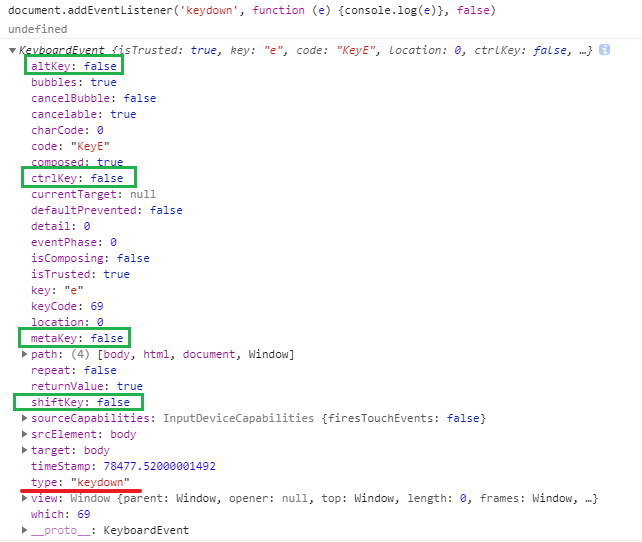

[TOC]

### 键盘事件

键盘事件由用户击打键盘触发，主要有`keydown`、`keypress`、`keyup`三个事件，它们都继承了`KeyboardEvent`接口。

- `keydown`：按下键盘时触发。
- `keypress`：按下有值的键时触发，即**按下 Ctrl、Alt、Shift、Meta 这样无值的键，这个事件不会触发**。对于有值的键，按下时先触发`keydown`事件，再触发这个事件。
- `keyup`：松开键盘时触发该事件。

如果用户一直按键不松开，就会连续触发键盘事件，触发的顺序如下。

1. keydown
2. keypress
3. keydown
4. keypress
5. …（重复以上过程）
6. keyup

### 如何监听组件按键

如 ctrl + a



- `KeyboardEvent.altKey`：是否按下 Alt 键
- `KeyboardEvent.ctrlKey`：是否按下 Ctrl 键
- `KeyboardEvent.metaKey`：是否按下 meta 键（Mac 系统是一个四瓣的小花，Windows 系统是 windows 键）
- `KeyboardEvent.shiftKey`：是否按下 Shift 键

### KeyboardEvent 接口

`KeyboardEvent`接口用来描述用户与键盘的互动。这个接口继承了`Event`接口，并且定义了自己的实例属性和实例方法。

浏览器原生提供`KeyboardEvent`构造函数，用来新建键盘事件的实例。

```
new KeyboardEvent(type, options)
```

`KeyboardEvent`构造函数接受两个参数。第一个参数是字符串，表示事件类型；第二个参数是一个事件配置对象，该参数可选。除了`Event`接口提供的属性，还可以配置以下字段，它们都是可选。

- `key`：字符串，当前按下的键，默认为空字符串。
- `code`：字符串，表示当前按下的键的字符串形式，默认为空字符串。
- `location`：整数，当前按下的键的位置，默认为`0`。
- `ctrlKey`：布尔值，是否按下 Ctrl 键，默认为`false`。
- `shiftKey`：布尔值，是否按下 Shift 键，默认为`false`。
- `altKey`：布尔值，是否按下 Alt 键，默认为`false`。
- `metaKey`：布尔值，是否按下 Meta 键，默认为`false`。
- `repeat`：布尔值，是否重复按键，默认为`false`。


`KeyboardEvent.code`属性返回一个字符串，表示当前按下的键的字符串形式。该属性只读。

下面是一些常用键的字符串形式，其他键请查[文档](https://developer.mozilla.org/en-US/docs/Web/API/KeyboardEvent/code#Code_values)。

- 数字键0 - 9：返回`digital0` - `digital9`
- 字母键A - z：返回`KeyA` - `KeyZ`
- 功能键F1 - F12：返回 `F1` - `F12`
- 方向键：返回`ArrowDown`、`ArrowUp`、`ArrowLeft`、`ArrowRight`
- Alt 键：返回`AltLeft`或`AltRight`
- Shift 键：返回`ShiftLeft`或`ShiftRight`
- Ctrl 键：返回`ControLeft`或`ControlRight`


### position: sticky 不会改变元素的流体类型


### 滚动到顶部或底部

```js
window.scrollTo(0, 0);

window.scrollTo(0, document.body.scrollHeight);
```


