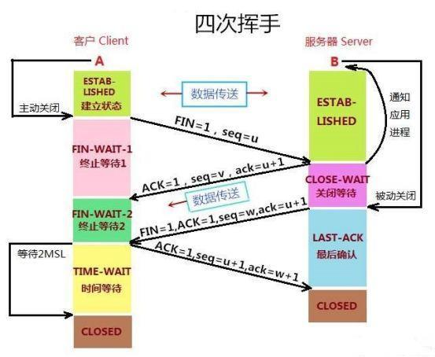

[TOC]


## 前端产生异常的原因主要分5类：

| **原因**     | **案例**                                                     | **频率** |
| ------------ | ------------------------------------------------------------ | -------- |
| 逻辑错误     | 1)  业务逻辑判断条件错误 2)  事件绑定顺序错误 3)  调用栈时序错误 4)  错误的操作js对象 | 经常     |
| 数据类型错误 | 1)  将null视作对象读取property 2)  将undefined视作数组进行遍历 3)  将字符串形式的数字直接用于加运算 4)  函数参数未传 | 经常     |
| 语法句法错误 |                                                              | 较少     |
| 网络错误     | 1)  慢 2)  服务端未返回数据但仍200，前端按正常进行数据遍历 3)  提交数据时网络中断 4)  服务端500错误时前端未做任何错误处理 | 偶尔     |
| 系统错误     | 1)  内存不够用 2)  磁盘塞满 3)  壳不支持API 4)  不兼容       | 较少     |

## 三次握手 通俗理解

将客户端看成男孩，服务器看成女孩，那么男孩喜欢女孩于是通过写信的方式告诉女孩和我交往吧，但是男孩又不知到这个信能不能顺利的到女孩手中，这是第一次 握手  重点是客户端发送给服务端东西，可是客户端自己都不晓得服务端能收到不，第二次则是女孩收到男孩情书后，发现两个是两情相悦，于是成功的响应了，并回了封信且焦急的等待，不晓得男孩能收到不，这是第二次握手，重点第一次握手成功服务器给了响应并且等待客户端的回应，第三次握手则是男孩收到了女孩的回信且知道了女孩愿意和自己交往，于是男孩又给女孩谢了封信，表达了一下自己对女孩的爱慕，然后男孩和女孩就愉快的在一起了（传输通道建立） 这就是三次握手  期间男孩女孩通过三封信来确认了互相的关系（传输通道是否正常）


为什么 要进行三次握手？为了防止服务器端开启一些无用的连接增加服务器开销以及防止已失效的连接请求报文段突然又传送到了服务端，因而产生错误。

## 至于四次挥手的

其中 两个重点是

- 为什么要客户端要等待2MSL呢
  服务器端收到从客户端发出的TCP报文之后结束LAST-ACK阶段，进入CLOSED阶段。由此正式确认关闭服务器端到客户端方向上的连接。
  客户端等待完2MSL之后，结束TIME-WAIT阶段，进入CLOSED阶段，由此完成“四次挥手”


特别注意后“两次挥手”既让客户端知道了服务器端准备好释放连接了，也让服务器端知道了客户端了解了自己准备好释放连接了。于是，可以确认关闭服务器端到客户端方向上的连接了，由此完成“四次挥手


### 所以  三次握手  记住男女写信次数   四次挥手则是男女分手的过程

简单理解就是
"第一次挥手"：日久见人心，男孩发现女孩变成了自己讨厌的样子，忍无可忍，于是决定分手，随即写了一封信告诉女孩。“第二次挥手”：女孩收到信之后，知道了男孩要和自己分手，怒火中烧，心中暗骂：你算什么东西，当初你可不是这个样子的！于是立马给男孩写了一封回信：分手就分手，给我点时间，我要把你的东西整理好，全部还给你！男孩收到女孩的第一封信之后，明白了女孩知道自己要和她分手。随后等待女孩把自己的东西收拾好。“第三次挥手”：过了几天，女孩把男孩送的东西都整理好了，于是再次写信给男孩：你的东西我整理好了，快把它们拿走，从此你我恩断义绝！“第四次挥手”：男孩收到女孩第二封信之后，知道了女孩收拾好东西了，可以正式分手了，于是再次写信告诉女孩：我知道了，这就去拿回来！这里双方都有各自的坚持。女孩自发出第二封信开始，限定一天内收不到男孩回信，就会再发一封信催促男孩来取东西！男孩自发出第二封信开始，限定两天内没有再次收到女孩的信就认为，女孩收到了自己的第二封信；若两天内再次收到女孩的来信，就认为自己的第二封信女孩没收到，需要再写一封信，再等两天…..
倘若双方信都能正常收到，最少只用四封信就能彻底分手！这就是“四次挥手”。


挥手和握手都是客户端发起的，因为男孩要主动点嘛


首先客户端想要释放连接，向服务器端发送一段TCP报文，其中：
标记位为FIN，表示“请求释放连接“；序号为Seq=U；随后客户端进入FIN-WAIT-1阶段，即半关闭阶段。并且停止在客户端到服务器端方向上发送数据，但是客户端仍然能接收从服务器端传输过来的数据。注意：这里不发送的是正常连接时传输的数据(非确认报文)，而不是一切数据，所以客户端仍然能发送ACK确认报文。
（2）服务器端接收到从客户端发出的TCP报文之后，确认了客户端想要释放连接，随后服务器端结束ESTABLISHED阶段，进入CLOSE-WAIT阶段（半关闭状态）并返回一段TCP报文，其中：
标记位为ACK，表示“接收到客户端发送的释放连接的请求”；序号为Seq=V；确认号为Ack=U+1，表示是在收到客户端报文的基础上，将其序号Seq值加1作为本段报文确认号Ack的值；随后服务器端开始准备释放服务器端到客户端方向上的连接。客户端收到从服务器端发出的TCP报文之后，确认了服务器收到了客户端发出的释放连接请求，随后客户端结束FIN-WAIT-1阶段，进入FIN-WAIT-2阶段
前"两次挥手"既让服务器端知道了客户端想要释放连接，也让客户端知道了服务器端了解了自己想要释放连接的请求。于是，可以确认关闭客户端到服务器端方向上的连接了
（3）服务器端自从发出ACK确认报文之后，经过CLOSED-WAIT阶段，做好了释放服务器端到客户端方向上的连接准备，再次向客户端发出一段TCP报文，其中：
标记位为FIN，ACK，表示“已经准备好释放连接了”。注意：这里的ACK并不是确认收到服务器端报文的确认报文。序号为Seq=W；确认号为Ack=U+1；表示是在收到客户端报文的基础上，将其序号Seq值加1作为本段报文确认号Ack的值。随后服务器端结束CLOSE-WAIT阶段，进入LAST-ACK阶段。并且停止在服务器端到客户端的方向上发送数据，但是服务器端仍然能够接收从客户端传输过来的数据。
（4）客户端收到从服务器端发出的TCP报文，确认了服务器端已做好释放连接的准备，结束FIN-WAIT-2阶段，进入TIME-WAIT阶段，并向服务器端发送一段报文，其中：
标记位为ACK，表示“接收到服务器准备好释放连接的信号”。序号为Seq=U+1；表示是在收到了服务器端报文的基础上，将其确认号Ack值作为本段报文序号的值。确认号为Ack=W+1；表示是在收到了服务器端报文的基础上，将其序号Seq值作为本段报文确认号的值。随后客户端开始在TIME-WAIT阶段等待2MSL




## store的原理 [简单状态管理起步使用](https://cn.vuejs.org/v2/guide/state-management.html#%E7%AE%80%E5%8D%95%E7%8A%B6%E6%80%81%E7%AE%A1%E7%90%86%E8%B5%B7%E6%AD%A5%E4%BD%BF%E7%94%A8)

采用一个简单的 **store 模式**：

```
var store = {
  debug: true,
  state: {
    message: 'Hello!'
  },
  setMessageAction (newValue) {
    if (this.debug) console.log('setMessageAction triggered with', newValue)
    this.state.message = newValue
  },
  clearMessageAction () {
    if (this.debug) console.log('clearMessageAction triggered')
    this.state.message = ''
  }
}
```

需要注意，所有 store 中 state 的变更，都放置在 store 自身的 action 中去管理。这种集中式状态管理能够被更容易地理解哪种类型的变更将会发生，以及它们是如何被触发。当错误出现时，我们现在也会有一个 log 记录 bug 之前发生了什么。此外，**每个实例/组件仍然可以拥有和管理自己的私有状态**


> 重要的是，注意你不应该在 action 中 替换原始的状态对象 - 组件和 store 需要引用同一个共享对象，变更才能够被观察到。

> 组件不允许直接变更属于 store 实例的 state，而应执行 action 来分发 (dispatch) 事件通知 store 去改变，我们最终达成了 [Flux](https://facebook.github.io/flux/) 架构。这样约定的好处是，我们能够记录所有 store 中发生的 state 变更，同时实现能做到记录变更、保存状态快照、历史回滚/时光旅行的先进的调试工具。
