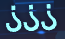

[TOC]


## threejs 文本

TextBufferGeometry

```js
// 使用require通过路径查询到node_modules/three....下的json文件, 好像不能使用import因为json没有export
const fontJson = require('three/examples/fonts/helvetiker_regular.typeface.json');
// 初始化loader实例, 使用parse方法将json转换成一个THREE识别的Font
const font = new THREE.FontLoader().parse(fontJson)
// 传参
const geometry = new THREE.TextBufferGeometry('Hello three.js!', {
      font, 
}
```

font 也可以是本地转换的字体json文件

```js
// 载入本地字体JSON 生成文本并加入到场景中
createShapeText({layerGroup, coord, color, name, angle}) {
   const loader = new THREE.FontLoader();
    // loader.load('./fonts/Microsoft_YaHei_Regular.json', (font) => {
    loader.load('./fonts/FZYaoTi_Regular.json', (font) => {
      const matLite = new THREE.MeshBasicMaterial({
        color: color,
        transparent: false,
        opacity: 0.4,
        side: THREE.DoubleSide
      });
      const message = name;
      const shapes = font.generateShapes(message, 15);
      const geometry = new THREE.ShapeBufferGeometry(shapes);
      const text = new THREE.Mesh(geometry, matLite);
      text.position.set(coord.x, coord.y, coord.z);	
      text.rotateX(Math.PI * 0.5);
      text.rotateZ(angle * Math.PI / 180); // 传入的角度
      layerGroup.add(text);
    });
}
```


## threejs 中文乱码

 

路径:  C:\Windows\Fonts

tff 格式

转换方式 [facetypejs](http://gero3.github.io/facetype.js/) 注意需要从Fonts目录中拷贝出来才能上传转换格式


## vscode 登陆Leetcode 账号密码登陆


登陆平台提示token失效的问题的原因 (胡国材)

84以上的版本需要set cookies 是需要加上secure 才能跨域，但是secure 只能用在https协议的。

目前系统都是使用http协议的，使用cookies用用户认证暂时无解。
