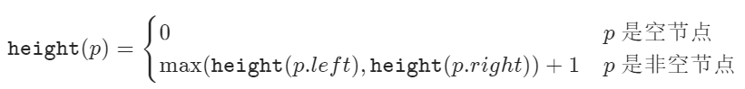
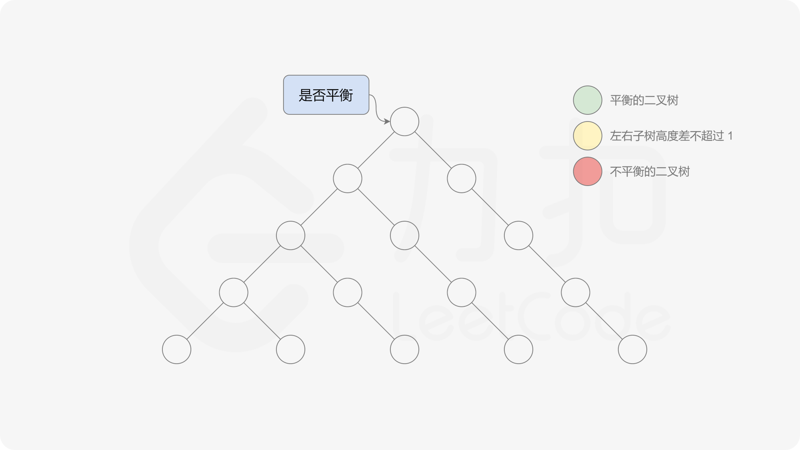

[toc]

# #110平衡二叉树[力扣官方题解](https://leetcode-cn.com/u/leetcode-solution/)

#### 前言

这道题中的平衡二叉树的定义是：

> 二叉树的每个节点的左右子树的高度差的绝对值不超过 1，则二叉树是平衡二叉树。

根据定义，一棵二叉树是平衡二叉树，当且仅当其所有子树也都是平衡二叉树，因此可以使用递归的方式判断二叉树是不是平衡二叉树，递归的顺序可以是自顶向下或者自底向上。

#### 方法一：自顶向下的递归

定义函数 *height*，用于计算二叉树中的任意一个节点 p*p* 的高度：



有了计算节点高度的函数，即可判断二叉树是否平衡。具体做法类似于二叉树的前序遍历，即对于当前遍历到的节点，首先计算左右子树的高度，如果左右子树的高度差是否不超过 11，再分别递归地遍历左右子节点，并判断左子树和右子树是否平衡。这是一个自顶向下的递归的过程。





```java
class Solution {
    public boolean isBalanced(TreeNode root) {
        if (root == null) {
            return true;
        } else {
            return Math.abs(height(root.left) - height(root.right)) <= 1 && isBalanced(root.left) && isBalanced(root.right);
        }
    }

    public int height(TreeNode root) {
        if (root == null) {
            return 0;
        } else {
            return Math.max(height(root.left), height(root.right)) + 1;
        }
    }
}
```

**复杂度分析**

- 时间复杂度：O(n ^ 2)，其中 n 是二叉树中的节点个数。
  最坏情况下，二叉树是满二叉树，需要遍历二叉树中的所有节点，时间复杂度是 O(n)。
  对于节点 p，如果它的高度是 d，则 height(*p*) 最多会被调用 *d* 次（即遍历到它的每一个祖先节点时）。对于平均的情况，一棵树的高度 *h* 满足 O*(*h*)=*O*(log*n*)，因为 d *≤*h*，所以总时间复杂度为 *O*(*n*log*n*)。对于最坏的情况，二叉树形成链式结构，高度为O*(*n)，此时总时间复杂度为 O(n^2)。
- 空间复杂度：O*(*n*)，其中 n* 是二叉树中的节点个数。空间复杂度主要取决于递归调用的层数，递归调用的层数不会超过 *n*。

方法二：自底向上的递归
方法一由于是自顶向下递归，因此对于同一个节点，函数 *height*会被重复调用，导致时间复杂度较高。如果使用自底向上的做法，则对于每个节点，函数 *height*只会被调用一次。

自底向上递归的做法类似于后序遍历，对于当前遍历到的节点，先递归地判断其左右子树是否平衡，再判断以当前节点为根的子树是否平衡。如果一棵子树是平衡的，则返回其高度（高度一定是非负整数），否则返回 -1−1。如果存在一棵子树不平衡，则整个二叉树一定不平衡。


```java
class Solution {
    public boolean isBalanced(TreeNode root) {
        return height(root) >= 0;
    }
	public int height(TreeNode root) {
        if (root == null) {
            return 0;
        }
        int leftHeight = height(root.left);
        int rightHeight = height(root.right);
        if (leftHeight == -1 || rightHeight == -1 || Math.abs(leftHeight - rightHeight) > 1) {
            return -1;
        } else {
            return Math.max(leftHeight, rightHeight) + 1;
        }
	}
}

```
复杂度分析
时间复杂度：O(n)，其中 n 是二叉树中的节点个数。使用自底向上的递归，每个节点的计算高度和判断是否平衡都只需要处理一次，最坏情况下需要遍历二叉树中的所有节点，因此时间复杂度是 O(n)。

空间复杂度：O(n)，其中 n 是二叉树中的节点个数。空间复杂度主要取决于递归调用的层数，递归调用的层数不会超过 n。


# Puppeteer [中文Api](https://zhaoqize.github.io/puppeteer-api-zh_CN/#/)


# H5 Drag & Drop
