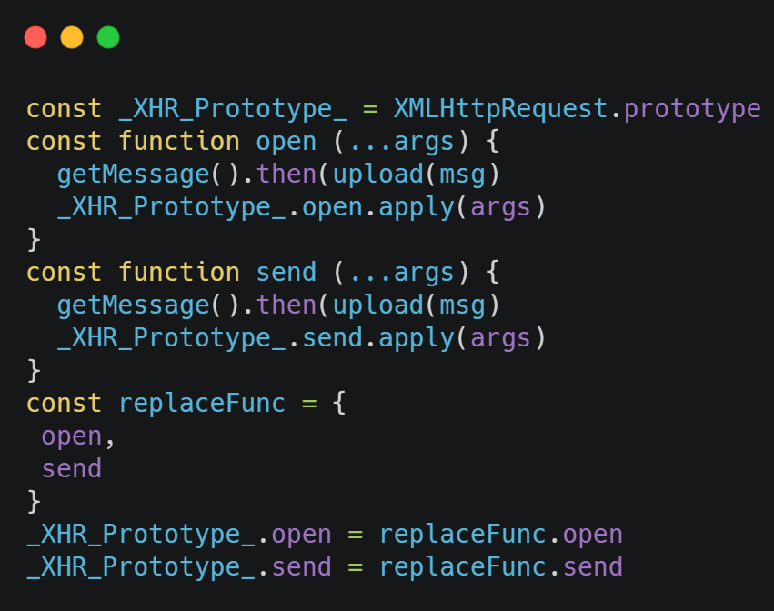
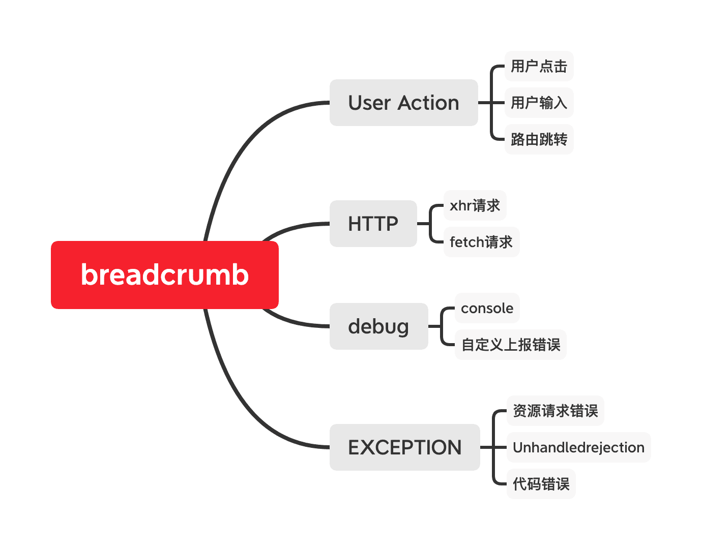

[toc]


前端监控 [mitojs](https://juejin.im/post/6862559324632252430#heading-1) [github](https://github.com/clouDr-f2e/mitojs)


## AJAX

AJAX (*Asynchronous JavaScript and XML*) 指的是通过 JavaScript 的异步通信，从服务器获取 XML 文档从中提取数据，再更新当前网页的对应部分，而不用刷新整个网页。后来，AJAX 这个词就成为 JavaScript 脚本发起 HTTP 通信的代名词，也就是说，只要用脚本发起通信，就可以叫做 AJAX 通信。

AJAX 包括以下几个步骤。

1. 创建 XMLHttpRequest 实例
2. 发出 HTTP 请求
3. 接收服务器传回的数据
4. 更新网页数据

概括起来，就是一句话，AJAX 通过原生的`XMLHttpRequest`对象发出 HTTP 请求，得到服务器返回的数据后，再进行处理。现在，服务器返回的都是 JSON 格式的数据，XML 格式已经过时了，但是 AJAX 这个名字已经成了一个通用名词，字面含义已经消失了。

### XMLHttpRequest

`XMLHttpRequest`对象是 AJAX 的主要接口，用于浏览器与服务器之间的通信。尽管名字里面有`XML`和`Http`，它实际上可以使用多种协议（比如`file`或`ftp`），发送任何格式的数据（包括字符串和二进制）。`XMLHttpRequest`本身是一个构造函数，可以使用`new`命令生成实例。它没有任何参数。

### 实例属性

### 实例方法

#### open

`XMLHttpRequest.open()`方法用于**指定 HTTP 请求的参数**，或者说初始化 XMLHttpRequest 实例对象。它一共可以接受五个参数。

- `method`：表示 HTTP 动词方法，比如`GET`、`POST`、`PUT`、`DELETE`、`HEAD`等。
- `url`: 表示请求发送目标 URL。
- `async`: 布尔值，表示**请求是否为异步**，默认为`true`。如果设为`false`，则`send()`方法只有等到收到服务器返回了结果，才会进行下一步操作。该参数可选。由于同步 AJAX 请求会造成浏览器失去响应，许多浏览器已经禁止在主线程使用，只允许 Worker 里面使用。所以，这个参数轻易不应该设为`false`。
- `user`：表示用于认证的用户名，默认为空字符串。该参数可选。
- `password`：表示用于认证的密码，默认为空字符串。该参数可选。

#### send

`XMLHttpRequest.send()`方法用于**实际发出 HTTP 请求**。

所有 XMLHttpRequest 的监听事件，都必须在`send()`方法调用之前设定。

它的参数是可选的，**如果不带参数，就表示 HTTP 请求只包含头信息**，也就是只有一个 URL，典型例子就是 GET 请求；

如果带有参数，就表示**除了头信息，还带有包含具体数据的信息体**，典型例子就是 POST 请求。

`GET`请求的参数，可以作为查询字符串附加在 URL 后面，也可以作为`send`方法的参数。

```js
var xhr = new XMLHttpRequest();
xhr.open('GET',
  'http://www.example.com/?id=' + encodeURIComponent(id),
  true
);
xhr.send(null);

// 等同于
var data = 'id=' + encodeURIComponent(id);
xhr.open('GET', 'http://www.example.com', true);
xhr.send(data);
```

#### abort

`abort()`方法用来终止已经发出的 HTTP 请求。调用这个方法以后，`readyState`属性变为`4`，`status`属性变为`0`。

#### setRequestHeader

`setRequestHeader()`方法用于设置浏览器发送的 HTTP **请求的头信息**。该方法接受两个参数。第一个参数是字符串，表示头信息的字段名，第二个参数是字段值。该方法必须在`open()`之后、`send()`之前调用。如果该方法多次调用，设定同一个字段，则每一次调用的值会被合并成一个单一的值发送。

#### getResponseHeader()

`getResponseHeader()`方法返回**HTTP 响应头信息**指定字段的值，如果还没有收到服务器回应或者指定字段不存在，返回`null`。该方法的参数不区分大小写。如果有多个字段同名，它们的值会被连接为一个字符串，每个字段之间使用“逗号+空格”分隔。

#### getAllResponseHeaders()

`XMLHttpRequest.getAllResponseHeaders()`方法返回一个字符串，表示服务器发来的**所有 HTTP 响应头信息**。格式为字符串，每个头信息之间使用`CRLF`分隔（回车+换行），如果没有收到服务器回应，该属性为`null`。如果发生网络错误，该属性为空字符串。

### overrideMimeType()

`XMLHttpRequest.overrideMimeType()`方法用来指定 MIME 类型，**覆盖服务器返回的真正的 MIME 类型，从而让浏览器进行不一样的处理**。举例来说，服务器返回的数据类型是`text/xml`，由于种种原因浏览器解析不成功报错，这时就拿不到数据了。为了拿到原始数据，我们可以把 MIME 类型改成`text/plain`，这样浏览器就不会去自动解析，从而我们就可以拿到原始文本了。

修改服务器返回的数据类型，不是正常情况下应该采取的方法。如果希望服务器返回指定的数据类型，可以用`responseType`属性告诉服务器，就像下面的例子。只有在服务器无法返回某种数据类型时，才使用`overrideMimeType()`方法。

### 实例事件

#### readyStateChange

#### progress 

#### load、error、abort

#### loadend 

#### timeout 


## 拦截Ajax上报错误信息的思路 [前端监控平台系列：JS SDK（已开源）](https://juejin.im/post/6862559324632252430#heading-1)

AJAX 初始化时重要的信息在**open & send方法的参数中**的可以获取到; 并在触发请求时上报



部分细节调整

1. open中识别自身url发出的请求则需要标记, 在send中则可以不做处理
2. 
3. **关于接口跨域、超时的问题**：这两种情况发生的时候，接口返回的响应体和响应头里面都是空的，`status`等于0，所以很难区分两者，但是正常情况下，一般项目中都的请求都是复杂请求，所以在正式请求会先进行`option`进行预请求，如果是跨域的话基本几十毫秒就会返回来，所以以此作为临界值来判断跨域与超时的问题（如果是接口不存在也会被判断成接口跨域）。


## 收集用户轨迹

使用栈来保存相关的信息, 在收集到错误信息的时候就触发上报这些轨迹

在每个事件类型的回调的时候都将类型整合：比如用户点击、路由跳转都是属于用户行为，这样做的原因是让开发者更好过滤无用信息和精准定位到需要的信息。



## 上报错误信息的方式

### 通过xhr上报

通过`xhr`上报，如果设置成异步的时候，当用户跳转新页面或者关闭页面时就会丢失当前这个请求，如果设置成同步，又会让页面造成卡顿的现象

`sentry`目前是通过`xhr`发送的，不过它在发送前会推到它设置的一个请求缓冲区` _buffer`，以此来优化并发请求过多的问题。

### Image的形式来发送请求

**特点：**

1. 没有跨域问题、
2. 发 GET 请求之后不需要获取和处理数据、
3. 服务器也不需要发送数据、
4. 不会携带当前域名 cookie、不会阻塞页面加载，影响用户的体验，只需 **new Image** 对象、
5. 相比于 BMP/PNG 体积最小，可以节约 41% / 35% 的网络资源小

### Navigator.sendBeacon

**MDN：**可用于通过[HTTP](https://developer.mozilla.org/zh-CN/docs/Glossary/HTTP)将少量数据异步传输到Web服务器，**统计和诊断代码通常要在 `unload` 或者 `beforeunload` 事件处理器中发起一个同步 `XMLHttpRequest` 来发送数据**。同步的 `XMLHttpRequest` 迫使用户代理延迟卸载文档，并使得下一个导航出现的更晚。下一个页面对于这种较差的载入表现无能为力

**特点：**

1. 发出的是异步请求，并且是`POST`请求
2. 发出的请求，是放到的浏览器任务队列执行的，脱离了当前页面，所以不会阻塞当前页面的卸载和后面页面的加载过程，用户体验较好
3. 只能判断出是否放入浏览器任务队列，不能判断是否发送成功
4. `Beacon API`不提供相应的回调，因此后端返回最好省略`response body`
5. 兼容性不是很友好


## 代码重复率检查工具jsinspect
