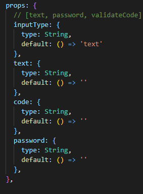

[TOC]

## Vue 父子组件中如何优雅的修改父级传下来的prop?

## [单向数据流](https://cn.vuejs.org/v2/guide/components-props.html#单向数据流)

所有的 prop 都使得其父子 prop 之间形成了一个**单向下行绑定**：父级 prop 的更新会向下流动到子组件中，但是反过来则不行。这样会防止从子组件意外变更父级组件的状态，从而导致你的应用的数据流向难以理解。

额外的，每次父级组件发生变更时，子组件中所有的 prop 都将会刷新为最新的值。这意味着你**不**应该在一个子组件内部改变 prop。如果你这样做了，Vue 会在浏览器的控制台中发出警告。

这里有两种常见的试图变更一个 prop 的情形：

1. **这个 prop 用来传递一个初始值；这个子组件接下来希望将其作为一个本地的 prop 数据来使用。**在这种情况下，最好定义一个本地的 data property 并将这个 prop 用作其初始值：

   ```
   props: ['initialCounter'],
   data: function () {
     return {
       counter: this.initialCounter
     }
   }
   ```

   > 这种情况加了默认值是不是就不能正确获取到prop呢

2. **这个 prop 以一种原始的值传入且需要进行转换。**在这种情况下，最好使用这个 prop 的值来定义一个计算属性：

   ```
   props: ['size'],
   computed: {
     normalizedSize: function () {
       return this.size.trim().toLowerCase()
     }
   }
   ```

> 注意在 JavaScript 中对象和数组是通过**引用传入**的，所以对于一个数组或对象类型的 prop 来说，在子组件中改变变更这个对象或数组本身**将会**影响到父组件的状态。


如何快速构造同类型的属性



```js
const props = ['text', 'code', 'password'].map(type=>({text: { type: String, default: () => ''},}))
props=[{…}, {…}, {…}]
const a = {a: 1, ...props}
// a = {0: {…}, 1: {…}, 2: {…}, a: 1}
```

```js
const prop = {type: String, default: ()=>""}
const a = {}; a.type=a.code=a.password=prop;
const b = {...a}
// b = {password: {…}, code: {…}, type: {…}}
```


String.prototype.slice

包前不包后
