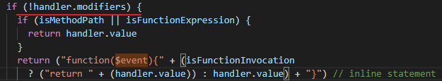
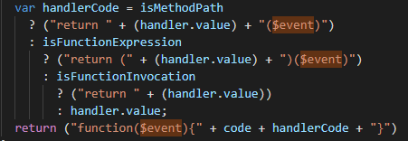
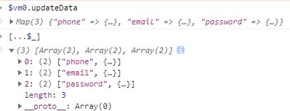

[TOC]

## 检验添加到场景中的geoJson数据是否正常

1. [ geoJson在线预览地址 ](http://geojson.io/#map=13/37.9298/102.6298) 确认改动在平面底图的那个位置
2. 是否正确加载数据文件, 网络中确认
3. 是否正否处理了数据文件, 自定义方法中确认
4. 处理完毕是否正确添加到场景里作为一个模型单元, ---- 单独选中这个模型进行确认
5. 是否正确显示与在线预览地址核对


## indexedDB


## 虚拟滚动


## 注册成功直接使用相关的数据进行登录

`register(param).then(... login(param))`


## $event的使用范围

v-on指令使用方式

- **缩写**：`@`
- **预期**：**Function** | **Inline Statement** | **Object**
- **参数**：`event`

用在普通元素上时，只能监听[**原生 DOM 事件**](https://developer.mozilla.org/zh-CN/docs/Web/Events)。用在自定义元素组件上时，也可以监听子组件触发的**自定义事件**, 组件内部的原生DOM事件需要添加.native? 还是不用?。

在监听原生 DOM 事件时，方法以事件为唯一的参数。如果使用**内联语句**，语句可以访问一个 `$event` property：`v-on:click="handle('ok', $event)"`。

```html
<!-- 动态事件缩写 (2.6.0+) -->
<button @[event]="doThis"></button>

<!-- 内联语句 --> 
<button v-on:click="doThat('hello', $event)"></button>

<!-- 对象语法 (2.4.0+) -->
<button v-on="{ mousedown: doThis, mouseup: doThat }"></button>
```

在子组件上监听自定义事件 (当子组件触发“my-event”时将调用事件处理器)：

```html
<my-component @my-event="handleThis"></my-component>

<!-- 内联语句 -->
<!-- $emit('my-event', 456), emit的首位值会传给$event-->
<my-component @my-event="handleThis(123, $event)"></my-component>

<!-- 组件中的原生事件 -->
<my-component @click.native="onClick"></my-component>
```


部分解析源码结果





## .sync修饰符


## Map 解构


