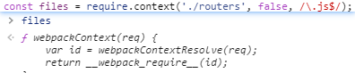
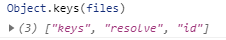

[TOC]

# 通过加载文件夹配置的方式添加vue-router路由

```js
/**
 * 加载文件夹routers里的路由配置文件
 */
const files = require.context('./routers', false, /\.js$/);
files.keys().forEach(key => {
  const data = files(key).default;
  if (Array.isArray(data)) {
    routes[1].children.push(...data);
  } else if (typeof data === 'object') {
    routes[1].children.push(data);
  }
});
```

# require.context ---- [webpack-依赖管理](https://www.webpackjs.com/guides/dependency-management/#带表达式的-require-语句)

> es6 modules

> commonjs

> amd

## 带表达式的 require 语句

如果你的 request 含有表达式(expressions)，会创建一个上下文(context)，因为在编译时(compile time)并不清楚**具体**是哪一个模块被导入。

示例：

```javascript
require("./template/" + name + ".ejs");
```

webpack 解析 `require()` 的调用，提取出来如下这些信息：

```diff
Directory: ./template
Regular expression: /^.*\.ejs$/
```

**context module** (具有上下文的模块)

（译者注：这里的 request 应该是指在 require() 语句中的表达式，如 "./template/" + name + ".ejs"）生成一个**context module**(具有上下文的模块)。它包含**目录下的所有模块**的引用(reference)，这些模块能够「通过从 request 匹配出来的正则表达式」所 require 进来。**context module**(上下文模块)包含一个 map 对象，会把 request 中所有模块转译成对应的模块 id。

示例：

```javascript
{
    "./table.ejs": 42,
    "./table-row.ejs": 43,
    "./directory/folder.ejs": 44
}
```

上下文模块还包含一些运行时(runtime)逻辑来访问这个 map 对象。

这意味着 webpack 能够支持动态 require，但会导致所有可能用到的模块都包含在 bundle 中。

## `require.context`

你还可以使用 `require.context()` 方法来创建自己的（模块）上下文。webpack 会在构建的时候解析代码中的 `require.context()` 。

语法如下：

```javascript
require.context(
    directory, 
    useSubdirectories = false,
    regExp = /^\.\//
)
```

你可以给这个方法传 3 个参数：

- 要搜索的文件夹目录，
- 是否还应该搜索它的子目录，
- 一个匹配文件的正则表达式。

示例：

```javascript
require.context("./test", false, /\.test\.js$/);
```

（创建了）一个包含了 test 文件夹（不包含子目录）下面的、所有文件名以 `.test.js` 结尾的、能被 require 请求到的文件的上下文。

`require.context("../", true, /\.stories\.js$/);`
（创建了）一个包含了父级文件夹（包含子目录）下面，所有文件名以 `.stories.js` 结尾的文件的上下文。

> 传递给 `require.context` 的参数必须是字面量(literal)！

### 上下文模块 API

一个上下文模块导出一个（require）函数，这个函数可以接收一个参数：request。



```JavaScript
ƒ webpackContext(req) {
	var id = webpackContextResolve(req);
	return __webpack_require__(id);
}
// modulePath => moduleExports
```

```js
// files(files.keys()[0])
{
  "default": [
    {
      "path": "sceneManage",
      "name": "SceneManage",
      "meta": {
        "permission": 255,
        "breadRouterName": "场景管理"
      }
    }
  ]
}
```

```js
const route = [{
  path: 'sceneManage',
  name: 'SceneManage',
  component: () => import('@/views/sceneManage/Index.vue'),
  meta: {
    permission: 255,
    breadRouterName: '场景管理'
  }
}];
export default route;
```


导出的方法有 3 个属性： `resolve`, `keys`, `id`。

- `resolve` 是一个函数，它返回请求**被解析后得到的模块 id**。

  files.resolve = (module: WebpackModule) : String => {}

  ```js
  // files.resolve.toString()
  function webpackContextResolve(req) {
  	if(!__webpack_require__.o(map, req)) {
  		var e = new Error("Cannot find module '" + req + "'");
  		e.code = 'MODULE_NOT_FOUND';
  		throw e;
  	}
  	return map[req];
  }
  ```

  

- `keys` 也是一个函数，它返回一个数组，由所有可能被上下文模块处理的请求（译者注：参考下面第二段代码中的 key）组成。

  ```js
  // files.keys.toString()
  function webpackContextKeys() {
  	return Object.keys(map);
  }
  ```

  


比如，如果想引入一个文件夹下面的所有文件，或者引入能匹配正则表达式的文件，你可以这样：

```javascript
function importAll (r) {
  r.keys().forEach(r);
}
importAll(require.context('../components/', true, /\.js$/));
```

```javascript
var cache = {};
function importAll (r) {
  r.keys().forEach(key => cache[key] = r(key));
}

importAll(require.context('../components/', true, /\.js$/));
// 在构建时，所有被 require 的模块都会被存到（上面代码中的）cache 里面。
```

- `id` 是上下文模块里面所包含的模块 id. 它可能在你使用 `module.hot.accept` 的时候被用到。`"./src/router/routers sync \.js$" // files.id `

  


## vue-router 获取所有的路由配置

$vm.$router.options


## vue 如何监听slot 插槽里面的事件?

```
<component>
    <slot name="child">
```

当组件渲染的时候，`slot` 将会被替换

在 slot 标签上添加的属性和指令会没有任何意义


v-slot can only be used on components or `<template>`.


### $vm.$data === $vm._data


## location

```js
{
  "href": "http://localhost:8089/#/retrievePassword",
  "ancestorOrigins": {},
  "origin": "http://localhost:8089",
  "protocol": "http:",
  "host": "localhost:8089",
  "hostname": "localhost",
  "port": "8089",
  "pathname": "/",
  "search": "",
  "hash": "#/retrievePassword"
}
```

