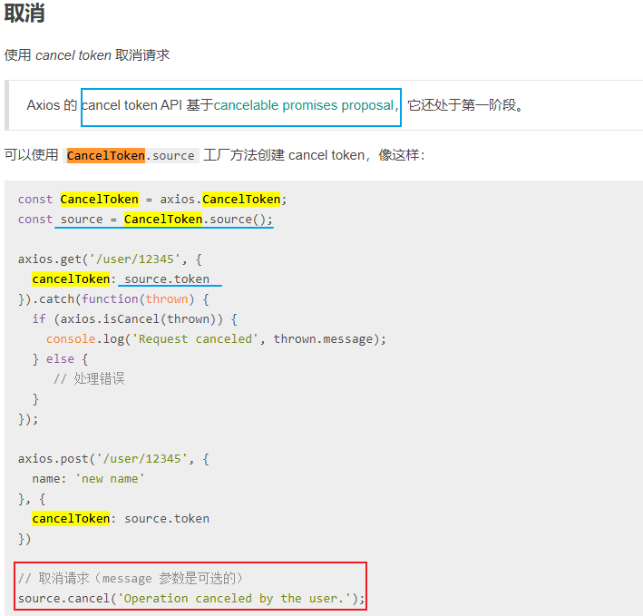
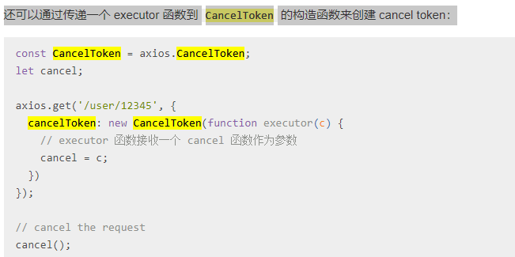

[TOC]

## karma


## axios 源码分析 (ts)

- axios/index.js  js 入口文件

- index.d.ts ts声明文件 声明的部分接口

  ```typescript
  // 配对对象接口
  export interface AxiosRequestConfig {
    url?: string;
    method?: Method;
    // `baseURL` 将自动加在 `url` 前面，除非 `url` 是一个绝对 URL。
    // 它可以通过设置一个 `baseURL` 便于为 axios 实例的方法传递相对 URL
    baseURL?: string;
      
    // `transformRequest` 允许在向服务器发送前，修改请求数据
    // 只能用在 'PUT', 'POST' 和 'PATCH' 这几个请求方法
    // 后面数组中的函数必须返回一个字符串，或 ArrayBuffer，或 Stream
    transformRequest?: AxiosTransformer | AxiosTransformer[];
      
    // `transformResponse` 在传递给 then/catch 前，允许修改响应数据
    transformResponse?: AxiosTransformer | AxiosTransformer[];
    headers?: any; // `headers` 是即将被发送的自定义请求头
    // `params` 是即将与请求一起发送的 URL 参数
    // 必须是一个无格式对象(plain object)或 URLSearchParams 对象
    params?: any;
    paramsSerializer?: (params: any) => string;
    // `data` 是作为请求主体被发送的数据
    // 只适用于这些请求方法 'PUT', 'POST', 和 'PATCH'
    data?: any;
    timeout?: number;
    timeoutErrorMessage?: string;
    withCredentials?: boolean; // `withCredentials` 表示跨域请求时是否需要使用凭证
    adapter?: AxiosAdapter;
    // `auth` 表示应该使用 HTTP 基础验证，并提供凭据
    // 这将设置一个 `Authorization` 头，覆写掉现有的任意使用 `headers` 设置的自定义 `Authorization`头
    auth?: AxiosBasicCredentials;
    responseType?: ResponseType;
    xsrfCookieName?: string; // `xsrfCookieName` 是用作 xsrf token 的值的cookie的名称
    xsrfHeaderName?: string; // `xsrfHeaderName` is the name of the http header that carries the xsrf token value
    /** requestHeaders[config.xsrfHeaderName] = cookies.read(config.xsrfCookieName); **/
    onUploadProgress?: (progressEvent: ProgressEvent) => void;
    onDownloadProgress?: (progressEvent: ProgressEvent) => void;
    maxContentLength?: number;
    validateStatus?: ((status: number) => boolean | null);
    maxBodyLength?: number;
    maxRedirects?: number;
    socketPath?: string | null;
    httpAgent?: any;
    httpsAgent?: any;
    proxy?: AxiosProxyConfig | false;
    cancelToken?: CancelToken;
    decompress?: boolean;
  }
  ```

  ```typescript
  // 返回结果接口
  export interface AxiosResponse<T = any>  {
    data: T; // `data` 由服务器提供的响应
    status: number; // `status` 来自服务器响应的 HTTP 状态码
    statusText: string; // `statusText` 来自服务器响应的 HTTP 状态信息
    headers: any; // `headers` 服务器响应的头
    config: AxiosRequestConfig; // `config` 是为请求提供的配置信息
    request?: any;
  }
  
  export interface AxiosError<T = any> extends Error {
    config: AxiosRequestConfig;
    code?: string;
    request?: any;
    response?: AxiosResponse<T>;
    isAxiosError: boolean;
    toJSON: () => object;
  }
  ```

  ```typescript
  // 实例接口
  export interface AxiosInstance {
    (config: AxiosRequestConfig): AxiosPromise;
    (url: string, config?: AxiosRequestConfig): AxiosPromise;
    defaults: AxiosRequestConfig;
    interceptors: {
      request: AxiosInterceptorManager<AxiosRequestConfig>;
      response: AxiosInterceptorManager<AxiosResponse>;
    };
    getUri(config?: AxiosRequestConfig): string;
    request<T = any, R = AxiosResponse<T>> (config: AxiosRequestConfig): Promise<R>;
    get<T = any, R = AxiosResponse<T>>(url: string, config?: AxiosRequestConfig): Promise<R>;
    delete<T = any, R = AxiosResponse<T>>(url: string, config?: AxiosRequestConfig): Promise<R>;
    head<T = any, R = AxiosResponse<T>>(url: string, config?: AxiosRequestConfig): Promise<R>;
    options<T = any, R = AxiosResponse<T>>(url: string, config?: AxiosRequestConfig): Promise<R>;
    post<T = any, R = AxiosResponse<T>>(url: string, data?: any, config?: AxiosRequestConfig): Promise<R>;
    put<T = any, R = AxiosResponse<T>>(url: string, data?: any, config?: AxiosRequestConfig): Promise<R>;
    patch<T = any, R = AxiosResponse<T>>(url: string, data?: any, config?: AxiosRequestConfig): Promise<R>;
  }
  // 构造函数静态接口
  export interface AxiosStatic extends AxiosInstance {
    create(config?: AxiosRequestConfig): AxiosInstance;
    Cancel: CancelStatic;
    CancelToken: CancelTokenStatic;
    isCancel(value: any): boolean;
    all<T>(values: (T | Promise<T>)[]): Promise<T[]>;
    spread<T, R>(callback: (...args: T[]) => R): (array: T[]) => R;
  }
  ```

- axios.js 核心

  ```javascript
  /**
   * Create an instance of Axios
   *
   * @param {Object} defaultConfig The default config for the instance
   * @return {Axios} A new instance of Axios
   */
  function createInstance(defaultConfig) {
    var context = new Axios(defaultConfig);
    var instance = bind(Axios.prototype.request, context);
    // instance 为一个wrap函数, request 绑定了 context (Axios实例)
    
    // Copy axios.prototype to instance
    utils.extend(instance, Axios.prototype, context);
    /** Object.keys(instance)
    ["request", "getUri", "delete", "get", "head", "options", "post", "put", "patch"]
    **/
      
    // Copy context to instance
    utils.extend(instance, context);
    /** Object.keys(instance)
    ["request", "getUri", "delete", "get", "head", "options", "post", "put", "patch", "defaults", "interceptors"]
    **/
  
    return instance;
  }
  
  // Create the default instance to be exported
  var axios = createInstance(defaults);	// ./defaults.js
  
  // Expose Axios class to allow class inheritance
  axios.Axios = Axios;
  module.exports = axios;
  
  // Allow use of default import syntax in TypeScript
  module.exports.default = axios;
  
  // 至此, axios就是一个wrap函数, 该函数执行时, 执行的是axios.prototype.get
  // 该函数上挂载了关联到了axios的原型方法, 为所有支持的请求方法提供别名
  // 同时, 又暴露配置对象和拦截器
  ```

  

  

  ```javascript
  // defaultConfig
  {
    "transformRequest": [null],
    "transformResponse": [null],
    "timeout": 0,
    "xsrfCookieName": "XSRF-TOKEN",
    "xsrfHeaderName": "X-XSRF-TOKEN",
    "maxContentLength": -1,
    "maxBodyLength": -1,
    "headers": {
      "common": {"Accept": "application/json, text/plain, */*"},
      "delete": {},
      "get": {},
      "head": {},
      "post": {"Content-Type": "application/x-www-form-urlencoded"},
      "put": {"Content-Type": "application/x-www-form-urlencoded"},
      "patch": {"Content-Type": "application/x-www-form-urlencoded"}
    }
  }
  // 内部Axios构造函数生成axios实例
  function Axios(instanceConfig) {
    // 可以通过defaults来访问默认配置, 该属性挂载到wrap函数上
    this.defaults = instanceConfig;
    this.interceptors = {
      request: new InterceptorManager(),
      response: new InterceptorManager()
    };
  }
  ```

  ```javascript
  // bind.js
  module.exports = function bind(fn, thisArg) {
    // 返回一个 wrap 函数
    return function wrap() {
      var args = new Array(arguments.length);
      for (var i = 0; i < args.length; i++) {
        args[i] = arguments[i];
      }
      return fn.apply(thisArg, args);
    };
  };
  
  /**
   * Extends object a by mutably adding to it the properties of object b.
   *
   * @param {Object} a The object to be extended
   * @param {Object} b The object to copy properties from
   * @param {Object} thisArg The object to bind function to
   * @return {Object} The resulting value of object a
   */
  function extend(a, b, thisArg) {
    // 针对函数的extend添加了执行上下文的限制
    forEach(b, function assignValue(val, key) {
      if (thisArg && typeof val === 'function') {
        a[key] = bind(val, thisArg);
      } else {
        a[key] = val;
      }
    });
    return a;
  }
  ```

  ```javascript
  // Axios.prototype
  /**
   * Dispatch a request
   * @param {Object} config 
   The config specific for this request (merged with this.defaults)
   */
  Axios.prototype.request = function request(config) {
    /*eslint no-param-reassign:0*/
    // Allow for axios('example/url'[, config]) a la fetch API
    if (typeof config === 'string') {
      config = arguments[1] || {};
      config.url = arguments[0];
    } else {
      config = config || {};
    }
  
    config = mergeConfig(this.defaults, config);
  
    // Set config.method
    if (config.method) {
      config.method = config.method.toLowerCase();
    } else if (this.defaults.method) {
      config.method = this.defaults.method.toLowerCase();
    } else {
      config.method = 'get';
    }
  
    // Hook up interceptors middleware
    var chain = [dispatchRequest, undefined]; // 默认首位为触发XHR请求的方法,且共享一个拦截链
    var promise = Promise.resolve(config);
  
    // chain, unshift添加到最前, push添加到最后;
    // 成对的添加, fulfilled 为执行成功的函数, rejected 为执行失败的函数
    this.interceptors.request.forEach(
        function unshiftRequestInterceptors(interceptor) {
          // 针对请求的拦截添加到最前, 插入到dispatchRequest函数之前执行
      	chain.unshift(interceptor.fulfilled, interceptor.rejected);
    });
  
    this.interceptors.response.forEach(
        function pushResponseInterceptors(interceptor) {
          // 针对返回的拦截添加到末尾, 插入到dispatchRequest函数之后执行
      	chain.push(interceptor.fulfilled, interceptor.rejected);
    });
  
      /***promise的执行顺序跟想象中会有些区别 ***/
    while (chain.length) {
      // 精髓: 遍历异步执行, Promise连续then, 
      // 每一轮遍历后promise都指向刚刚promise.then这个promise
      promise = promise.then(chain.shift(), chain.shift());
    }
  
    return promise;
  };
  
  Axios.prototype.getUri = function getUri(config) {
    config = mergeConfig(this.defaults, config);
    return buildURL(config.url, config.params, config.paramsSerializer).replace(/^\?/, '');
  };
  
  // Provide aliases for supported request methods
  utils.forEach(['delete', 'get', 'head', 'options'], function forEachMethodNoData(method) {
    Axios.prototype[method] = function(url, config) {
      return this.request(mergeConfig(config || {}, {
        method: method,
        url: url
      }));
    };
  });
  
  utils.forEach(['post', 'put', 'patch'], function forEachMethodWithData(method) {
    Axios.prototype[method] = function(url, data, config) {
      return this.request(mergeConfig(config || {}, {
        method: method,
        url: url,
        data: data
      }));
    };
  });
  
  module.exports = Axios;
  ```

- 拦截器 interceptor

  ```javascript
  function InterceptorManager() {
    this.handlers = [];
  }
  /**
   * Add a new interceptor to the stack
   * @param {Function} fulfilled  The function to handle `then` for a `Promise`
   * @param {Function} rejected 	The function to handle `reject` for a `Promise`
   *
   * @return {Number} 	An ID used to remove interceptor later
   */
  InterceptorManager.prototype.use = function use(fulfilled, rejected) {
    this.handlers.push({
      fulfilled: fulfilled,
      rejected: rejected
    });
    return this.handlers.length - 1; // 返回加入时该handle的下标
  };
  
  /** eject / v. 逐出
   * Remove an interceptor from the stack
   * @param {Number} id 	The ID that was returned by `use`
   */
  InterceptorManager.prototype.eject = function eject(id) {
    if (this.handlers[id]) {
      this.handlers[id] = null;
    }
  };
  
  /**
   * Iterate over all the registered interceptors
   * This method is particularly useful for skipping over any
   * interceptors that may have become `null` calling `eject`.
   *
   * @param {Function} fn 	The function to call for each interceptor
   */
  InterceptorManager.prototype.forEach = function forEach(fn) {
    utils.forEach(this.handlers, function forEachHandler(h) {
      // utils.forEach(obj, fn)=>fn.call(null, val, index, obj)
      // h 指向为 handler {fulfilled, rejected}
      if (h !== null) {
        fn(h); // 形参执行, 传入h, request方法中当做interceptor
      }
    });
  };
  module.exports = InterceptorManager;
  ```

  文档中的使用方式

  ```javascript
  // 为所有的XHR请求添加拦截器, 执行自定义的操作
  // 添加请求拦截器处理config $: 重点是use的第一个函数参数最后return config, 
  // 因为是连续的promise.then, 后一个then会把前一个returnValue当做参数, 
  // 当然return config的地方也可以设置某些异常来 Promise.reject 提前终止
  axios.interceptors.request.use(function (config) {
      // 在发送请求之前做些什么
      return config;
    }, function (error) {
      // 对请求错误做些什么
      return Promise.reject(error);
    });
  
  // 添加响应拦截器 $: 重点同上, 如果需要多个response处理就需要传递response
  axios.interceptors.response.use(function (response) {
      // 对响应数据做点什么
      return response;
    }, function (error) {
      // 对响应错误做点什么
      return Promise.reject(error);
    });
  ```

- dispatchRequest

  ```javascript
  /** 
   * Dispatch a request to the server using the configured adapter.
   * @param {object} config 	The config that is to be used for the request
   [config为request函数中共享的config, 经由多个拦截器处理时后的config]
   * @returns {Promise} 		The Promise to be fulfilled
   */
  module.exports = function dispatchRequest(config) {
    // Ensure headers exist
    config.headers = config.headers || {};
  
    // Transform request data
    config.data = transformData(
      config.data,
      config.headers,
      config.transformRequest
    );
  
    // Flatten headers
    config.headers = utils.merge(
      config.headers.common || {},
      config.headers[config.method] || {},
      config.headers
    );
  
    utils.forEach(
      ['delete', 'get', 'head', 'post', 'put', 'patch', 'common'],
      function cleanHeaderConfig(method) {
        delete config.headers[method];
      }
    );
  
    var adapter = config.adapter || defaults.adapter; 
    // adapter为使用了Promise封装的XMLHTTPRequest
  
    return adapter(config).then(
        // xhr 请求成功的fulfilled
        function onAdapterResolution(response) {
          // Transform response data
          response.data = transformData(
            response.data,
            response.headers,
            config.transformResponse
          );
          return response;
   	}, 
        function onAdapterRejection(reason) {
          // xhr 失败的 rejected
          if (!isCancel(reason)) {
            // Transform response data
            if (reason && reason.response) {
              reason.response.data = transformData(
                reason.response.data,
                reason.response.headers,
                config.transformResponse
              );
            }
          }
          return Promise.reject(reason);
     });
  };
  ```

- xhr.js Promise封装XMLHttpRequest

  ```js
  // 仅有一种状态请求是成功的2xx + readyStatus === 4
  module.exports = function xhrAdapter(config) {
    return new Promise(function dispatchXhrRequest(resolve, reject) {
      var requestData = config.data;
      var requestHeaders = config.headers;
  
      if (utils.isFormData(requestData)) {
        delete requestHeaders['Content-Type']; // Let the browser set it
      }
      if (
        (utils.isBlob(requestData) || utils.isFile(requestData)) &&
        requestData.type
      ) delete requestHeaders['Content-Type']; // Let the browser set it
  
      var request = new XMLHttpRequest(); //xhr实例
  
      // HTTP basic authentication
      if (config.auth) {
        var username = config.auth.username || '';
        var password = unescape(encodeURIComponent(config.auth.password)) || '';
        requestHeaders.Authorization = 'Basic ' + btoa(username + ':' + password);
      }
  
      var fullPath = buildFullPath(config.baseURL, config.url);
      request.open( // open 可接受5个参数, method, url, async, user, password 
          config.method.toUpperCase(), 
          buildURL(fullPath, config.params, config.paramsSerializer), true);
  
      // Set the request timeout in MS
      request.timeout = config.timeout;
  
      // Listen for ready state
      request.onreadystatechange = function handleLoad() {
        if (!request || request.readyState !== 4) return;
          
        // The request errored out and we didn't get a response, this will be
        // handled by onerror instead
        // With one exception: request that using file: protocol, most browsers
        // will return status as 0 even though it's a successful request
        if (request.status === 0 
            //XMLHttpRequest.status属性返回一个整数，表示服务器回应的 HTTP 状态码。
            //一般来说，如果通信成功的话，这个状态码是200；
            //如果服务器没有返回状态码，那么这个属性默认是200。
            //请求发出之前，该属性为0。该属性只读。
            && !(request.responseURL && request.responseURL.indexOf('file:') === 0)) {
          return;
        }
  
        // Prepare the response
        var responseHeaders = 'getAllResponseHeaders' in request ? parseHeaders(request.getAllResponseHeaders()) : null;
        var responseData = !config.responseType || config.responseType === 'text' ? request.responseText : request.response;
        var response = {
          data: responseData,
          status: request.status,
          statusText: request.statusText,
          headers: responseHeaders,
          config: config,
          request: request
        };
  
        settle(resolve, reject, response); // 执行状态码检测
  
        // Clean up request
        request = null;
      };
  
      // Handle browser request cancellation (as opposed to a manual cancellation)
      request.onabort = function handleAbort() {
        if (!request) return;
        reject(createError('Request aborted', config, 'ECONNABORTED', request));
        // Clean up request
        request = null;
      };
  
      // Handle low level network errors
      request.onerror = function handleError() {
        // Real errors are hidden from us by the browser
        // onerror should only fire if it's a network error
        reject(createError('Network Error', config, null, request));
        // Clean up request
        request = null;
      };
  
      // Handle timeout
      request.ontimeout = function handleTimeout() {
        // config.timeoutErrorMessage 在文档中没有体现
        var timeoutErrorMessage = 'timeout of ' + config.timeout + 'ms exceeded';
        if (config.timeoutErrorMessage) timeoutErrorMessage=config.timeoutErrorMessage;
        reject(createError(timeoutErrorMessage, config, 'ECONNABORTED', request));
        // Clean up request
        request = null;
      };
  
      // Add xsrf header
      // This is only done if running in a standard browser environment.
      // Specifically not if we're in a web worker, or react-native.
      if (utils.isStandardBrowserEnv()) {
        // Add xsrf header
        var xsrfValue = 
            (config.withCredentials || isURLSameOrigin(fullPath)) 
        	  && config.xsrfCookieName ?
          	cookies.read(config.xsrfCookieName) :
          	undefined;
  
        if (xsrfValue) {
          requestHeaders[config.xsrfHeaderName] = xsrfValue;
          // 设置对应的header用于传token吧? headerName: cookie
        }
      }
  
      // Add headers to the request
      if ('setRequestHeader' in request) {
        utils.forEach(requestHeaders, function setRequestHeader(val, key) {
          if (typeof requestData === 'undefined' 
              && key.toLowerCase() === 'content-type') {
            // Remove Content-Type if data is undefined
            delete requestHeaders[key];
          } else {
            // Otherwise add header to the request
            request.setRequestHeader(key, val);
          }
        });
      }
  
      // Add withCredentials to request if needed
      if (!utils.isUndefined(config.withCredentials)) {
        request.withCredentials = !!config.withCredentials;
      }
  
      // Add responseType to request if needed
      if (config.responseType) {
        // XMLHttpRequest.responseType属性是一个字符串，表示服务器返回数据的类型。
        // ""(等同于"text"), "arrayBuffer, "blob", "document", "json", "tetx"
        try {
          request.responseType = config.responseType;
        } catch (e) {
          // Expected DOMException thrown by browsers not compatible XMLHttpRequest Level 2.
          // But, this can be suppressed for 'json' type as it can be parsed by default 'transformResponse' function.
          //浏览器抛出的预期DOMException不兼容XMLHttpRequest Level 2。
          //但是，对于'json'类型，可以取消此设置，因为默认情况下'transformResponse'函数可以对其进行解析。
          if (config.responseType !== 'json') {
            throw e;
          }
        }
      }
  
      // 实例事件类型: progress, readyStateChange, load, error, abort, loadend, timeout
      // Handle progress if needed
      if (typeof config.onDownloadProgress === 'function') {
        request.addEventListener('progress', config.onDownloadProgress);
      }
  
      // Not all browsers support upload events
      if (typeof config.onUploadProgress === 'function' && request.upload) {
        request.upload.addEventListener('progress', config.onUploadProgress);
      }
  
      if (config.cancelToken) {
        // Handle cancellation
        config.cancelToken.promise.then(function onCanceled(cancel) {
          if (!request) return;
          request.abort();
          reject(cancel);
          // Clean up request
          request = null;
        });
      }
  
      if (!requestData) {
        requestData = null;
      }
        
      // Send the request
      request.send(requestData);
    });
  };
  ```

  **取消请求的方式: 根本上的API. XHR.abort(); 闭包访问XHR/XHR.abort**

  具体的配置方式是配置一个`cancelToken`配置成一个Promise; 在dispatchXhrRequest之前会给这个Promise设置回调,回调函数中将执行abort取消请求, 可以在配置外部手动调用`cancelToken.cancel`方法更改Promise的状态来取消; 

  

  

  `new Promise(function executor(resolve, reject))` 但是这个axios的promise只有一种状态更改, 这个函数参数会通过闭包把内部更改状态的`resolve`抛出来, 形成闭包, 在外部可以控制取消;

  

- 拦截器自定义函数执行的顺序

  ```javascript
  // 添加请求拦截器
  [1,2].forEach(num => {
      axios.interceptors.request.use(
          function (config) {
              console.log(`request-interceptors: ${num} - ${config.url}`);
              return config;
          },
          function (error) {
              // 对请求错误做些什么
              return Promise.reject(error);
          }
      );
  
      // 添加响应拦截器
      axios.interceptors.response.use(
          function (response) {
              // 对响应数据做点什么
              console.log(`response-interceptors: ${num} - ${response.config.url}`);
              return response;
          },
          function (error) {
              // 对响应错误做点什么
              return Promise.reject(error);
          }
      );
  });
  // 此时有两个axios请求: axios('url1') axios('url2')
  // 输出结果为: ?
  ```

  

  

 从现象可以看出请求的拦截器执行顺序是

- axios执行发出请求前都会执行request拦截器

- 后添加的request拦截器先执行

  

- response拦截器则是先添加的先执行

- response按顺序执行且独立的原因是在获取到网络请求的结果后依次执行拦截器

拦截器链: [{request-interceptors}, ... , dispatchRequest, undefined, {response-interceptors}, ... ]

请求拦截器的执行顺序是统一倒置是因为: 

```js
while (chain.length) {
    // from beginning of the queue, and execute, consume two functions of the queue
    promise = promise.then(chain.shift(), chain.shift());
}
```

这里说明了一轮请求拦截器生成的Promise微任务执行完再到下一轮

## Axios请求超时失败时重新请求N次的设置

```javascript
// 设置全局的请求次数，请求的间隙
axios.defaults.retry = 1;
axios.defaults.retryDelay = 1000;
// 请求超时拦截，重新请求
axios.interceptors.response.use(function(response) {
  const status = response.status;
  if (status !== 200) {
    Message({
      type: 'error',
      message: '请求服务好像出错了，' + status
    });
    return Promise.reject(response);
  }
  return Promise.resolve(response);
}, function axiosRetryInterceptor(err) {
  const config = err.config;
  // If config does not exist or the retry option is not set, reject
  if (!config || !config.retry) return Promise.reject(err);

  // Set the variable for keeping track of the retry count
  config.__retryCount = config.__retryCount || 0;

  // Check if we've maxed out the total number of retries
  if (config.__retryCount >= config.retry) {
    // Reject with the error
    return Promise.reject(err);
  }

  // Increase the retry count
  config.__retryCount += 1;

  // Create new promise to handle exponential backoff
  const backoff = new Promise(function(resolve) {
    setTimeout(function() {
      resolve();
    }, config.retryDelay || 1);
  });

  // Return the promise in which recalls axios to retry the request
  return backoff.then(function() {
    return axios(config);
  });
});
```


## 遍历对象属性的方法

1. ES5 之前的遍历: for ... in;  `Object.getOwnPropertyNames`(还会返回不可枚举的属性名),
2. 自身可枚举属性的遍历:Object.keys, Object.values, Object.entries; `会过滤Symbol属性名`
3. Symbol**属性名**的遍历: `Object.getOwnPropertySymbols`
4. `Reflect.ownKeys` 返回所有类型的键名，包括常规键名和 Symbol 键名; `Object.getOwnPropertyNames`(包含不可枚举的属性名)与`Object.getOwnPropertySymbols`(包含Symbol属性名) 之和


## 连续Promise.then的执行顺序

```js
let i = 5, counter = 0, promise = Promise.resolve('start');
while (i) {
    promise = promise.then(res => {
        console.log(res);
        return counter++;
    });
    i--;
}
// 求输出结果
```

```js
function createPromise(type) {
let i = 5, counter = 0, promise = Promise.resolve('start');
    while (i) {
        promise = promise.then(res => {
            console.log(`${res}~${type}`);
            return counter++;
        });
        i--;
    }
}
createPromise('first');
createPromise('second');
// 求输出结果
```


## 网络安全

网络攻击方式

- XSS
- CSRF
