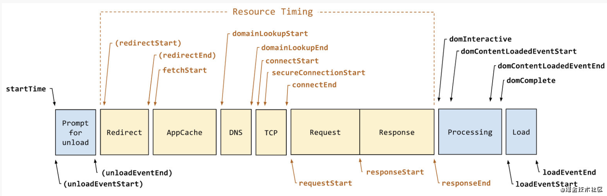

[TOC]

## Performance Interface API

```ts
interface performance {
	eventCounts: EventCountes; // for google
	memory: MemoryInfo; //  // for google
	readonly navigation: PerformanceNavigation;
	readonly timeOrigin: number;
	readonly timing: PerformanceTiming;
    onresourcetimingbufferfull: function | null;
}
```

[`Performance.navigation`](https://developer.mozilla.org/zh-CN/docs/Web/API/Performance/navigation) 只读

​	[`PerformanceNavigation`](https://developer.mozilla.org/zh-CN/docs/Web/API/PerformanceNavigation) 对象提供了**在指定的时间段里发生的操作相关信息，包括页面是加载还是刷新、发生了多少次重定向**等等。*Not available in workers*.

[`Performance.timing`](https://developer.mozilla.org/zh-CN/docs/Web/API/Performance/timing) 只读

​	[`PerformanceTiming`](https://developer.mozilla.org/zh-CN/docs/Web/API/PerformanceTiming) 对象包含延迟相关的性能信息。*Not available in workers*.

[`performance.memory`](https://developer.mozilla.org/zh-CN/docs/Web/API/Performance/memory) 

​	其是 Chrome 添加的一个非标准扩展，这个属性提供了一个可以获取到*基本内存*使用情况的对象。**不应该**使用这个非标准的 API。

[`Performance.timeOrigin`](https://developer.mozilla.org/zh-CN/docs/Web/API/Performance/timeOrigin) 只读 

​	返回性能测量开始时的时间的高精度时间戳。

[`Performance.onresourcetimingbufferfull`](https://developer.mozilla.org/zh-CN/docs/Web/API/Performance/onresourcetimingbufferfull)

​	一个回调的 [`EventTarget`](https://developer.mozilla.org/zh-CN/docs/Web/API/EventTarget)，当触发 `resourcetimingbufferfull` 事件的时候会被调用。

### 实例方法

**`Performance` 接口没有继承任何方法。**

- [`Performance.mark()`](https://developer.mozilla.org/zh-CN/docs/Web/API/Performance/mark)

  根据给出 name 值，在浏览器的**性能输入缓冲区**中创建一个相关的[`timestamp`](https://developer.mozilla.org/zh-CN/docs/Web/API/DOMHighResTimeStamp)

- [`Performance.clearMarks()`](https://developer.mozilla.org/zh-CN/docs/Web/API/Performance/clearMarks)

  将给定的 mark 从浏览器的性能输入缓冲区中移除。

- [`Performance.measure()`](https://developer.mozilla.org/zh-CN/docs/Web/API/Performance/measure)

  在浏览器的**指定 *start mark 和 end mark* 间的性能输入缓冲区**中创建一个指定的 [`timestamp`](https://developer.mozilla.org/zh-CN/docs/Web/API/DOMHighResTimeStamp)

- [`Performance.clearMeasures()`](https://developer.mozilla.org/zh-CN/docs/Web/API/Performance/clearMeasures)

  将给定的 measure 从浏览器的性能输入缓冲区中移除。

  **~~ mark 打标记, 然后使用 measure 测量标记之间的时间长度 ~~**

  ```js
  measure = function (name, startTag, endTag) {
      perf.measure(name, startTag, endTag);
      perf.clearMarks(startTag);
      perf.clearMarks(endTag);
      // perf.clearMeasures(name)
  };
  updateComponent = function () {
      var name = vm._name;
      var id = vm._uid;
      var startTag = "vue-perf-start:" + id;
      var endTag = "vue-perf-end:" + id;
  
      mark(startTag);
      var vnode = vm._render();
      mark(endTag);
      measure(("vue " + name + " render"), startTag, endTag);
  
      mark(startTag);
      vm._update(vnode, hydrating);
      mark(endTag);
      measure(("vue " + name + " patch"), startTag, endTag);
  };
  ```

  

- [`Performance.clearResourceTimings()`](https://developer.mozilla.org/zh-CN/docs/Web/API/Performance/clearResourceTimings)

  从浏览器的性能数据缓冲区中移除所有 [`entryType`](https://developer.mozilla.org/zh-CN/docs/Web/API/PerformanceEntry/entryType) 是 "`resource`" 的 [`performance entries`](https://developer.mozilla.org/zh-CN/docs/Web/API/PerformanceEntry)。

- [`Performance.getEntries()`](https://developer.mozilla.org/zh-CN/docs/Web/API/Performance/getEntries)

  基于给定的 *filter* 返回一个 [`PerformanceEntry`](https://developer.mozilla.org/zh-CN/docs/Web/API/PerformanceEntry) 对象的列表。

- [`Performance.getEntriesByName()`](https://developer.mozilla.org/zh-CN/docs/Web/API/Performance/getEntriesByName)

  基于给定的 *name* 和 *entry type* 返回一个 [`PerformanceEntry`](https://developer.mozilla.org/zh-CN/docs/Web/API/PerformanceEntry) 对象的列表。

- [`Performance.getEntriesByType()`](https://developer.mozilla.org/zh-CN/docs/Web/API/Performance/getEntriesByType)

  基于给定的 *entry type* 返回一个 [`PerformanceEntry`](https://developer.mozilla.org/zh-CN/docs/Web/API/PerformanceEntry) 对象的列表

- [`Performance.now()`](https://developer.mozilla.org/zh-CN/docs/Web/API/Performance/now)

  返回一个表示从性能测量时刻开始经过的毫秒数 [`DOMHighResTimeStamp`](https://developer.mozilla.org/zh-CN/docs/Web/API/DOMHighResTimeStamp)

- [`Performance.setResourceTimingBufferSize()`](https://developer.mozilla.org/zh-CN/docs/Web/API/Performance/setResourceTimingBufferSize)

  将浏览器的资源 timing 缓冲区的大小设置为 "`resource`" [`type`](https://developer.mozilla.org/zh-CN/docs/Web/API/PerformanceEntry/entryType) [`performance entry`](https://developer.mozilla.org/zh-CN/docs/Web/API/PerformanceEntry) 对象的指定数量

- [`Performance.toJSON()`](https://developer.mozilla.org/zh-CN/docs/Web/API/Performance/toJSON)

  其是一个 JSON 格式转化器，返回 `Performance` 对象的 JSON 对象

```js
// performance.getEntriesByType("navigation")[0].toJSON();
{
  "name": "https://developer.mozilla.org/zh-CN/docs/Web/API/Performance",
  "entryType": "navigation",
  "startTime": 0,
  "duration": 1491.9350000000122,
  "initiatorType": "navigation",
  "nextHopProtocol": "h2",
  "workerStart": 0,
  "redirectStart": 0,
  "redirectEnd": 0,
  "fetchStart": 2.5649999997767736,
  "domainLookupStart": 2.5649999997767736,
  "domainLookupEnd": 2.5649999997767736,
  "connectStart": 2.5649999997767736,
  "connectEnd": 2.5649999997767736,
  "secureConnectionStart": 2.5649999997767736,
  "requestStart": 6.049999999959255,
  "responseStart": 656.025000000227,
  "responseEnd": 1331.7600000000311,
  "transferSize": 44088,
  "encodedBodySize": 43401,
  "decodedBodySize": 327023,
  "serverTiming": [],
  "workerTiming": [],
  "unloadEventStart": 659.9100000003091,
  "unloadEventEnd": 659.9400000004607,
  "domInteractive": 1362.5849999998536,
  "domContentLoadedEventStart": 1408.7650000001304,
  "domContentLoadedEventEnd": 1408.770000000004,
  "domComplete": 1489.875000000211,
  "loadEventStart": 1489.9100000002363,
  "loadEventEnd": 1491.9350000000122,
  "type": "navigate",
  "redirectCount": 0
}
```


### PerformanceTiming

值类型: new Date().getTime() 返回的时间戳

[`PerformanceTiming.navigationStart`](https://developer.mozilla.org/zh-CN/docs/Web/API/PerformanceTiming/navigationStart) 只读

表征了从同一个浏览器上下文的上一个文档卸载(unload)结束时的UNIX时间戳。

如果没有上一个文档，这个值会和PerformanceTiming.fetchStart相同。

[`PerformanceTiming.unloadEventStart`](https://developer.mozilla.org/zh-CN/docs/Web/API/PerformanceTiming/unloadEventStart) 只读

表征了`unload`事件抛出时的UNIX时间戳。如果没有上一个文档，or if the previous document, or one of the needed redirects, is not of the same origin, 这个值会返回0.

[`PerformanceTiming.unloadEventEnd`](https://developer.mozilla.org/zh-CN/docs/Web/API/PerformanceTiming/unloadEventEnd) 只读

表征了`unload`事件处理完成时的UNIX时间戳。如果没有上一个文档，or if the previous document, or one of the needed redirects, is not of the same origin, 这个值会返回0.

[`PerformanceTiming.redirectStart`](https://developer.mozilla.org/zh-CN/docs/Web/API/PerformanceTiming/redirectStart) 只读

表征了第一个HTTP重定向开始时的UNIX时间戳。

如果没有重定向，或者重定向中的一个不同源，这个值会返回0.

[`PerformanceTiming.redirectEnd`](https://developer.mozilla.org/zh-CN/docs/Web/API/PerformanceTiming/redirectEnd) 只读

表征了最后一个HTTP重定向完成时（也就是说是HTTP响应的最后一个比特直接被收到的时间）的UNIX时间戳。

如果没有重定向，或者重定向中的一个不同源，这个值会返回0.

[`PerformanceTiming.fetchStart`](https://developer.mozilla.org/zh-CN/docs/Web/API/PerformanceTiming/fetchStart) 只读

表征了浏览器准备好使用HTTP请求来获取(fetch)文档的UNIX时间戳。

这个时间点会在检查任何应用缓存之前。

[`PerformanceTiming.domainLookupStart`](https://developer.mozilla.org/zh-CN/docs/Web/API/PerformanceTiming/domainLookupStart) 只读

表征了域名查询开始的UNIX时间戳。

如果使用了持续连接(persistent connection)，或者这个信息存储到了缓存或者本地资源上，这个值将和 `PerformanceTiming.fetchStart一致。`

[`PerformanceTiming.domainLookupEnd`](https://developer.mozilla.org/zh-CN/docs/Web/API/PerformanceTiming/domainLookupEnd) 只读

表征了域名查询结束的UNIX时间戳。

如果使用了持续连接(persistent connection)，或者这个信息存储到了缓存或者本地资源上，这个值将和 `PerformanceTiming.fetchStart一致。`

[`PerformanceTiming.connectStart`](https://developer.mozilla.org/zh-CN/docs/Web/API/PerformanceTiming/connectStart) 只读

返回HTTP请求开始向服务器发送时的Unix毫秒时间戳。

如果使用持久连接（persistent connection），则返回值等同于fetchStart属性的值。

[`PerformanceTiming.connectEnd`](https://developer.mozilla.org/zh-CN/docs/Web/API/PerformanceTiming/connectEnd) 只读

返回浏览器与服务器之间的连接建立时的Unix毫秒时间戳。

如果建立的是持久连接，则返回值等同于fetchStart属性的值。

连接建立指的是所有握手和认证过程全部结束。

[`PerformanceTiming.secureConnectionStart`](https://developer.mozilla.org/zh-CN/docs/Web/API/PerformanceTiming/secureConnectionStart) 只读

返回浏览器与服务器开始安全链接的握手时的Unix毫秒时间戳。

如果当前网页不要求安全连接，则返回0。

[`PerformanceTiming.requestStart`](https://developer.mozilla.org/zh-CN/docs/Web/API/PerformanceTiming/requestStart) 只读

返回浏览器向服务器发出HTTP请求时（或开始读取本地缓存时）的Unix毫秒时间戳。

[`PerformanceTiming.responseStart`](https://developer.mozilla.org/zh-CN/docs/Web/API/PerformanceTiming/responseStart) 只读

返回浏览器从服务器收到（或从本地缓存读取）第一个字节时的Unix毫秒时间戳。如果传输层在开始请求之后失败并且连接被重开，该属性将会被数制成新的请求的相对应的发起时间。

[`PerformanceTiming.responseEnd`](https://developer.mozilla.org/zh-CN/docs/Web/API/PerformanceTiming/responseEnd) 只读

返回浏览器从服务器收到（或从本地缓存读取，或从本地资源读取）最后一个字节时（如果在此之前HTTP连接已经关闭，则返回关闭时）的Unix毫秒时间戳。

[`PerformanceTiming.domLoading`](https://developer.mozilla.org/zh-CN/docs/Web/API/PerformanceTiming/domLoading) 只读

返回当前网页DOM结构开始解析时（即[`Document.readyState`](https://developer.mozilla.org/zh-CN/docs/Web/API/Document/readyState)属性变为“loading”、相应的 `readystatechange`事件触发时）的Unix毫秒时间戳。

[`PerformanceTiming.domInteractive`](https://developer.mozilla.org/zh-CN/docs/Web/API/PerformanceTiming/domInteractive) 只读

返回当前网页DOM结构结束解析、开始加载内嵌资源时（即[`Document.readyState`](https://developer.mozilla.org/zh-CN/docs/Web/API/Document/readyState)属性变为“interactive”、相应的`readystatechange`事件触发时）的Unix毫秒时间戳。

[`PerformanceTiming.domComplete`](https://developer.mozilla.org/zh-CN/docs/Web/API/PerformanceTiming/domComplete) 只读

返回当前文档**解析完成**，即[`Document.readyState`](https://developer.mozilla.org/zh-CN/docs/Web/API/Document/readyState) 变为 `'complete'`且相对应的`readystatechange` 被触发时的Unix毫秒时间戳。

[`PerformanceTiming.domContentLoadedEventStart`](https://developer.mozilla.org/zh-CN/docs/Web/API/PerformanceTiming/domContentLoadedEventStart) 只读

返回当解析器发送`DOMContentLoaded` 事件，即所有需要被执行的脚本已经被解析时的Unix毫秒时间戳。

[`PerformanceTiming.domContentLoadedEventEnd`](https://developer.mozilla.org/zh-CN/docs/Web/API/PerformanceTiming/domContentLoadedEventEnd) 只读

返回当所有需要**立即执行的脚本已经被执行**（不论执行顺序）时的Unix毫秒时间戳。

[`PerformanceTiming.loadEventStart`](https://developer.mozilla.org/zh-CN/docs/Web/API/PerformanceTiming/loadEventStart) 只读

返回该文档下，`load`事件被发送时的Unix毫秒时间戳。

如果这个事件还未被发送，它的值将会是0。

[`PerformanceTiming.loadEventEnd`](https://developer.mozilla.org/zh-CN/docs/Web/API/PerformanceTiming/loadEventEnd) 只读

返回当`load`事件结束，即加载事件完成时的Unix毫秒时间戳。

如果这个事件还未被发送，或者尚未完成，它的值将会是0.

```json
{
// dom 相关的时间节点
  "domComplete": 1600051859831,
  "domContentLoadedEventEnd": 1600051855763,
  "domContentLoadedEventStart": 1600051855763,
  "domInteractive": 1600051855763,
  "domLoading": 1600051855695
}
```


#### 网络指标

> 从网络层面来看涉及的指标有：重定向耗时、DNS解析耗时、TCP连接耗时、SSL耗时、TTFB网络请求耗时、数据传输耗时、资源加载耗时……,各个指标的解释如下表所示：

| 指标              | 解释                                                         |
| ----------------- | ------------------------------------------------------------ |
| 重定向耗时        | 重定向所耗费的时间                                           |
| DNS解析耗时       | 浏览器输入网址后首先会进行DNS解析，其可以对服务器是否工作作出反馈 |
| TCP连接耗时       | 指建立连接过程的耗时                                         |
| SSL连接耗时       | 指数据安全性、完整性建立耗时                                 |
| TTFB 网络请求耗时 | 表示浏览器接收第一个字节的时间                               |
| 数据传输耗时      | 浏览器接收内容所耗费的时间                                   |
| 资源加载耗时      | DOM构建完毕后到页面加载完毕这段时间                          |

#### **页面指标**

| 指标                            | 解释                                                         |
| ------------------------------- | ------------------------------------------------------------ |
| FP（First Paint）               | 首次绘制，标记浏览器渲染任何在视觉上不同于导航前屏幕内容之内容的时间点. |
| FCP（First Contentful Paint）   | 首次内容绘制，标记浏览器渲染来自 DOM 第一位内容的时间点，该内容可能是文本、图像、SVG 甚至 元素. |
| LCP（Largest Contentful Paint） | 最大内容渲染，表示可视区“内容”最大的可见元素开始出现在屏幕上的时间点。 |
| FMP（First Meaningful Paint）   | 首次有效绘制，表示页面的“主要内容”开始出现在屏幕上的时间点。它是我们测量用户加载体验的主要指标。 |
| DCL（DomContentLoaded）         | 当 HTML 文档被完全加载和解析完成之后，DOMContentLoaded 事件被触发，无需等待样式表、图像和子框架的完成加载. |
| L（onLoad）                     | 当依赖的资源全部加载完毕之后才会触发                         |
| TTI（Time to Interactive）      | 可交互时间，用于标记应用已进入视觉渲染并能可靠响应用户输入的时间点 |
| FID（First Input Delay）        | 首次输入延迟，用户首次和页面交互（单击链接、点击按钮等）到页面响应交互的时间 |

window.performance中的timing属性中的内容不就是为了求解上述指标所需要的值


| 指标              | 计算                                      |
| ----------------- | ----------------------------------------- |
| 重定向耗时        | redirectEnd - redirectStart               |
| DNS解析耗时       | domainLookupEnd - domainLookupStart       |
| TCP连接耗时       | connectEnd - connectStart                 |
| SSL连接耗时       | connectEnd - secureConnectionStart        |
| TTFB 网络请求耗时 | responseStart - requestStart              |
| 数据传输耗时      | responseEnd - responseStart               |
| 资源加载耗时      | loadEventStart - domContentLoadedEventEnd |

##### FP和FCP

通过window.performance.getEntriesByType(‘paint’)的方式获取

```
const paint = window.performance.getEntriesByType('paint');
const FP = paint[0].startTime,
const FCP = paint[1].startTime,
```

##### LCP

```
function getLCP() {
    // 增加一个性能条目的观察者
    new PerformanceObserver((entryList, observer) => {
        let entries = entryList.getEntries();
        const lastEntry = entries[entries.length - 1];
        observer.disconnect();
        console.log('LCP', lastEntry.renderTime || lastEntry.loadTime);
    }).observe({entryTypes: ['largest-contentful-paint']});
}
```

##### FMP

```
function getFMP() {
    let FMP;
    new PerformanceObserver((entryList, observer) => {
        let entries = entryList.getEntries();
        observer.disconnect();
        console.log('FMP', entries);
    }).observe({entryTypes: ['element']});
}
```

##### DCL

```
domContentLoadEventEnd – fetchStart
```

##### L

```
loadEventStart – fetchStart
```

##### TTI

```
domInteractive – fetchStart
```

##### FID

```
function getFID() {
    new PerformanceObserver((entryList, observer) => {
        let firstInput = entryList.getEntries()[0];
        if (firstInput) {
            const FID = firstInput.processingStart - firstInput.startTime;
            console.log('FID', FID);
        }
        observer.disconnect();
    }).observe({type: 'first-input', buffered: true});
}
```


### document.readyState

`document.readyState`属性返回当前文档的状态，共有三种可能的值。

- `loading`：加载 HTML 代码阶段（尚未完成解析）
- `interactive`：加载外部资源阶段
- `complete`：加载完成

这个属性变化的过程如下。

1. 浏览器开始解析 HTML 文档，`document.readyState`属性等于`loading`。
2. 浏览器遇到 HTML 文档中的**`<script>`**元素，并且没有`async`或`defer`属性，就暂停解析，开始执行脚本 **(解析阻塞执行同步脚本)**，这时`document.readyState`属性还是等于`loading`。
3. HTML 文档解析完成，`document.readyState`属性变成`interactive`。
4. 浏览器等待图片、样式表、字体文件等外部资源加载完成，一旦全部加载完成，`document.readyState`属性变成`complete`。

## 前端性能监控


## Scss 模块化语法

### CSS功能拓展

1. 嵌套

2. 父选择器 **&**

   1. ```scss
      a {
        font-weight: bold;
        text-decoration: none;
        &:hover { text-decoration: underline; }
        body.firefox & { font-weight: normal; } // 这种不太直观
      }
      ```

      编译为

      ```css
      a {
        font-weight: bold;
        text-decoration: none; }
        a:hover {
          text-decoration: underline; }
        body.firefox a {
          font-weight: normal; }
      ```

   2. `&` 必须作为选择器的第一个字符，其后可以跟随后缀生成复合的选择器，例如

      ```scss
      #main {
        color: black;
        &-sidebar { border: 1px solid; }
      }
      ```

      编译为

      ```css
      #main {
        color: black; }
        #main-sidebar {
          border: 1px solid; }
      ```

3. 属性嵌套

   有些 CSS 属性遵循相同的命名空间 (namespace)，比如 `font-family, font-size, font-weight` 都以 `font` 作为属性的命名空间。

   ```scss
   .funky {
     font: {
       family: fantasy;
       size: 30em;
       weight: bold;
     }
   }
   ```

   编译为

   ```css
   .funky {
     font-family: fantasy;
     font-size: 30em;
     font-weight: bold; }
   ```

   命名空间也可以包含自己的属性值，例如：

   ```scss
   .funky {
     font: 20px/24px {
       family: fantasy;
       weight: bold;
     }
   }
   ```

   编译为

   ```css
   .funky {
     font: 20px/24px;
       font-family: fantasy;
       font-weight: bold; }
   ```

### SassScipt

在 CSS 属性的基础上 Sass 提供了一些名为 SassScript 的新功能。 

SassScript 可作用于任何属性，允许属性使用变量、算数运算等额外功能。

通过 interpolation，SassScript 甚至可以生成选择器或属性名，这一点对编写 mixin 有很大帮助。

1. Interactive Shell, 命令行中进行运算

   ```sh
   $ sass -i
   >> "Hello, Sassy World!"
   "Hello, Sassy World!"
   >> 1px + 1px + 1px
   3px
   >> #777 + #777
   #eeeeee
   >> #777 + #888
   white
   ```

2. 变量 `$` (Variables: `$`)

   SassScript 最普遍的用法就是变量，变量以美元符号开头，

   变量支持块级作用域，嵌套规则内定义的变量只能在嵌套规则内使用（局部变量），不在嵌套规则内定义的变量则可在任何地方使用（全局变量）。

   将局部变量转换为全局变量可以添加 `!global` 声明：

   **CSS 可以直接使用变量**

   ```
   --height: 40px;
   height: var(--height); // CSS
   
   $height: 40px;
   height: $height;
   ```

3. 数据类型 (Data Types)

SassScript 支持 6 种主要的数据类型：

- 数字，`1, 2, 13, 10px`
- 字符串，有引号字符串与无引号字符串，`"foo", 'bar', baz`
- 颜色，`blue, #04a3f9, rgba(255,0,0,0.5)`
- 布尔型，`true, false`
- 空值，`null`
- 数组 (list)，用空格或逗号作分隔符，`1.5em 1em 0 2em, Helvetica, Arial, sans-serif`
- maps, 相当于 JavaScript 的 object，`(key1: value1, key2: value2)`

4. 运算 + 圆括号

   所有数据类型均支持相等运算 `==` 或 `!=`，此外，每种数据类型也有其各自支持的运算方式。 圆括号可以用来影响运算的顺序

5. 内置函数 [$](https://sass-lang.com/documentation/modules)

6. 插值语句 `#{}` (Interpolation: `#{}`)

   通过 `#{}` 插值语句可以**在选择器或属性名中使用变量**：

   ```scss
   $name: foo;
   $attr: border;
   p.#{$name} {
     #{$attr}-color: blue;
   }
   ```

   编译为

   ```css
   p.foo {
     border-color: blue; }
   ```

   `#{}` 插值语句也可以在属性值中插入 SassScript，大多数情况下，这样可能还不如使用变量方便，但是使用 `#{}` 可以避免 Sass运行运算表达式，直接编译 CSS。

   ```scss
   p {
     $font-size: 12px;
     $line-height: 30px;
     font: #{$font-size}/#{$line-height};
   }
   ```

   编译为

   ```css
   p {
     font: 12px/30px; }
   ```

7. 变量定义 `!default` (Variable Defaults: `!default`)

   可以**在变量的结尾添加 `!default` **给一个未通过 `!default` 声明赋值的变量赋值，此时，如果变量已经被赋值，不会再被重新赋值，但是如果变量还没有被赋值或者为null空值时，则会被赋予新的值。

   ```scss
   $content: "First content";
   $content: "Second content?" !default;
   $new_content: "First time reference" !default;
   
   #main {
     content: $content;
     new-content: $new_content;
   }
   ```

   编译为

   ```css
   #main {
     content: "First content";
     new-content: "First time reference"; }
   ```

8. @-Rules 与指令 (@-Rules and Directives)

   + @import 

     Sass 拓展了 `@import` 的功能，允许其导入 SCSS 或 Sass 文件。

     被导入的文件将合并编译到同一个 CSS 文件中

     另外，被导入的文件中所包含的变量或者混合指令 (mixin) 都可以在导入的文件中使用。

     通常，`@import` 寻找 Sass 文件并将其导入，但在以下情况下，`@import` 仅作为普通的 CSS 语句，不会导入任何 Sass 文件。

     - 文件拓展名是 `.css`；
     - 文件名以 `http://` 开头；
     - 文件名是 `url()`；
     - `@import` 包含 media queries

     如果不在上述情况内，文件的拓展名是 `.scss` 或 `.sass`，则导入成功。

     没有指定拓展名，Sass 将会试着寻找文件名相同，拓展名为 `.scss` 或 `.sass` 的文件并将其导入。

   + @midia

   + @extend

     在设计网页的时候常常遇到这种情况：一个元素使用的样式与另一个元素完全相同，但又添加了额外的样式。

     通常会在 HTML 中给元素定义两个 class，一个通用样式，一个特殊样式。

     假设现在要设计一个普通错误样式与一个严重错误样式，一般会这样写：

     ```html
     <div class="error seriousError">
       Oh no! You've been hacked!
     </div>
     ```

     样式如下

     ```css
     .error {
       border: 1px #f00;
       background-color: #fdd;
     }
     .seriousError {
       border-width: 3px;
     }
     ```

     麻烦的是，这样做必须时刻记住使用 `.seriousError` 时需要参考 `.error` 的样式，带来了很多不变：智能比如加重维护负担，导致 bug，或者给 HTML 添加无语意的样式。

     使用 `@extend` 可以避免上述情况，告诉 Sass **将一个选择器下的所有样式继承给另一个选择器**。

     ```scss
     .error {
       border: 1px #f00;
       background-color: #fdd;
     }
     .seriousError {
       @extend .error;
       border-width: 3px;
     }
     ```

     上面代码的意思是将 `.error` 下的所有样式继承给 `.seriousError`，`border-width: 3px;` 是单独给 `.seriousError` 设定特殊样式，这样，使用 `.seriousError` 的地方可以不再使用 `.error`。

     **其他使用到 `.error` 的样式也会同样继承给 `.seriousError`**，例如，另一个样式 `.error.intrusion` 使用了 `hacked.png` 做背景，`<div class="seriousError intrusion">` 也同样会使用 `hacked.png` 背景。

     ```css
     .error.intrusion {
       background-image: url("/image/hacked.png");
     }
     ```

     - `@extend` 的作用是将重复使用的样式 (`.error`) 延伸 (extend) 给需要包含这个样式的特殊样式（`.seriousError`），刚刚的例子：

       ```scss
       .error {
         border: 1px #f00;
         background-color: #fdd;
       }
       .error.intrusion {
         background-image: url("/image/hacked.png");
       }
       .seriousError {
         @extend .error;
         border-width: 3px;
       }
       ```

       编译为

       ```css
       .error, 
       .seriousError {
         border: 1px #f00;
         background-color: #fdd; }
       
       .error.intrusion, 
       .seriousError.intrusion {
         background-image: url("/image/hacked.png"); }
       
       .seriousError {
         border-width: 3px; }
       ```

       当合并选择器时，`@extend` 会很聪明地避免无谓的重复，`.seriousError.seriousError` 将编译为 `.seriousError`，不能匹配任何元素的选择器（比如 `#main#footer` ）也会删除。

   + 复杂延伸

   + 多重延伸

   + 链式延伸

   + @extend-Only

   + !optional声明

   + ...

9. @at-root

   The @at-root directive causes one or more rules **to be emitted at the root of the document**, rather than being nested beneath their parent selectors. 

   使选择器和其内部规则上升至最外部, 而不是嵌套在父级选择器内部

   It can either be used with a single **inline selector**:

   ```scss
   .parent {
     ...
     @at-root .child { ... }
   }
   ```

   Which would produce:

   ```css
   .parent { ... }
   .child { ... }
   ```

   Or it can be used with **a block containing multiple selectors**:

   ```scss
   .parent {
     ...
     @at-root {
       .child1 { ... }
       .child2 { ... }
     }
     .step-child { ... }
   }
   ```

   Which would output the following:

   ```css
   .parent { ... }
   .child1 { ... }
   .child2 { ... }
   .parent .step-child { ... }
   ```

   - @at-root (without: ...) and @at-root (with: ...)

10. @debug

11. @warn

12. 控制指令

    1. if() 内置函数

    2. @if

       当 `@if` 的表达式返回值不是 `false` 或者 `null` 时，条件成立，输出 `{}` 内的代码：

       ```scss
       p {
         @if 1 + 1 == 2 { border: 1px solid; }
         @if 5 < 3 { border: 2px dotted; }
         @if null  { border: 3px double; }
       }
       ```

       编译为

       ```css
       p {
         border: 1px solid; }
       ```

       `@if` 声明后面可以跟多个 `@else if` 声明，或者一个 `@else` 声明。

    3. @for ~ 循环

       `@for` 指令可以**在限制的范围内重复输出格式**，每次按要求（变量的值）对输出结果做出变动。

       这个指令包含两种格式：

       `@for $var from <start> through <end> `，

       `@for $var from <start> to <end> `，

       区别在于 `through` 与 `to` 的含义：

       ​	使用 `through` 时，条件范围包含两个边界值，

       ​	使用 `to` 时条件范围只包含start边界。

       另外，`$var` 可以是任何变量，比如 `$i`；`<start>` 和 `<end>` 必须是整数值。

       ```scss
       @for $i from 1 through 3 {
         .item-#{$i} { width: 2em * $i; }
       }
       ```

       编译为

       ```css
       .item-1 {
         width: 2em; }
       .item-2 {
         width: 4em; }
       .item-3 {
         width: 6em; }
       ```

    4. @each

       `@each` 指令的格式是 `$var in `, `$var` 可以是任何变量名，比如 `$length` 或者 `$name`，而 `<list>` 是一连串的值，也就是值列表。

       `@each` 将变量 `$var` 作用于值列表中的每一个项目，然后输出结果，例如：

       ```scss
       @each $animal in puma, sea-slug, egret, salamander {
         .#{$animal}-icon {
           background-image: url('/images/#{$animal}.png');
         }
       }
       ```

       编译为

       ```css
       .puma-icon {
         background-image: url('/images/puma.png'); }
       .sea-slug-icon {
         background-image: url('/images/sea-slug.png'); }
       .egret-icon {
         background-image: url('/images/egret.png'); }
       .salamander-icon {
         background-image: url('/images/salamander.png'); }
       ```

       1. 多重声明 Multiple Assignment

          @each指令同样可以使用多个变量, 例如`@each $var1, $var2, ... in . `

          如果是列表列表，则子列表的每个元素都分配给相应的变量。如

          ```scss
          @each $animal, $color, $cursor in (puma, black, default),
                                            (sea-slug, blue, pointer),
                                            (egret, white, move) {
            .#{$animal}-icon {
              background-image: url('/images/#{$animal}.png');
              border: 2px solid $color;
              cursor: $cursor;
            }
          }
          ```

          is compiled to:

          ```css
          .puma-icon {
            background-image: url('/images/puma.png');
            border: 2px solid black;
            cursor: default; }
          .sea-slug-icon {
            background-image: url('/images/sea-slug.png');
            border: 2px solid blue;
            cursor: pointer; }
          .egret-icon {
            background-image: url('/images/egret.png');
            border: 2px solid white;
            cursor: move; }
          ```

          Since **maps** are treated as lists of pairs, multiple assignment works with them as well. For example:

          ```scss
          @each $header, $size in (h1: 2em, h2: 1.5em) {
            #{$header} {
              font-size: $size;
            }
          }
          ```

          is compiled to:

          ```css
          h1 {
            font-size: 2em; }
          h2 {
            font-size: 1.5em; }
          ```

    5. @while

       `@while` 指令重复输出格式直到表达式返回结果为 `false`。这样可以实现比 `@for` 更复杂的循环，只是很少会用到。

    6. 混合指令 (Mixin Directives)

       混合指令（Mixin）用于**定义可重复使用的样式**，避免了使用无语意的 class

       混合指令可以包含所有的 CSS 规则，绝大部分 Sass 规则，甚至通过参数功能引入变量，输出多样化的样式。

       1. ### 定义混合指令 `@mixin` (Defining a Mixin: `@mixin`)

          混合指令的用法是在 `@mixin` 后添加名称与样式，比如名为 `large-text` 的混合通过下面的代码定义：

          ```scss
          @mixin large-text {
            font: {
              family: Arial;
              size: 20px;
              weight: bold;
            }
            color: #ff0000;
          }
          ```

          混合也需要包含选择器和属性，甚至可以用 `&` 引用父选择器：

          ```scss
          @mixin clearfix {
            display: inline-block;
            &:after {
              content: ".";
              display: block;
              height: 0;
              clear: both;
              visibility: hidden;
            }
            * html & { height: 1px }
          }
          ```

       2. ### 引用混合样式 `@include` (Including a Mixin: `@include`)

          使用 `@include` 指令引用混合样式，格式是在其后**添加混合名称**，**以及需要的参数（可选）**：

          ```scss
          .page-title {
            @include large-text;
            padding: 4px;
            margin-top: 10px;
          }
          ```

          编译为

          ```css
          .page-title {
            font-family: Arial;
            font-size: 20px;
            font-weight: bold;
            color: #ff0000;
            padding: 4px;
            margin-top: 10px; }
          ```

          也可以在**最外层引用混合样式**，不会直接定义属性，也不可以使用父选择器。

          ```scss
          @mixin silly-links {
            a {
              color: blue;
              background-color: red;
            }
          }
          @include silly-links;
          ```

          编译为

          ```css
          a {
            color: blue;
            background-color: red; }
          ```

          这种方式就是简单的把@mixin定义的样式输出

          

          混合样式中也可以包含其他混合样式，比如

          ```scss
          @mixin compound {
            @include highlighted-background;
            @include header-text;
          }
          @mixin highlighted-background { background-color: #fc0; }
          @mixin header-text { font-size: 20px; }
          ```

          **混合样式中应该只定义后代选择器**，这样可以安全的导入到文件的任何位置。

       3. ### 参数 (Arguments)

          **参数用于给混合指令中的样式设定变量，并且赋值使用**。

          在定义混合指令的时候，按照变量的格式，通过逗号分隔，将参数写进圆括号里。

          引用指令时，按照参数的顺序，再将所赋的值对应写进括号：

          ```scss
          @mixin sexy-border($color, $width) {
            border: {
              color: $color;
              width: $width;
              style: dashed;
            }
          }
          p { 
              @include sexy-border(blue, 1in); // 传参
          }
          ```

          编译为

          ```css
          p {
            border-color: blue;
            border-width: 1in;
            border-style: dashed; }
          ```

          混合指令也可以使用给变量赋值的方法给参数设定默认值`sexy-border($color, $width: 1in)`, 默认值也支持CSS关键字

          #### 参数变量 (Variable Arguments)

          有时，不能确定混合指令需要使用多少个参数，比如一个关于 `box-shadow` 的混合指令不能确定有多少个 'shadow' 会被用到。这时，可以使用参数变量 `…` 声明（写在参数的最后方）告诉 Sass 将这些参数视为值列表处理：

          ```scss
          @mixin box-shadow($shadows...) {
            -moz-box-shadow: $shadows;
            -webkit-box-shadow: $shadows;
            box-shadow: $shadows;
          }
          .shadows {
            @include box-shadow(0px 4px 5px #666, 2px 6px 10px #999);
          }
          ```

          编译为

          ```css
          .shadowed {
            -moz-box-shadow: 0px 4px 5px #666, 2px 6px 10px #999;
            -webkit-box-shadow: 0px 4px 5px #666, 2px 6px 10px #999;
            box-shadow: 0px 4px 5px #666, 2px 6px 10px #999;
          }
          ```

          您可以使用可变参数来包装混合包并添加其他样式，而无需更改mixin的参数声明。 

          如果这样做，那么甚至关键字参数都将传递给包装的mixin。 例如：

          ```scss
          @mixin wrapped-stylish-mixin($args...) {
            font-weight: bold;
            @include stylish-mixin($args...);
          }
          .stylish {
            // The $width argument will get passed on to "stylish-mixin" as a keyword
            @include wrapped-stylish-mixin(#00ff00, $width: 100px);
          }
          ```

          上面注释内的意思是：`$width` 参数将会传递给 `stylish-mixin` 作为关键词。

       4. ### 向混合样式中导入内容 (Passing Content Blocks to a Mixin)

          在引用混合样式的时候，可以先将一段代码导入到混合指令中，然后再输出混合样式，

          额外导入的部分将出现在 `@content` 标志的地方：

          ```scss
          @mixin apply-to-ie6-only {
            * html {
              @content; // 相当于预留自定义的样式插槽
            }
          }
          @include apply-to-ie6-only { // @include内部的规则会作为@content的替换内容
            #logo {
              background-image: url(/logo.gif); // 在@mixin定义的样式表中添加自定义的样式规则
            }
          }
          ```

          编译为

          ```css
          * html #logo {
            background-image: url(/logo.gif);
          }
          ```

          **为便于书写，`@mixin` 可以用 `=` 表示，而 `@include` 可以用 `+` 表示**，

          所以上面的例子可以写成：

          ```sass
          =apply-to-ie6-only
            * html
              @content
          
          +apply-to-ie6-only
            #logo
              background-image: url(/logo.gif)
          ```

          **注意：** 当 `@content` 在指令中出现过多次或者出现在循环中时，额外的代码将被导入到每一个地方。

       5. ### 函数指令 (Function Directives)

          Sass 支持自定义函数，并能在任何属性值或 Sass script 中使用：

          ```scss
          $grid-width: 40px;
          $gutter-width: 10px;
          // @function 指令声明一个函数
          @function grid-width($n) {
            @return $n * $grid-width + ($n - 1) * $gutter-width;
          }
          
          #sidebar { width: grid-width(5); } // 调用一个函数
          ```

          编译为

          ```css
          #sidebar {
            width: 240px; }
          ```

          与 mixin 相同，也可以传递若干个全局变量给函数作为参数。一个函数可以含有多条语句，需要调用 `@return` 输出结果。

       6. 

13. 1


## Scss~快速入门~混合器 [$](https://www.sass.hk/guide/)

### 混合器

如果你的整个网站中有几处小小的样式类似（例如一致的颜色和字体），那么使用变量来统一处理这种情况是非常不错的选择。但是当你的样式变得越来越复杂，你需要大段大段的重用样式的代码，独立的变量就没办法应付这种情况了。你可以通过`sass`的混合器实现大段样式的重用。

混合器使用`@mixin`标识符定义。看上去很像其他的`CSS @`标识符，比如说`@media`或者`@font-face`。这个标识符给一大段样式赋予一个名字，这样你就可以轻易地通过引用这个名字重用这段样式。

然后就可以在你的样式表中通过`@include`来使用这个混合器，放在你希望的任何地方。`@include`调用会把混合器中的所有样式提取出来放在`@include`被调用的地方。

这一节将介绍使用混合器来避免重复。通过使用参数，你可以使用混合器把你样式中的通用样式抽离出来，然后轻松地在其他地方重用。实际上，混合器太好用了，一不小心你可能会过度使用。大量的重用可能会导致生成的样式表过大，导致加载缓慢。所以，首先我们将讨论**混合器的使用场景**，避免滥用。

### 5-1. 何时使用混合器;

利用混合器，可以很容易地在样式表的不同地方共享样式。如果你发现自己在不停地重复一段样式，那就应该把这段样式构造成优良的混合器，尤其是这段样式本身就是一个逻辑单元，比如说是一组放在一起有意义的属性。

判断一组属性是否应该组合成一个混合器，一条经验法则就是你能否为这个混合器想出一个好的名字。如果你能找到一个很好的短名字来描述这些属性修饰的样式，比如`rounded-corners``fancy-font`或者`no-bullets`，那么往往能够构造一个合适的混合器。如果你找不到，这时候构造一个混合器可能并不合适。

混合器在某些方面跟`css`类很像。都是让你给一大段样式命名，所以在选择使用哪个的时候可能会产生疑惑。最重要的区别就是类名是在`html`文件中应用的，而混合器是在样式表中应用的。这就意味着类名具有语义化含义，而不仅仅是一种展示性的描述：用来描述`html`元素的含义而不是`html`元素的外观。而另一方面，混合器是展示性的描述，用来描述一条`css`规则应用之后会产生怎样的效果。

在之前的例子中，`.notice`是一个有语义的类名。如果一个`html`元素有一个`notice`的类名，就表明了这个`html`元素的用途：向用户展示提醒信息。`rounded-corners`混合器是展示性的，它描述了包含它的`css`规则最终的视觉样式，尤其是边框角的视觉样式。混合器和类配合使用写出整洁的`html`和`css`，因为使用语义化的类名亦可以帮你避免重复使用混合器。为了保持你的`html`和`css`的易读性和可维护性，在写样式的过程中一定要铭记二者的区别。

有时候仅仅把属性放在混合器中还远远不够，可喜的是，`sass`同样允许你把`css`规则放在混合器中。

### 5-2. 混合器中的CSS规则;

混合器中不仅可以包含属性，也可以包含`css`规则，包含选择器和选择器中的属性，如下代码:

```
@mixin no-bullets {
  list-style: none;
  li {
    list-style-image: none;
    list-style-type: none;
    margin-left: 0px;
  }
}
```

当一个包含`css`规则的混合器通过`@include`包含在一个父规则中时，在混合器中的规则最终会生成父规则中的嵌套规则。举个例子，看看下边的`sass`代码，这个例子中使用了`no-bullets`这个混合器：

```
ul.plain {
  color: #444;
  @include no-bullets;
}
```

`sass`的`@include`指令会将引入混合器的那行代码替换成混合器里边的内容。最终，上边的例子如下代码:

```
ul.plain {
  color: #444;
  list-style: none;
}
ul.plain li {
  list-style-image: none;
  list-style-type: none;
  margin-left: 0px;
}
```

混合器中的规则甚至可以使用`sass`的父选择器标识符`&`。使用起来跟不用混合器时一样，`sass`解开嵌套规则时，用父规则中的选择器替代`&`。

如果一个混合器只包含`css`规则，不包含属性，那么这个混合器就可以在文档的顶部调用，写在所有的`css`规则之外。如果你只是为自己写一些混合器，这并没有什么大的用途，但是当你使用一个类似于`Compass`的库时，你会发现，这是提供样式的好方法，原因在于你可以选择是否使用这些样式。

接下来你将学习如何通过给混合器传参数来让混合器变得更加灵活和可重用。

### 5-3. 给混合器传参;

混合器并不一定总得生成相同的样式。可以通过在`@include`混合器时给混合器传参，来定制混合器生成的精确样式。当`@include`混合器时，参数其实就是可以赋值给`css`属性值的变量。如果你写过`JavaScript`，这种方式跟`JavaScript`的`function`很像：

```
@mixin link-colors($normal, $hover, $visited) {
  color: $normal;
  &:hover { color: $hover; }
  &:visited { color: $visited; }
}
```

当混合器被`@include`时，你可以把它当作一个`css`函数来传参。如果你像下边这样写：

```
a {
  @include link-colors(blue, red, green);
}

//Sass最终生成的是：

a { color: blue; }
a:hover { color: red; }
a:visited { color: green; }
```

当你@include混合器时，有时候可能会很难区分每个参数是什么意思，参数之间是一个什么样的顺序。为了解决这个问题，`sass`允许通过语法`$name: value`的形式指定每个参数的值。这种形式的传参，参数顺序就不必再在乎了，只需要保证没有漏掉参数即可：

```
a {
    @include link-colors(
      $normal: blue,
      $visited: green,
      $hover: red
  );
}
```

尽管给混合器加参数来实现定制很好，但是有时有些参数我们没有定制的需要，这时候也需要赋值一个变量就变成很痛苦的事情了。所以`sass`允许混合器声明时给参数赋默认值。

### 5-4. 默认参数值;

为了在`@include`混合器时不必传入所有的参数，我们可以给参数指定一个默认值。参数默认值使用`$name: default-value`的声明形式，默认值可以是任何有效的`css`属性值，甚至是其他参数的引用，如下代码：

```
@mixin link-colors(
    $normal,
    $hover: $normal,
    $visited: $normal
  )
{
  color: $normal;
  &:hover { color: $hover; }
  &:visited { color: $visited; }
}
```

如果像下边这样调用：`@include link-colors(red)` `$hover`和`$visited`也会被自动赋值为`red`。

混合器只是`sass`样式重用特性中的一个。我们已经了解到混合器主要用于样式展示层的重用，如果你想重用语义化的类呢？这就涉及`sass`的另一个重要的重用特性：选择器继承。
