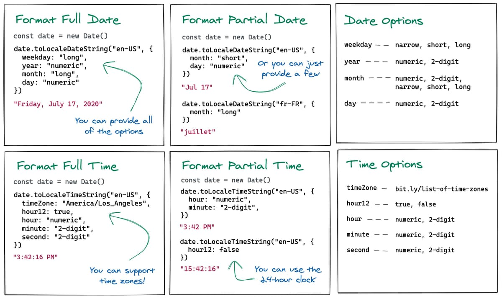
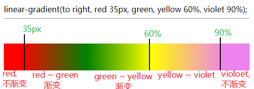

日期格式化

# Date.prototype.toLocaleDateString()

`toLocaleDateString()` 方法返回该日期对象**日期部分**的字符串，该字符串格式因不同语言而不同。新增的参数 `locales` 和 `options` 使程序能够指定使用哪种语言格式化规则，允许定制该方法的表现（behavior）。在旧版本浏览器中， `locales` 和 `options` 参数被忽略，使用的语言环境和返回的字符串格式是各自独立实现的。

```js
dateObj.toLocaleDateString([locales [, options]])
```

new Date().toLocaleDateString('zh-CN', options);

语言可以*从navigator.language获取*

### Options

- `weekday` - `"narrow"`, `"short"`, `"long"`
- `year` - `"numeric"`, `"2-digit"`
- `month` - `"numeric"`, `"2-digit"`, `"narrow"`, `"short"`, `"long"`
- `day` - `"numeric"`, `"2-digit"`

```js
new Date().toLocaleDateString('zh-CN', 
	{year: 'numeric', month: 'numeric', day:'numeric',weekday:'long'});
// "2020年12月28日星期一"
```

`year: '2-digit'=> 20年 `

`month:'2-digit => 02月/两位数月份不影响 `

`month:'narrow => 1月/两位数月份不影响 ` (窄)

`month: 'short/long' => 英文月份缩写/完整`

### 2digit => 两位数字, 不够补零

### numeric => 原始阿拉伯数字

## Date.prototype.toLocaleDateString()

`toLocaleDateString()` 方法返回该日期对象**时间部分**的字符串

### Options

- `timeZone` - [List of Time Zones](https://en.wikipedia.org/wiki/List_of_tz_database_time_zones)
- `hour12` - `true`, `false`
- `hour` - `"numeric"`, `"2-digit"`
- `minute` - `"numeric"`, `"2-digit"`
- `second` - `"numeric"`, `"2-digit"`



## Date.prototype.toLocaleString（）

还有一个称为的通用方法[`toLocaleString`](https://developer.mozilla.org/en-US/docs/Web/JavaScript/Reference/Global_Objects/Date/toLocaleString)，您可以将`toLocaleDateString`和`toLocaleTimeString`方法中的一个或所有Options传递给该方法。

```js
new Date().toLocaleString('zh-cn', 
	{year: 'numeric', month: 'numeric', day:'numeric', 
	hour12: false,
	hour: '2-digit', minute: '2-digit',second: '2-digit'})
// "2021/6/7 10:09:28"
// "2021/6/7上午10:10:27" // hour12: true时的输出
```


## 悬浮过渡动画

```CSS
div {
  background-image: 
      linear-gradient(black, black), 
      linear-gradient(yellow, yellow);
  background-size: 100% 2px, 0 2px;
  background-position: right, left;
  background-repeat: no-repeat;
  transition: background-size .5s ease-in-out;
}
div:hover {
  background-size:  0 2px, 100% 2px;
}
```

黑色背景图片position设置为right 指该背景图片从右侧开始往左放, 默认铺满, 黄色是从左侧开始宽度为0隐藏

hover时: 修改宽度, 配合过渡动画使用

## linear-gradient用法 [菜鸟](https://www.runoob.com/cssref/func-linear-gradient.html)

linear-gradient() 函数用于创建一个表示**两种或多种颜色线性渐变的图片**。

创建一个线性渐变，

- 需要指定两种颜色(至少)，

- 还可以实现不同方向（指定为一个角度）的渐变效果，如果不指定方向，默认从下到上渐变。

```CSS
background-image: linear-gradient(direction, color-stop1, color-stop2, ...);
```

### direction

​	用角度值指定渐变的方向（或角度）, 值类型

- deg: 顺时针从0到360deg, 可以省略, 则取默认180deg(从上到下)
- 关键字 **to direction1 [,direction2]**: 矩形的四个方向(top, right, bottom, left), 可以同时使用关键字指定渐变方向为斜角

### color-stop 终止色

- 颜色值: 支持关键字, rgb 及带透明度的颜色值(也可以同一个颜色的不同透明度渐变)
- 渐变色作用范围: 颜色值后面可以跟一个长度单位连用指示颜色值的作用起始位置
- 


## CSS3 渐变（Gradients） [菜鸟](https://www.runoob.com/css3/css3-gradients.html)

- linear-gradient() 函数
- repeating-linear-gradient() 函数
- radial-gradient() 函数
- repeating-radial-gradient() 函数

CSS3渐变的使用范围

background-image: 

border-image


## 多背景图

background-image: url(), url();

其他的background属性也需要指定多个`-size, -position, -repeat`

`background-image:  linear-gradient(black, black), linear-gradient(yellow, yellow);`

表现为前面的背景图片在最上面

background-position: 

