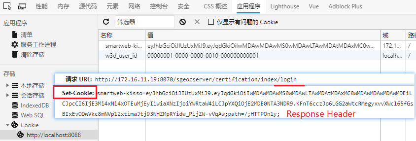
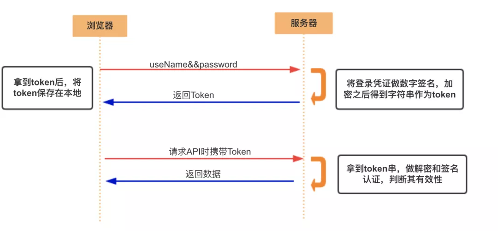

装饰器 (es6 / ts) [$](https://mp.weixin.qq.com/s?__biz=MjM5MTY2NTIyMA==&mid=2648999910&idx=1&sn=52df039f7ca1effae74bf418fd78ad76&chksm=bea23acd89d5b3db065b188ac989d32786798d50a36c4889463f895a8c60127082863e529ba7&scene=126&sessionid=1600847814&key=649ec29a953848f4eb409bacd424c1acc8003ffcf2d284a6ea4d0cb122fb049127c1541e8267b481c1787c64b6a7a3cd160f14f1ab4d586a46bf05c8341cdd7e8d9a5b9a71992fad5516d762fb547cc0e422c72aca4a53a718434301c2025ef14f26328137a8257855c03db0e634766ab6b520d4ee6e7ad84ee1f81000c9b7e9&ascene=1&uin=MTgzNDQ0NjEyNw%3D%3D&devicetype=Windows+10+x64&version=62090529&lang=zh_CN&exportkey=A2SGdzBmwPZWfC6Zr6A0yQo%3D&pass_ticket=qtOXOF1jIhKxQ4R44r9vqi%2FyKhRBMy%2Fa9RedDHNsHxZuZqTh8TAQdKfk6nZI6LRD&wx_header=0)

background-image 模拟过渡效果

1. [张鑫旭](https://www.zhangxinxu.com/wordpress/2018/03/background-gradient-transtion/)

2. [张鑫旭](https://www.zhangxinxu.com/wordpress/2020/08/background-image-animation/)

CSS 图片专场动画 [张鑫旭](https://www.zhangxinxu.com/wordpress/2019/05/css-transfer-animation/)

node.js ~ koa

## 服务器如何设置浏览器的cookie

发送一个ajax请求, 服务端都会返回response.

response header中有一项叫`set-cookie`, 是服务端专门用来设置cookie的;

- 一个set-cookie只能设置一个cookie, 当你想设置多个, 需要添加同样多的`set-cookie`
- 服务端可以设置cookie的所有选项: expires, domain, path, secure, HttpOnly

当然Login接口也会返回token

1. 用户通过用户名和密码发送请求
2. 程序验证
3. 程序返回一个签名的token给客户端
4. 客户端储存token, 并且每次用每次发送请求
5. 服务端验证Token并返回数据

这个方式的技术其实很早就已经有很多实现了，而且还有现成的标准可用，这个标准就是**JWT(JSON Web Token)**;

## Cookie和Session的区别

1. 存储位置不同：cookie数据存放在客户的浏览器上，session数据放在服务器上
2. 隐私策略不同：cookie不是很安全， 别人可以分析存放在本地的cookie并进行cookie欺骗，考虑到安全应当使用session
3. session会在一定时间内保存在服务器上。当访问增多，就会比较占用你服务器的性能，考虑到减轻服务器性能方面，应当使用cookie
4. 存储大小不同：单个cookie保存的数据不能超过4k, 很多浏览器都限制一个站点最多保存20个cookie

> 一般建议：将登陆信息等重要信息存放为session, 其他信息如果需要保留，可以放在cookie中

## Token和Session的区别

Session是一种HTTP储存机制， 为无状态的HTTP提供持久机制; Token就是令牌， 比如你授权(登录)一个程序时，它就是个依据，判断你是否已经授权该软件；

Session和Token并不矛盾，作为身份认证Token安全性比Session好，因为每一个请求都有签名还能防止监听以及重放攻击，而Session就必须依赖链路层来保障通讯安全了。如上所说，如果你需要实现有状态的回话，仍然可以增加Session来在服务端保存一些状态。
