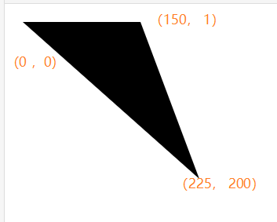

[TOC]

## svg默认样式

```css
svg{
    display inline;
    width 300px;
    height 150px;
    overflow-x hidden;
    overflow-y hidden;
}
svg:not(:root) {
    overflow: hidden;
}
```

#### 为什么默认尺寸是300*150？

为什么`canvas`元素默认尺寸是`300*150`，而不是其他尺寸组合呢？这个是CSS规范中定义的，作为替换元素，默认的尺寸是`300*150`，`canvas`元素就是替换元素，因此默认尺寸是`300*150`。由于`canvas`元素也是替换元素，因此，`canvas`默认的尺寸也是300*150。

从视觉表现上而言，CSS的`width`，`height`属性权重要大于`canvas`元素的`width`，`height`属性权重

图片文件还有个neutral size, 权重最小

深究下来，`canvas`和`img`还是有一点区别，就是`canvas`的等比例特性是强制的，会忽略HTML属性的设置，但`img`不会这样。对比下面的测试HTML：

```html

<canvas width="300" height="150" style="background:green; height:88px;"></canvas>
```

img => 300 * 88, 宽度依然是300px，并没有保持原始比例; canvas => 176 * 88, 保持了与300*150的等比特性, 这就是和img的区别。


## SVG实例

这里是SVG文件（SVG文件的保存与SVG扩展）：

```xml
<?xml version="1.0" standalone="no"?>
<!DOCTYPE svg PUBLIC "-//W3C//DTD SVG 1.1//EN"
"http://www.w3.org/Graphics/SVG/1.1/DTD/svg11.dtd">

<svg xmlns="http://www.w3.org/2000/svg" version="1.1">
 <circle cx="100" cy="50" r="40" stroke="black"
 stroke-width="2" fill="red" />
</svg>
```

**SVG 代码解析：**

第一行包含了 XML 声明。请注意 standalone 属性！该属性规定此 SVG 文件是否是"独立的"，或含有对外部文件的引用。

standalone="no" 意味着 SVG 文档会引用一个外部文件 - 在这里，是 DTD 文件。

第二和第三行引用了这个外部的 SVG DTD。该 DTD 位于 "http://www.w3.org/Graphics/SVG/1.1/DTD/svg11.dtd"。该 DTD 位于 W3C，含有所有允许的 SVG 元素。

`SVG 代码以 <svg> 元素开始，包括开启标签 <svg>和关闭标签 </svg> 。这是根元素。width 和 height 属性可设置此 SVG 文档的宽度和高度。version 属性可定义所使用的 SVG 版本，xmlns 属性可定义 SVG 命名空间。`


## svg [菜鸟](https://www.runoob.com/svg/svg-path.html)

svg本身属性 width, height 控制svg图形的宽高, 默认为300/150

stroke

- CSS 的 fill 属性定义填充颜色（rgb 值、颜色名或者十六进制值）, fill-opacity, 填充色的透明度
- CSS 的 stroke-width 属性定义边框的宽度
- CSS 的 stroke 属性定义矩形边框的颜色, stroke-opacity 属性定义边框的透明度

直线**line**的x1,y1为起点做点, x2,y2为终点坐标

矩形**rect**的x,y为左上角定点坐标, width,height为宽高, rx 和 ry 属性可使矩形产生圆角, rx,ry为圆角水平/垂直半径

圆形**circle**的cx,cy为圆心坐标[默认为0,0], r为半径

椭圆**ellipse**

​	椭圆与圆很相似。不同之处在于椭圆有不同的x和y半径，而圆的x和y半径是相同的：

​	cx,cy为圆心坐标, rx/ry分别为水平/垂直半径

文本**text**

​	x,y 相当于margin-left, margin-top, fill = color

### 曲线**polyline**

`<polyline>` 元素是用于创建任何只有直线的形状, 首尾不闭合

` <polyline points="200,10 250,190 160,210">`


### 多边形**polygon** 

多边形是由直线组成，其形状是"封闭"的; 

`<polygon points="200,10 250,190 160,210">`

​	points 属性定义多边形每个角的 x,y 坐标, 其实也是从前往后的相邻两个点连接组成的线再组成图形, 首尾闭合

polygon来自希腊。 "Poly" 意味 "many" ， "gon" 意味 "angle".

​	fill-rule

| *有效值:* | nonzero \| evenodd \| [inherit](http://www.w3.org/TR/2008/REC-CSS2-20080411/cascade.html#value-def-inherit) |
| --------- | ------------------------------------------------------------ |
| *默认值:* | nonzero                                                      |
| *应用于:* | [shape形状类元素](http://www.w3.org/TR/SVG/intro.html#TermShape) 和 [文字内容类元素](http://www.w3.org/TR/SVG/intro.html#TermTextContentElement) |

**fill-rule** 属性用于指定使用哪一种算法去判断画布上的**某区域是否属于该图形“内部”** （内部区域将被填充）。对一个简单的无交叉的路径，哪块区域是“内部” 是很直观清除的。但是，对一个复杂的路径，比如自相交或者一个子路径包围另一个子路径，“内部”的理解就不那么明确了。

fill-rule 属性提供两种选项用于指定如何判断图形的“内部”:

**nonzero**

字面意思是“非零”。按该规则，要判断一个**点是否在图形内**，从该点作任意方向的一条射线，然后**检测射线与图形路径的交点情况**。从0开始计数，路径从左向右穿过射线则计数加1，从右向左穿过射线则计数减1。得出计数结果后，如果结果是0，则认为点在图形外部，否则认为在内部。下图演示了nonzero规则:


[点击查看示例SVG文件 (仅适用于支持SVG的浏览器)](https://c.runoob.com/codedemo/3633)

**evenodd**

字面意思是“奇偶”。按该规则，要判断一个点是否在图形内，从该点作任意方向的一条射线，然后**检测射线与图形路径的交点的数量**。如果结果是**奇数则认为点在内部，是偶数则认为点在外部**。下图演示了evenodd 规则:


[点击查看示例SVG文件 (仅适用于支持SVG的浏览器)](https://c.runoob.com/codedemo/3634)

**提示:** 上述解释未指出当路径片段与射线重合或者相切的时候怎么办，因为任意方向的射线都可以，那么只需要简单的选择另一条没有这种特殊情况的射线即可。


### 路径path

`<path>` 元素用于定义一个路径。

下面的命令可用于路径数据：

- M = moveto ~ 移至
- L = lineto ~ 划线到
- H = horizontal lineto ~ 水平划线到
- V = vertical lineto ~ 垂直划线到
- C = curveto ~ 画曲线到
- S = smooth curveto ~ 光滑曲线到
- Q = quadratic Bézier curve ~ 二次贝塞尔曲线
- T = smooth quadratic Bézier curveto ~ 光滑二次贝塞尔曲线
- A = elliptical Arc ~ 椭圆弧
- Z = closepath ~ 闭合路径

**注意：**以上所有命令均允许小写字母。**大写表示绝对定位，小写表示相对定位**。

```
<svg xmlns="http://www.w3.org/2000/svg" version="1.1">
    <path d="M150 0 L75 200 L225 200 Z" />
    <path d="M150 0 l 75 200 l -225 -200 Z" />
</svg>
```

- 一条路径，它开始于位置150 0，到达位置75 200，然后从那里开始到225 200，最后在150 0关闭路径。

- 一条路径，它开始于位置150 0，往右下相对定位(75, 200)划线，然后从那里再往左上(225, 200)划线，最后在150 0关闭路径。
  - 

> 属性名为d, 属性值为**`命令字符[空格]x y`**形式的间隔字符串


## svg滤镜[菜鸟](https://www.runoob.com/svg/svg-filters-intro.html)


## svg参考手册[菜鸟](https://www.runoob.com/svg/svg-reference.html)
