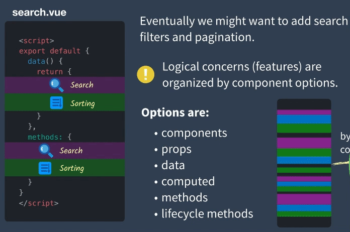
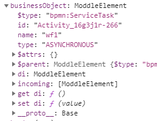

[TOC]

## 2020年最后一天

## gitless[$](https://gitless.com/)

## 解谜英语语法[$](http://www.yinwang.org/blog-cn/2018/11/23/grammar)

## Vue3 CompositionAPI

OptionsAPI => CompositionAPI

### Vue2的局限性

在传统的OptionsAPI中我们需要将逻辑分散到以下六个部分

- components
- props
- data
- computed
- methods
- lifecycle methods

编辑一个逻辑不得不在代码中反复横跳

会导致的明显问题

- 组件逻辑膨胀导致的可读性变差
- 无法跨组件重用代码
- Vue2对TS的支持有限

### 使用CompositionAPI解决问题

最佳的解决方法是将逻辑聚合就可以很好的代码可读性。

###  代码重用方法

- #### Mixin

- #### Mixin Factory

- ### ScopeSlots

- #### CompositionApi

## hightlight.js

bpmn-js-examples/modeling-api 使用了类似于 code&show 的方式

## bpmn-js

业务数据
