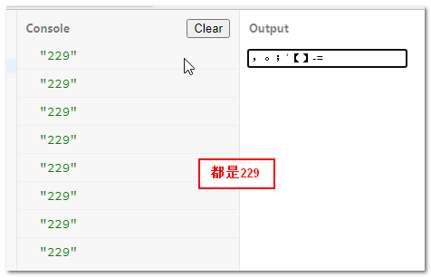

## keyCode [$_zxx](https://www.zhangxinxu.com/wordpress/2021/01/js-keycode-deprecated/)

不推荐使用keyCode, 原因如下:

- keyCode 不准确
  - 不同的字符共用keyCode(一个键上有两个字符通过shift切换, 他们的keyCode是跟着键盘走的而不是字符内容)
  - 相同按键不同keyCode----全键盘中的数字按键按shift可以输出其他内容, 按下此键和Shift+按下此键的keyCode值是不一样的。
  - 相同字符不同keyCode(两处不同的"+/-"号)
  - 中文输入法下标点符号keyCode都是一样的----“，。；‘【】-=”这些字符的keyCode全部都返回229
- 目前规范推荐使用event.code或event.key。

### KeyboardEvent.key KeyboardEvent.code [$_ryf](https://javascript.ruanyifeng.com/dom/event-type.html#toc20)

`KeyboardEvent.key`属性返回一个字符串，表示按下的**键名**。该属性只读。

如果按下的键代表可打印字符，则返回这个字符，比如数字、字母。

如果按下的键代表不可打印的特殊字符，则返回**预定义的键值**，比如 Backspace，Tab，Enter，Shift，Control，Alt，CapsLock，Esc，Spacebar，PageUp，PageDown，End，Home，Left，Right，Up，Down，PrintScreen，Insert，Del，Win，F1～F12，NumLock，Scroll 等。

如果同时按下一个**控制键 (ctrl/shift)**和一个符号键，则返回符号键的键名。比如，按下 Ctrl + a，则返回`a`；按下 Shift + a，则返回大写的`A`。

如果无法识别键名，返回字符串`Unidentified`。

------

`KeyboardEvent.code`属性返回一个字符串，表示**当前按下的键的字符串形式**。该属性只读。

下面是一些常用键的字符串形式，其他键请查[文档](https://developer.mozilla.org/en-US/docs/Web/API/KeyboardEvent/code#Code_values)。

- 数字键0 - 9：返回`digital0` - `digital9`
- 字母键A - z：返回`KeyA` - `KeyZ`
- 功能键F1 - F12：返回 `F1` - `F12`
- 方向键：返回`ArrowDown`、`ArrowUp`、`ArrowLeft`、`ArrowRight`
- Alt 键：返回`AltLeft`或`AltRight`
- Shift 键：返回`ShiftLeft`或`ShiftRight`
- Ctrl 键：返回`ControLeft`或`ControlRight`

------

| keyCode值 |      code值      |   key值   |             描述              |
| :-------: | :--------------: | :-------: | :---------------------------: |
|    49     |     ‘Digit1’     |    ‘1’    |        上方数字键1按下        |
|    97     |    ‘Numpad1’     |    ‘1’    |       小键盘数字键1按下       |
|    16     |   ‘ShiftLeft’    |  ‘Shift’  |         左侧的Shift键         |
|    16     |   ‘ShiftRight’   |  ‘Shift’  |         右侧的Shift键         |
|    190    |     ‘Period’     |    ‘.’    |       主键盘中的点符号        |
|    110    | ‘NumpadDecimal’  |    ‘.’    |    数字键盘中的小数点符号     |
|    229    |     ‘Period’     | ‘Process’ | 中文输入法下主键盘中的点符号  |
|    229    |     ‘Minus’      | ‘Process’ | 中文输入法下主键盘中的’-‘符号 |
|    189    |     ‘Minus’      |    ‘-‘    |       主键盘中的’-‘符号       |
|    109    | ‘NumpadSubtract’ |    ‘-‘    |      数字键盘中的’-‘符号      |

`code`指明按下的是具体哪个物理键，键盘上每一个按键都对应一个唯一的`event.code`值，均使用大写英文单词表示。

`key`指明具体输入的字符内容，如果是非打印字符（例如Enter键、Esc键、Shift键、Alt键等），则返回具体的非打印字符的英文名称，如果输入内容**与输入法有关则返回固定的Process名称**。

对于英文场景，只需要使用`event.key`就可以知道键盘输入的内容了。

在中文输入框开启的场景下，如果按键的内容和非中文输入法下的内容不一样，则`event.key`的返回值是固定的Process，表示输入的字符内容和键盘对应的原始内容进行了处理。在中文输入法场景下，用户或者开发者是无法知道按键应该输入的内容的。

## 常见功能键key值

功能键key值更实用，因此放在前面展示。详见下表：

|    按键名称    | event.key  | keyCode值 |
| :------------: | :--------: | :-------: |
|      回车      |   Enter    |    13     |
|   delete删除   |   Delete   |    46     |
| backspace退格  | Backspace  |     8     |
|    esc取消     |   Escape   |    27     |
|    tab索引     |    Tab     |     9     |
|       上       |  ArrowUp   |    38     |
|       下       | ArrowDown  |    40     |
|       左       | ArrowLeft  |    37     |
|       右       | ArrowRight |    39     |
| pageDown下一页 |  PageDown  |    34     |
|  pageUp上一页  |   PageUp   |    33     |
|     home键     |    Home    |    36     |
|     end键      |    End     |    35     |
|    shift键     |   Shift    |    16     |
|   control键    |  Control   |    17     |
|     alt键      |    Alt     |    18     |

## 常见功能键的code值

如下表所示，大部分返回值和key值是一样的，因为都是功能键，如果是可打印字符，则code值和key值那就完全是两码事了：

|    按键名称    |        event.code        |              说明               |
| :------------: | :----------------------: | :-----------------------------: |
|      回车      |          Enter           |                –                |
|   delete删除   |          Delete          | Shift+NumpadDecimal也可能是删除 |
| backspace退格  |        Backspace         |                –                |
|    esc取消     |          Escape          |                –                |
|    tab索引     |           Tab            |                –                |
|       上       |         ArrowUp          |               38                |
|       下       |        ArrowDown         |               40                |
|       左       |        ArrowLeft         |                –                |
|       右       |        ArrowRight        |                –                |
| pageDown下一页 |         PageDown         |                –                |
|  pageUp上一页  |          PageUp          |                –                |
|     home键     |           Home           |                –                |
|     end键      |           End            |                –                |
|    shift键     |   ShiftLeft/ShiftRight   |                –                |
|   control键    | ControlLeft/ControlRight |                –                |
|     alt键      |     AltLeft/AltRight     |                –                |
