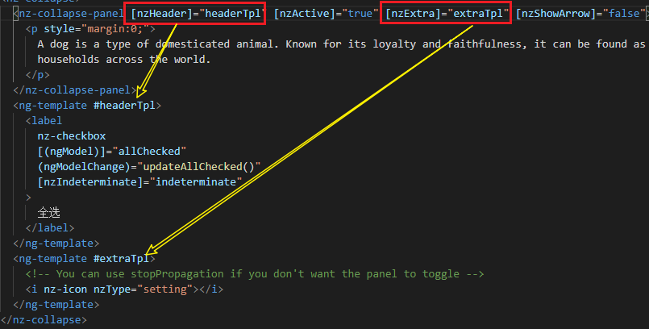
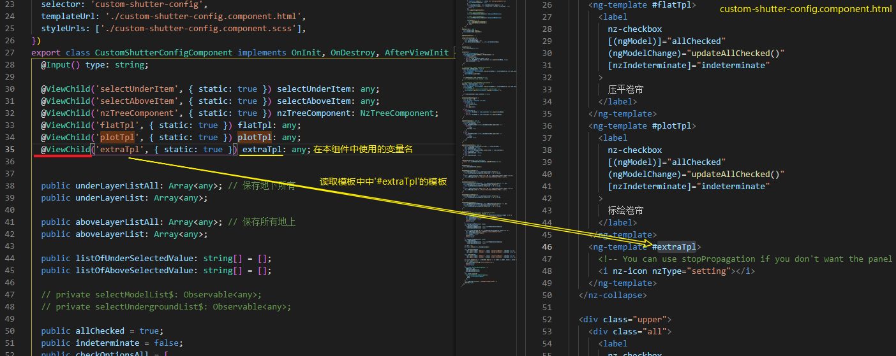

[TOC]

## angular 视图封装

在 Angular 中，组件的 CSS 样式被封装进了自己的视图中，而不会影响到应用程序的其它部分。

通过在组件的元数据上设置**视图封装模式**，你可以分别控制**每个组件**的封装模式。 可选的封装模式一共有如下几种：

- `ShadowDom` 模式使用浏览器原生的 Shadow DOM 实现（参阅 [MDN](https://developer.mozilla.org/) 上的 [Shadow DOM](https://developer.mozilla.org/en-US/docs/Web/Web_Components/Shadow_DOM)）来为组件的宿主元素附加一个 Shadow DOM。组件的视图被附加到这个 Shadow DOM 中，组件的样式也被包含在这个 Shadow DOM 中。(译注：不进不出，没有样式能进来，组件样式出不去。)
- `Emulated` 模式（**仿真模式, 默认值**）通过预处理（并改名）CSS 代码来模拟 Shadow DOM 的行为，以达到把 CSS 样式局限在组件视图中的目的。 更多信息，见[附录 1](https://angular.cn/guide/view-encapsulation#inspect-generated-css)。(译注：只进不出，全局样式能进来，组件样式出不去)
- `None` 意味着 Angular 不使用视图封装。 Angular 会把 CSS 添加到全局样式中。而不会应用上前面讨论过的那些作用域规则、隔离和保护等。 从本质上来说，这跟把组件的样式直接放进 HTML 是一样的。(译注：能进能出。)

通过组件元数据中的 `encapsulation` 属性来设置组件封装模式：

```ts
/**src/app/quest-summary.component.ts**/
// warning: few browsers support shadow DOM encapsulation at this time 
encapsulation: ViewEncapsulation.ShadowDom
```


`ShadowDom` 模式只适用于提供了原生 Shadow DOM 支持的浏览器（参阅 [Can I use](https://caniuse.com/) 上的 [Shadow DOM v1](https://caniuse.com/shadowdomv1) 部分）。 它仍然受到很多限制，这就是为什么仿真 (`Emulated`) 模式是默认选项，并建议将其用于大多数情况。

当使用默认的仿真模式时，Angular 会对组件的所有样式进行预处理，让它们模仿出标准的 Shadow CSS 作用域规则。

在启用了仿真模式的 Angular 应用的 DOM 树中，每个 DOM 元素都被加上了一些额外的属性。

生成出的属性分为两种：

- 一个元素在原生封装方式下可能是 Shadow DOM 的宿主，在这里被自动添加上一个 `_nghost` 属性。 这是组件宿主元素的典型情况。
- 组件视图中的每一个元素，都有一个 `_ngcontent` 属性，它会标记出该元素属于哪个宿主的模拟 Shadow DOM。
- 会作为样式中的属性选择器渗透到CSS上


## vue 组件作用域(sfc)


## angular [组件之间的交互](https://angular.cn/guide/component-interaction#component-interaction)

### 通过输入型绑定把数据从父组件传到子组件。

`HeroChildComponent` 有两个**输入型属性**，它们通常带[@Input 装饰器](https://angular.cn/guide/inputs-outputs#input)。

```ts
// hero-child.component.ts
import { Component, Input } from '@angular/core';
import { Hero } from './hero';
@Component({
  selector: 'app-hero-child',
  template: `
    <h3>{{hero.name}} says:</h3>
    <p>I, {{hero.name}}, am at your service, {{masterName}}.</p>
  `
})
export class HeroChildComponent {
  @Input() hero: Hero;	// 类似于Vue中的props
  @Input('master') masterName: string; // tslint:disable-line: no-input-rename
}
```

第二个 `@Input` 为子组件的属性名 `masterName` 指定一个别名 `master`(译者注：不推荐为起别名，请参阅风格指南).

```ts
// hero-parent.component.ts
import { Component } from '@angular/core';
import { HEROES } from './hero';
@Component({
  selector: 'app-hero-parent',
  template: ` 父组件传参 [hero] [master]
    <h2>{{master}} controls {{heroes.length}} heroes</h2>
    <app-hero-child *ngFor="let hero of heroes"
      [hero]="hero"
      [master]="master">
    </app-hero-child>
  `
})
export class HeroParentComponent {
  heroes = HEROES;
  master = 'Master';
}
```


### 通过 setter 截听输入属性值的变化[*link*](https://angular.cn/guide/component-interaction#intercept-input-property-changes-with-a-setter)

使用一个输入属性的 setter，以拦截父组件中值的变化，并采取行动

```ts
import { Component, Input } from '@angular/core';
@Component({
  selector: 'app-name-child',
  template: '<h3>"{{name}}"</h3>'
})
export class NameChildComponent {
  @Input()
  get name(): string { return this._name; } // 针对 @Input 输入的属性 写get/set函数
  set name(name: string) {
    this._name = (name && name.trim()) || '<no name set>';
  }
  private _name = '';
}
```


### 通过*ngOnChanges()*来截听输入属性值的变化[*link*](https://angular.cn/guide/component-interaction#intercept-input-property-changes-with-ngonchanges)

使用 `OnChanges` 生命周期钩子接口的 `ngOnChanges()` 方法来监测输入属性值的变化并做出回应。当需要监视多个、交互式输入属性的时候，本方法比用属性的 setter 更合适。

```ts
export class VersionChildComponent implements OnChanges {
  @Input() major: number;
  @Input() minor: number;
  changeLog: string[] = [];

  ngOnChanges(changes: SimpleChanges) {
    // 监测输入属性 major 和 minor 的变化，并把这些变化编写成日志以报告这些变化。
    const log: string[] = [];
    for (const propName in changes) { // changes 是一个Object
      const changedProp = changes[propName];
      const to = JSON.stringify(changedProp.currentValue);
      if (changedProp.isFirstChange()) {
        log.push(`Initial value of ${propName} set to ${to}`);
      } else {
        const from = JSON.stringify(changedProp.previousValue);
        log.push(`${propName} changed from ${from} to ${to}`);
      }
    }
    this.changeLog.push(log.join(', '));
  }
}
```

这个方法类似于watch, watch 中的监听是基于key一个个分开来监听的,  ngOnChages 的对输入属性的变化监听


### 父组件监听子组件的事件[*link*](https://angular.cn/guide/component-interaction#parent-listens-for-child-event)

子组件暴露一个 `EventEmitter` 属性，当事件发生时，子组件利用该属性 `emits`(向上弹射)事件。父组件绑定到这个事件属性，并在事件发生时作出回应。

子组件的 `EventEmitter` 属性是一个**输出属性**，通常带有[@Output 装饰器](https://angular.cn/guide/inputs-outputs#output)

```ts
import { Component, EventEmitter, Output } from '@angular/core';
@Component({
  selector: 'app-voter',
  template: `
    <button (click)="vote(true)"  [disabled]="didVote">Agree</button>
    <button (click)="vote(false)" [disabled]="didVote">Disagree</button>
  `
})
export class VoterComponent {
  @Output() voted = new EventEmitter<boolean>();
  didVote = false;

  vote(agreed: boolean) {
    this.voted.emit(agreed); // emit 触发事件
    this.didVote = true;
  }
}
```

父组件 绑定了一个事件处理器(`onVoted()`)，用来响应子组件的事件(`$event`)并更新, 把事件参数(用 `$event` 表示)传给事件处理方法

```ts
import { Component } from '@angular/core';
@Component({
  selector: 'app-vote-taker',
  template: `
    <h3>Agree: {{agreed}}, Disagree: {{disagreed}}</h3>
    <app-voter *ngFor="let voter of voters"
      [name]="voter"
      (voted)="onVoted($event)"> 可以使用$event代替参数
    </app-voter>`
})
export class VoteTakerComponent {
  agreed = 0;
  disagreed = 0;
  voters = ['Narco', 'Celeritas', 'Bombasto'];

  onVoted(agreed: boolean) { // on + EventEmitter的实例
    agreed ? this.agreed++ : this.disagreed++;
  }
}
```

Vue 中的父子组件处理事件的方式为

```vue
<father-comp>
 <child-comp @event-name="callback1"/>
   
(child-comp).$emit('event-name', arg);
```

angular 的callback 被限制了函数名称, 相当于说了一层配置(配置事件监听函数)


### angular 父组件与子组件通过[本地变量]互动

父组件不能使用数据绑定来读取子组件的属性或调用子组件的方法。

但可以在父组件模板里，**新建一个本地变量来代表子组件**，然后利用这个变量来读取子组件的属性和调用子组件的方法，如下例所示。

```ts
import { Component } from '@angular/core';
import { CountdownTimerComponent } from './countdown-timer.component';
@Component({
  selector: 'app-countdown-parent-lv',
  template: `
  <h3>Countdown to Liftoff (via local variable)</h3>
  <button (click)="timer.start()">Start</button>
  <button (click)="timer.stop()">Stop</button>
  <div class="seconds">{{timer.seconds}}</div>
  <app-countdown-timer #timer></app-countdown-timer> 模板中新建一个#timer代替子组件
  `,
  styleUrls: ['../assets/demo.css']
})
export class CountdownLocalVarParentComponent { }
```

父组件不能通过数据绑定使用子组件的 `start` 和 `stop` 方法，也不能访问子组件的 `seconds` 属性。

把**本地变量**(`#timer`)放到(`countdown-timer`)标签中，用来代表子组件。

这样父组件的**模板就得到了子组件的引用**，于是可以在父组件的模板中访问子组件的所有属性和方法。

`this.timer` 来访问子组件


vue 中父组件获取子组件的方式(模板), vue中理论上来说没有在模板中能获取组件的方式, slot-scope 也只能读取到某个数据

```vue
<father-comp>
  <child-comp ref="child"/>
(father-comp).$refs.child
```

非模板 `(father-compo).$children`


## Ng-ZORO 

参数类型: `TemplateRef<void>`



HTML模板传参格式


### 父组件调用@ViewChild()

[**本地变量**]方法是个简单便利的方法。但是它也有局限性，因为**父组件-子组件的连接必须全部在父组件的模板中进行**。

<u>父组件本身的代码(`.ts`)对子组件没有访问权。</u>

如果父组件的**类**需要**读取子组件的属性值或调用子组件的方法，就[不能使用本地变量]方法**。 

因为需要使用js来访问, 这个在模板中进行的[本地变量]无法满足

当父组件*类*需要这种访问时，可以把子组件作为 [**ViewChild**]，**注入**到父组件里面

```ts
import { AfterViewInit, ViewChild } from '@angular/core';
import { Component } from '@angular/core';
import { CountdownTimerComponent } from './countdown-timer.component';
@Component({
  selector: 'app-countdown-parent-vc',
  template: `
  <h3>Countdown to Liftoff (via ViewChild)</h3>
  <button (click)="start()">Start</button>
  <button (click)="stop()">Stop</button>
  <div class="seconds">{{ seconds() }}</div>
  <app-countdown-timer></app-countdown-timer>`,
  styleUrls: ['../assets/demo.css']
})
export class CountdownViewChildParentComponent implements AfterViewInit {
  @ViewChild(CountdownTimerComponent)
  private timerComponent: CountdownTimerComponent; // 将组件作为私有属性 timerComponent

  seconds() { return 0; }
  ngAfterViewInit() {
    // Redefine `seconds()` to get from the `CountdownTimerComponent.seconds` ...
    // but wait a tick first to avoid one-time devMode
    // unidirectional-data-flow-violation error
    setTimeout(() => this.seconds = () => this.timerComponent.seconds, 0);
  }
  start() { this.timerComponent.start(); } // 访问子组件
  stop() { this.timerComponent.stop(); }
}
```

把子组件的视图插入到父组件类需要做一点额外的工作。

首先，你必须导入对装饰器 `ViewChild` 以及生命周期钩子 `AfterViewInit` 的引用。

接着，通过 `@ViewChild` 属性装饰器，将子组件 `CountdownTimerComponent` 注入到私有属性 `timerComponent` 里面。

组件元数据里就不再需要 `#timer` 本地变量了。而是把按钮绑定到父组件自己的 `start` 和 `stop` 方法，使用父组件的 `seconds` 方法的插值来展示秒数变化。

这些方法可以直接访问被注入的计时器组件。

**`ngAfterViewInit()` 生命周期钩子**是非常重要的一步。被注入的计时器组件只有**在 Angular 显示了父组件视图之后**才能访问，所以它先把秒数显示为 0.

然后 Angular 会调用 `ngAfterViewInit` 生命周期钩子，但这时候再更新父组件视图的倒计时就已经太晚了。Angular 的单向数据流规则会阻止在同一个周期内更新父组件视图。应用在显示秒数之前会被迫*再等一轮*。

使用 `setTimeout()` 来等下一轮，然后改写 `seconds()` 方法，这样它接下来就会从注入的这个计时器组件里获取秒数的值。


如果访问定义在HTML中的模板作为TemplateRef来使用:




### 父组件和子组件通过服务来通讯 [link](https://angular.cn/guide/component-interaction#parent-and-children-communicate-via-a-service)

父组件和它的子组件共享同一个服务，利用该服务*在组件家族内部*实现双向通讯。

该服务实例的作用域被限制在父组件和其子组件内。这个组件子树之外的组件将无法访问该服务或者与它们通讯。

服务只作为一条通知双方的媒介, 并不作为数据源

```ts
// mission.service.ts
import { Injectable } from '@angular/core';
import { Subject } from 'rxjs'; // Subject<主体> 是从 rxjs 中获取的服务
@Injectable() // 可注入的service
export class MissionService {
  // Observable string sources
  private missionAnnouncedSource = new Subject<string>(); // 每条服务支持一个属性的双向通讯
  private missionConfirmedSource = new Subject<string>();

  // Observable string streams
  missionAnnounced$ = this.missionAnnouncedSource.asObservable();
  missionConfirmed$ = this.missionConfirmedSource.asObservable();

  // Service message commands
  announceMission(mission: string) {
    this.missionAnnouncedSource.next(mission);
  }

  confirmMission(astronaut: string) {
    this.missionConfirmedSource.next(astronaut);
  }
}
```

sources - 资源 - Subject

streams - 流 - asObservable;  实例属性名为 asObservable() 返回的结果, 属性名后面带着$

commands - 命令 - next


使用service, `MissionControlComponent` 提供服务的实例，并将其共享给它的子组件(通过 `providers` 元数据数组)，子组件可以通过构造函数将该实例注入到自身。

```ts
// missioncontrol.component.ts
import { Component } from '@angular/core';
import { MissionService } from './mission.service';
@Component({
  selector: 'app-mission-control',
  template: `
    <h2>Mission Control</h2>
    <button (click)="announce()">Announce mission</button>
    <app-astronaut *ngFor="let astronaut of astronauts"
      [astronaut]="astronaut">
    </app-astronaut>
    <h3>History</h3>
    <ul>
      <li *ngFor="let event of history">{{event}}</li>
    </ul>
  `,
  providers: [MissionService] // 注入服务
})
export class MissionControlComponent {
  astronauts = ['Lovell', 'Swigert', 'Haise'];
  history: string[] = [];
  missions = ['Fly to the moon!',
              'Fly to mars!',
              'Fly to Vegas!'];
  nextMission = 0;

  constructor(private missionService: MissionService) { // 作为构造函数中的参数
    missionService.missionConfirmed$.subscribe( // service订阅某个数据的变化
      astronaut => {
        this.history.push(`${astronaut} confirmed the mission`);
      });
  }

  announce() {
    const mission = this.missions[this.nextMission++];
    this.missionService.announceMission(mission);	// next
    this.history.push(`Mission "${mission}" announced`);
    if (this.nextMission >= this.missions.length) { this.nextMission = 0; }
  }
}
```


### 在父子指令及组件之间共享数据

Angular 中的一个常见模式就是在父组件和一个或多个子组件之间共享数据。

用 `@Input()` 和 `@Output()` 来实现这个模式。

子组件或指令中的 `@Input()` 装饰器表示该属性可以从其父组件中获取值。

考虑以下层次结构：

```
<parent-component>
  <child-component></child-component>
</parent-component>
```

`parent-component` 充当了 `child-component` 的上下文。

`@Input()` 和 `@Output()` 为子组件提供了一种与其父组件通信的方法。 `@Input()` 允许父组件更新子组件中的数据。相反，`@Output()` 允许子组件向父组件发送数据。

要使用 `@Input()`，就必须对父组件和子组件进行配置

首先要导入 `Input`，然后用 `@Input()` 装饰该属性:

```ts
import { Component, Input } from '@angular/core'; // First, import Input
export class ItemDetailComponent {
  @Input() item: string; // decorate the property with @Input()
}
```

 `@Input()` 会修饰属性 `item`，它的类型为 `string`，但 `@Input()` 属性可以是任意类型，比如 `number`、`string`、`boolean` 或 `object`。`item` 的值来自父组件。

```html
// item-detail-component.html
<p>
  Today's item: {{item}} 子组件中能使用父组件传入的item
</p>
```

下一步配置父组件, 是在父组件的模板中绑定该属性。

1. 使用子组件的 selector (`<app-item-detail>`) 作为父组件模板中的指令。
2. 使用[属性绑定](https://angular.cn/guide/property-binding)把子组件的 `item` 属性绑定到父组件的 `currentItem` 属性上。

```
<app-item-detail [item]="currentItem"></app-item-detail>
```

我现在还不确定是不是必须以 `<app-html>`  名称的形式作为子组件的tagName

@Input 的结构示意图


### 把数据发送到父组件

子组件或指令中的 `@Output()` 装饰器允许数据从子组件传给父组件。


`@Output()` 在子组件中标记了一个属性，作为数据从子组件传递到父组件的途径。

子组件使用 `@Output()` 属性来引发事件，以通知父组件这一变化。

为了引发事件， `@Output()` 必须是 `EventEmitter` 类型，它是 `@angular/core` 中用来发出自定义事件的类。

------

配置子组件:

1. 在子组件类中导入 `Output` 和 `EventEmitter`

   ```ts
   import { Output, EventEmitter } from '@angular/core';
   ```

2. 在组件类中，用 `@Output()` **装饰一个属性**。 `@Output()` 的类型为 `EventEmitter` ，意味着它是一个事件。

   ```ts
   @Output() newItemEvent = new EventEmitter<string>();
   
   addNewItem(value: string) {
       this.newItemEvent.emit(value);
   }
   ```

   `@Output()` - 一个装饰器函数，它把该属性标记为数据从子组件进入父组件的一种途径

   `newItemEvent` - 这个 `@Output()` 的名字

   `EventEmitter` - 这个 `@Output()` 的类型

   `new EventEmitter<string>()` - 使用 Angular 来创建一个新的事件发射器，它发出的数据是 `string` 类型的。

3. 配置子组件模板

   ```html
   <label>Add an item: <input #newItem></label>
   <button (click)="addNewItem(newItem.value)">Add to parent's list</button>
   ```

   `addNewItem()` 函数使用 `newItemEvent` 这个 `@Output()` 来引发一个事件

------

配置父组件: 

1. 在父模板中，把父组件的方法绑定到子组件的事件上。

2. 把子组件选择器（`app-item-output`）放在父组件的模板 `app.component.html` 中。

   ```html
   <app-item-output (newItemEvent)="addItem($event)"></app-item-output>
   ```

   事件绑定 `(newItemEvent)='addItem($event)'` 会把子组件中的 `newItemEvent` 事件连接到父组件的 `addItem()` 方法。

   `$event` 中包含用户在子组件模板上的 `<input>` 中键入的数据。

有点像自定义事件, 但这个只是传递数据, 可能是事件交互的结果传递

## 3d tile layer

瓦片 

图层

- 倾斜摄影数据

   平台上如何兼容地下数据不进行开挖
   或者只对倾斜做开挖其他数据类型过滤

(目前倾斜数据, 底图的影像/地图可开挖, 与地形无关)


## 数据类型

- 模型数据
- 倾斜摄影
- 点云数据
- BIM模型
- 海量矢量
- 矢量数据
- 地形数据
- 影像数据
- 全景影像
- WMS服务
- WMTS服务
- 矢量图标

可挖数据 3dTileset ~ 倾斜, 地形, 模型, BIM

| (index) | code | showValue |
| :--- | :--------------- | :--------- |
| 0    | "IMAGERY"        | "倾斜摄影" |
| 1    | "TERRAIN"        | "地形数据" |
| 2    | "MODEL"          | "模型数据" |
| 3    | "GEO3DML"        | "地质模型" |
| 4    | "POINTCLOUD"     | "点云数据" |
| 5    | "PANORAMICIMAGE" | "全景影像" |
| 6    | "VECTOR"         | "矢量数据" |
| 7    | "VECTOR2"        | "海量矢量" |
| 8    | "WMS"            | "WMS服务"  |
| 9    | "IMAGEDATA"      | "影像数据" |
| 10   | "WMTS"           | "WMTS服务" |
| 11   | "BIMMODEL"       | "BIM模型"  |
| 12   | "I3S"            | "i3s服务"  |

