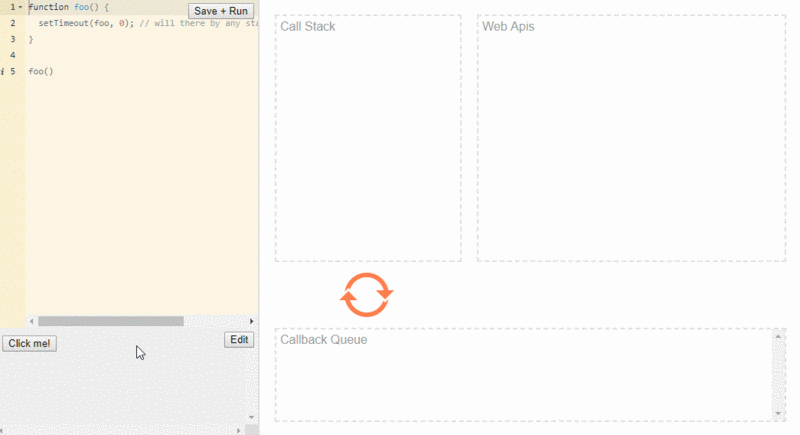

## 地形开挖设计方案

[前端 - 地形开挖优化_svn](http://172.16.11.131:8012/svn/SouthAI/research/Web3D/03_开发文档/04技术方案/01前端设计/前端 - 地形开挖优化.doc)

## 地形

`viewer.terrainDataSources` 场景默认应用的地形数据

`viewer.terrainProvider`场景当前的地形数据

`viewer.terrainProvider._layers` 为图层配置添加的地形图层

判断当前位置是否为地形数据范围边界内部


bounds为地形边界经纬度, 通过定位到其中一个点, 就是边界坐标


## 好题


> 结果: 不会存在堆栈溢出; 不会响应(即卡死)

分析: 

JavaScript并发模型基于"时间循环", 浏览器提供运行时环境来执行js代码.

浏览器主要组件包括 **调用堆栈** **事件循环** **任务队列** **Web API** 

像 setTimeout, setInterval 和Promise 这样的全局函数不属于JavaScript, 而是 Web API的一部分

JavaScript环境的可视化形式如下:


JS调用栈是后进先出(LIFO). 引擎每次从堆栈中取出一个函数, 然后从上到下依次运行代码. 每当遇到一些异步代码, 如 setTimeout, 就交给WebAPI(箭头1). 因此, 每当事件被触发时, callback都会被发送到任务队列(箭头2)

事件循环(EventLoop)不断监听任务队列(Task Queue), 并按他们排队的顺序一次处理一个回调函数. 每当调用堆栈(call stack)为空时, Event Loop 获取回调并将其放入堆栈(stack) (箭头3) 中进行处理.

> 请记住, 如果调用函数不是空的, 则事件循环不会将任何回调推入堆栈

代码分析: 

- 调用foo()会将foo函数放入调用堆栈
- 在处理内部代码时, JS引擎遇到了 setTimeout
- 然后将 foo 函数传递给WebAPI,并从函数返回, 调用堆栈再次为空
- 计时器设置为0, 因此foo将被发送到任务队列
- 由于调用堆栈为空, 事件循环将选择foo函数并将其推入调用堆栈(Main)进行处理
- 进行再次重复, 堆栈不会溢出



------

JavaScript中有宏任务和微任务

主要区别在于执行方式:

- 宏任务在单个循环周期中一次一个地推入堆栈
- 微任务队列总是在执行后返回到事件循环之前清空

 如果以处理条目的速度向这个队列中添加条目, 那么久永远在处理微任务. 只有当微任务队列Wie空时, 事件循环才会重新渲染页面

当运行以下代码段时:

```js
function foo() { return Promise.resolve().then(foo)}
```

每次调用 foo 都会继续在微任务队列上添加另一个 foo, 因此事件循环无法继续处理其他事件. 因此会阻止渲染
