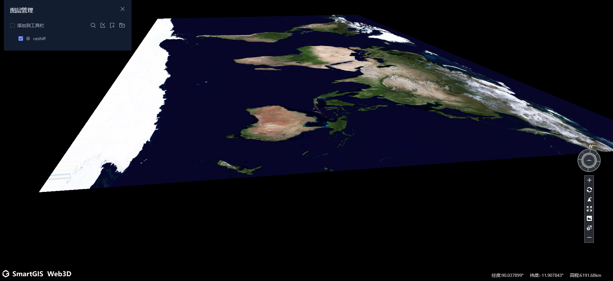

[TOC]

## 底图设置

地图/影像/地形

地图 ~ 百度矢量图

影响 ~ 卫星影响(纹理)

地形 ~ 增加了地形, 使得场景更加的立体化


## Cesium

scene


terrainProvider (地形)

globe (地球)

skyAtmosphere (天空大气)

skyBox (天空盒)

moon (月球)

sceneMode (场景模式)

| 名称            | 类型   | 描述                                                         |
| :-------------- | :----- | :----------------------------------------------------------- |
| `MORPHING`      | Number | Morphing between mode, e.g., 3D to 2D. <br>在模式之间变形，例如3D到2D。 |
| `COLUMBUS_VIEW` | Number | Columbus View mode.  A 2.5D perspective view where the map is laid out flat and objects with non-zero height are drawn above it.<br>哥伦布查看模式。一个2.5D透视图，在该图上面绘制了**平坦的地图**，并绘制了高度不为零的对象。 |
| `SCENE2D`       | Number | 2D mode.  The map is viewed top-down with an orthographic projection.<br>2D模式。使用正射投影从上至下查看地图。 |
| `SCENE3D`       | Number | 3D mode.  A traditional 3D perspective view of the globe.<br>3D模式。地球的一个传统3D透视图。 |



`COLUMBUS_VIEW` 倾斜的二维底图

## 场景模式

地球影响

1. 图层配置 (**无球模式 不影响 且用途为观察数据**)
2. 底图/影像/地形

场景模式具体操作

1. 地形
2. 地球
3. 天空大气
4. 天空盒
5. 月球
6. 背景色
7. 全局变量: SceneMode

场景效果

1. 天空盒子 -- 星空
2. 天空 -- 太阳/月亮可以不显示

场景默认设置 normal-config

添加到功能列表后的环境设置

场景为无球 ~ 可以直接关闭 天空盒&天空实体 

​	(可以不做数据关联, 但是场景要体现 (优先级), ~ ) 


**无球模式为了不看球 ，只看数据**


场景模式迁移到场景效果中, 

与球体对应

设置视角/封面判断了sceneMode (依赖关系), 无球模式直接return;

---- 更改值&订阅 只需要`handleSceneMode` 正确迁移, 不影响订阅,

如何保存场景模式到配置当中? (todo)  store

   	1. 保存场景后不变 
 	2. 新场景有Mode, 之前的场景无Mode, 可能是数据源不同 (场景初始化)
 	3. 目前无球模式没啥用, 也无法以noGlobe状态保存... 
 	4. 

如何二次读取修改的配置对象

  `sgeocserver/sceneservice/manager/sceneConfig?sceneId=&userId=`


1. 功能存在影响过多
2. 作为图层和底图/影像/地形的基底


bootStrap => viewer * 会有多次执行的情况

初始启动 => 初始化场景


## 场景Save 接口

`sgeocserver/sceneservice/manager/save?userId=`

```json
{
  "id": "3867699b-3025-43a2-b6bd-b80d7427670a",
  "sceneName": "JH-测试场景效果",
  "description": "",
  "status": 3,
  "cover": "/uploadservice/upload/3867699b-3025-43a2-b6bd-b80d7427670a1610680284858.jpeg",
  "perspectiveJson": "{\"InitialPosition\":{\"lon\":104.355,\"lat\":28.704999999999995,\"height\":10000000},\"InitialOrientation\":{\"heading\":360,\"roll\":0,\"pitch\":-90}}",
  "logo": "",
  "sceneMode": "noGlobe",
  "externalScene": null,
  "creator": "蒋豪",
  "creatorId": "cb4badb3-6b00-429e-88ef-5bf27fb9ea5e",
  "createTime": "2021-01-15 11:11:24",
  "accessCount": 0,
  "belongDepartmentId": "0022000300150002",
  "migrationTime": null,
  "configurationJson":"{...}",
  "layerTree": "{\"treeData\":[],\"configData\":{\"customPointCloudScheme\":[],\"configScheme\":{\"pointCloudColors\":[],\"tilesetStyles\":[],\"materials\":[],\"vectorStyles\":[],\"vector2Styles\":[],\"imageryStyles\":[]}}}",
  "functionData": "[]",
  "sceneNo": "1742376286"
}

```

scene-info 配置作为一级

configuration 包含场景效果和其他设置... 作为二级

数据来源需要修正.

部分地方使用无球模式来展示数据( 最好就不修改 ) 不要影响这个

`this.viewer.scene.skyAtmosphere.show = false;` 全局搜这个

save & reuse 数据采用的 service 不变, 所以只是交互的地方改了, 不会影响原来的使用


### noGlobal.component.html

不知道是否还有作用
