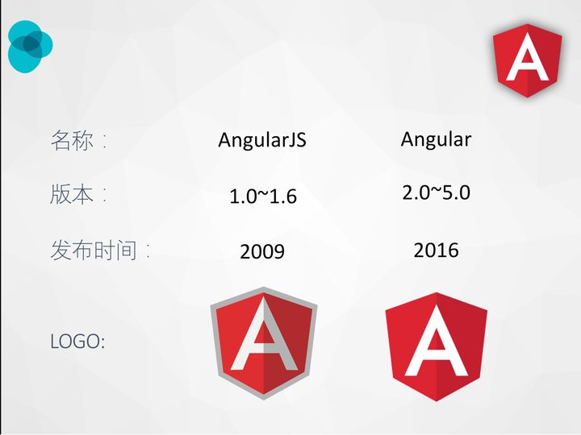

[toc]

## 2020年才是21世纪元年

风险投资家、《从零到一》的作者 [Peter Thiel](https://www.forbes.com/sites/alanohnsman/2020/12/03/peter-thiel-says-covid-marks-21st-centurys-true-start-spac-boom-surging-ev-stocks-are-a-sign/) 说， **2020年才是21世纪的第一年。新经济、新技术、新趋势在这一年确立了。**

列举一些2020年技术领域的大事。

mRNA 疫苗技术取得突破，从研发到大规模接种，只用了一年时间，很可能会永远改变流行病的预防技术。它的背后是生物科技的突飞猛进。

新能源技术（太阳能、风能、氢能和电池）一日千里，化石能源和汽油车明确将被淘汰。

无人驾驶开始大规模路试，并向公众开放，已经接近可用状态。[马斯克](https://finance.sina.com.cn/tech/2020-12-03/doc-iiznezxs4956682.shtml)甚至说，特斯拉公司2021年会发布真正的无人驾驶。

人类的生活方式加速转移到线上，远程办公、视频会议、在线教育......需要十年走完的路，一年就走完了

SpaceX 公司的火箭技术获得成功，开始载人飞行。三个国家（阿联酋、中国、美国）几乎同时发射火星探测器，预定今年二月到达火星，中国和美国的探测器将在火星登陆。

"人造肉"出现，并在沃尔玛上架，也做成了汉堡。如果植物蛋白可以替代动物蛋白，农业会发生巨大革命。

5G 开始普及，无线通信的带宽变得更大。星链计划的卫星宽度证实可行，地球的每个角落都能随时随地在线，即将成为现实。

8K 分辨率的视频开始商业化，家用播放设备和拍摄设备都上市了。这可能是电子屏幕的尽头了，因为接近人眼分辨率了。

苹果 M1 芯片成功，桌面电脑开始转向 ARM 架构，跟手机使用同一个架构，App 将可以通用。桌面电脑以后会进一步小型化、轻量化，而移动设备将变得功能更强大，更接近桌面电脑。

总之，2020年虽然结束了，但是它确实更像一个起点，人类正在进入新经济的下一个阶段。


## Cesium API [cesium2](http://cesium2.marsgis.cn/forcesium/Build/Documentation/)

Cartesian3  直接坐标


## Angular 

Augular & angular.js



AngularJS是Google发布的第一个MVVM框架，带来了许多新特性，为前端开发提供了很多新的思路，线上直到现在还有许多大型产品在用AngularJS，并且是lts版本（快到期）。

Angular实际上是Angular2+，官方推崇类似Chrome的版本迭代理念，让用户（开发者）淡化对版本号的变化感知，希望这个框架可以持续发展。Angular是个重架构，提供了模块、组建、装饰器、服务等多种功能组件，编译方式也从JIT逐渐过度到AOT，不断的优化性能及功能。


### 动态组件[$](https://angular.cn/guide/dynamic-component-loader)

```html
<div class="ad-banner-example">
    <h3>Advertisements</h3>
    <ng-template adHost></ng-template>
</div>
```

`ng-template` 元素就是刚才制作的指令将应用到的地方。 要应用 `AdDirective`，回忆一下来自 `ad.directive.ts` 的选择器 `ad-host`。把它应用到 `ng-template`（不用带方括号）。 这下，Angular 就知道该把组件动态加载到哪里了。`ng-template` 元素是动态加载组件的最佳选择，因为它不会渲染任何额外的输出。


```ts
export class {
    constructor(private componentFactoryResolver: ComponentFactoryResolver) { }
}
loadComponent() {
	const componentFactory = this.componentFactoryResolver.resolveComponentFactory(component);

    const viewContainerRef = this.adHost.viewContainerRef;
    viewContainerRef.clear();

    const componentRef = viewContainerRef.createComponent<AdComponent>(componentFactory);
    componentRef.instance.data = adItem.data;    
}
```

使用 `ComponentFactoryResolver` 来为每个具体的组件解析出一个 `ComponentFactory`。 然后 `ComponentFactory` 会为每一个组件创建一个实例。

接下来，你要把 `viewContainerRef` 指向这个组件的现有实例。但你怎么才能找到这个实例呢？ 很简单，因为它指向了 `adHost`，而这个 `adHost` 就是你以前设置过的指令，用来告诉 Angular 该把动态组件插入到什么位置。

`AdDirective` 曾在它的构造函数中注入了一个 `ViewContainerRef`。 因此这个指令可以访问到这个你打算用作动态组件宿主的元素。

要把这个组件添加到模板中，你可以调用 `ViewContainerRef` 的 `createComponent()`。

`createComponent()` 方法返回一个引用，指向这个刚刚加载的组件。 使用这个引用就可以与该组件进行交互，比如设置它的属性或调用它的方法。


### Angular 元素(Elements) [$](https://angular.cn/guide/elements)


### 绑定语法:

Angular 提供了多种数据绑定方式。绑定类型可以分为三类，按数据流的方向分为：

- 从*数据源到视图*
- 从*视图到数据源*
- 双向：*视图到数据源到视图*

| 绑定类型                                            | 语法                                                         | 分类                         |
| :-------------------------------------------------- | :----------------------------------------------------------- | :--------------------------- |
| 插值 <br/>属性 <br/>Attribute <br/>CSS 类 <br/>样式 | {{ expression }} <br/> [target]="expression" <br/> bind-target="expression" | 单向<br/>从数据源<br/>到视图 |
| 事件                                                | (target)="statement" <br/>on-target="statement"              | 从视图到数据源的单向绑定     |
| 双向                                                | [(target)]="expression" <br/>bindon-target="expression"      | 双向                         |

除插值以外的其它绑定类型在等号的左侧都有一个“目标名称”，由绑定符 `[]` 或 `()` 包起来， 或者带有前缀：`bind-`，`on-`，`bindon-`。

绑定的“目标”是绑定符内部的属性或事件：`[]`、`()` 或 `[()]`。

在绑定时可以使用**来源**指令的每个公共成员。


Vue中使用方式

- {{ 差值语法 }}
- v-bind  === :
- v-on === @
- v-model  语法糖

Angular内置指令

- [`NgClass`](https://angular.cn/guide/built-in-directives#ngClass) —— 添加和删除一组 CSS 类。

- [`NgStyle`](https://angular.cn/guide/built-in-directives#ngStyle) —— 添加和删除一组 HTML 样式。

- [`NgModel`](https://angular.cn/guide/built-in-directives#ngModel) —— 将数据双向绑定添加到 HTML 表单元素。

  ```html
  <div [ngClass]="currentClasses">
      <div [ngClass]="isSpecial ? 'special' : ''">
  ```

  ```html
  <div [style.font-size]="isSpecial ? 'x-large' : 'smaller'">
  	<div [ngStyle]="currentStyles">
  ```

  ```html
  <label for="example-ngModel">[(ngModel)]:</label>
  <input [(ngModel)]="currentItem.name" id="example-ngModel">
  ```


#### Vue的依赖注入 [#依赖注入](https://cn.vuejs.org/v2/guide/components-edge-cases.html#%E4%BE%9D%E8%B5%96%E6%B3%A8%E5%85%A5)

所有 `<root-component>` 的后代都需要访问一个 `getMap` 方法，以便知道要跟哪个地图进行交互。不幸的是，使用 `$parent` property 无法很好的扩展到更深层级的嵌套组件上。这也是依赖注入的用武之地，它用到了两个新的实例选项：`provide` 和 `inject`。

`provide` 选项允许我们指定我们想要**提供**给后代组件的数据/方法。

然后在任何后代组件里，我们都可以使用 `inject` 选项来接收指定的我们想要添加在这个实例上的 property：

```js
inject: ['getMap']
```

相比 `$parent` 来说，这个用法可以让我们在**任意**后代组件中访问 `getMap`，而不需要暴露整个  `<root-componenet>` 实例。这允许我们更好的持续研发该组件，而不需要担心我们可能会改变/移除一些子组件依赖的东西。同时这些组件之间的接口是始终明确定义的，就和 `props` 一样。

实际上，你可以把依赖注入看作一部分“大范围有效的 prop”，除了：

- 祖先组件不需要知道哪些后代组件使用它提供的 property
- 后代组件不需要知道被注入的 property 来自哪里

>然而，依赖注入还是有负面影响的。它将你应用程序中的组件与它们当前的组织方式耦合起来，使重构变得更加困难。
>
>同时所提供的 property 是非响应式的。这是出于设计的考虑，因为使用它们来创建一个中心化规模化的数据跟[使用 `$root`](https://cn.vuejs.org/v2/guide/components-edge-cases.html#访问根实例)做这件事都是不够好的。如果你想要共享的这个 property 是你的应用特有的，而不是通用化的，或者如果你想在祖先组件中更新所提供的数据，那么这意味着你可能需要换用一个像 [Vuex](https://github.com/vuejs/vuex) 这样真正的状态管理方案了。

### Angular 中的依赖注入 [DI](https://angular.cn/guide/dependency-injection)

关键的数据来源的处理逻辑

依赖注入（DI）是一种重要的应用设计模式。 

Angular 有自己的 DI 框架，在设计应用时常会用到它，以提升它们的开发效率和模块化程度。

依赖，是当类需要执行其功能时，所需要的服务或对象。 

DI 是一种编码模式，其中的类会从外部源中请求获取依赖，而不是自己创建它们。

在 Angular 中，DI 框架会在实例化该类时向其提供这个类所声明的依赖项。

### 创建可注入的服务类

创建服务的示例: 

```ts
// src/app/heroes/hero.service.ts (CLI-generated)
import { Injectable } from '@angular/core';

@Injectable({
  providedIn: 'root',
})
export class HeroService {
  constructor() { }
}
```

`@Injectable()` 是每个 Angular 服务定义中的基本要素。该类的其余部分导出了一个 `getHeroes` 方法，它会返回像以前一样的模拟数据。

```ts
// src/app/heroes/hero.service.ts
import { Injectable } from '@angular/core';
import { HEROES } from './mock-heroes';

@Injectable({
  // we declare that this service should be created
  // by the root application injector.
  providedIn: 'root',
})
export class HeroService {
  getHeroes() { return HEROES; }
}
```

### 用服务提供者配置注入器

我们创建的类提供了一个服务。`@Injectable()` 装饰器把它标记为可供注入的服务，不过在你使用该服务的 [provider](https://angular.cn/guide/glossary#provider) 提供者配置好 Angular 的[依赖注入器](https://angular.cn/guide/glossary#injector)之前，Angular 实际上无法将其注入到任何位置。

你可以在三种位置之一设置元数据，以便在应用的不同层级使用提供者来配置注入器：

- 在服务本身的 `@Injectable()` 装饰器中。
- 在 NgModule 的 `@NgModule()` 装饰器中。
- 在组件的 `@Component()` 装饰器中。

`@Injectable()` 装饰器具有一个名叫 `providedIn` 的元数据选项，在那里你可以指定把被装饰类的提供者放到 `root` 注入器中，或某个特定 NgModule 的注入器中。

`@NgModule()` 和 `@Component()` 装饰器都有用一个 `providers` 元数据选项，在那里你可以配置 NgModule 级或组件级的注入器。

所有组件都是指令，而 `providers` 选项是从 `@Directive()` 中继承来的。 你也可以与组件一样的级别为指令、管道配置提供者。

### 注入服务


## 服务于依赖注入简介 [$](https://angular.cn/guide/architecture-services)

**服务**是一个广义的概念，它包括应用所需的任何值、函数或特性。狭义的服务是一个明确定义了用途的类。它应该做一些具体的事，并做好。

Angular 把组件和服务区分开，以提高模块性和复用性。 通过把组件中和视图有关的功能与其它类型的处理分离开，你可以让组件类更加精简、高效。

理想情况下，组件的工作只管用户体验，而不用顾及其它。 它应该提供用于数据绑定的属性和方法，以便作为视图（由模板渲染）和应用逻辑（通常包含一些*模型*的概念）的中介者。

组件应该把诸如从服务器获取数据、验证用户输入或直接往控制台中写日志等工作委托给各种服务。

通过把各种处理任务定义到可注入的服务类中，你可以让它被任何组件使用。

通过在不同的环境中注入同一种服务的不同提供者，你还可以让你的应用更具适应性。

Angular 不会强迫你遵循这些原则。Angular 只会通过**依赖注入**来帮你更容易地将应用逻辑分解为服务，并让这些服务可用于各个组件中。

示例: 

```ts
// src/app/logger.service.ts (class)
export class Logger {
  log(msg: any)   { console.log(msg); }
  error(msg: any) { console.error(msg); }
  warn(msg: any)  { console.warn(msg); }
}
```

服务也可以依赖其它服务。比如，这里的 `HeroService` 就依赖于 `Logger` 服务，它还用 `BackendService` 来获取英雄数据。`BackendService` 还可能再转而依赖 `HttpClient` 服务来从服务器异步获取英雄列表。

```ts
// src/app/hero.service.ts (class)
export class HeroService {
  private heroes: Hero[] = [];

  constructor(
    private backend: BackendService,  // 通过构造函数的参数注入服务
    private logger: Logger) { }

  getHeroes() {
    this.backend.getAll(Hero).then( (heroes: Hero[]) => {
      this.logger.log(`Fetched ${heroes.length} heroes.`);
      this.heroes.push(...heroes); // fill cache
    });
    return this.heroes;
  }
}
```

### 依赖注入(dependency injection /DI) [$](https://angular.cn/guide/architecture-services#dependency-injection-di)


DI 被融入 Angular 框架中，用于在**任何地方给新建的组件提供服务**或所需的其它东西。 

**组件是服务的消费者**，也就是说，你可以把一个服务**注入**到组件中，**让组件类得以访问该服务类**。

在 Angular 中，要把一个类定义为服务，就要**用 `@Injectable()` 装饰器**来提供元数据，以便让 Angular 可以把它作为**依赖**注入到组件中。 同样，也要使用 `@Injectable()` 装饰器来表明一个组件或其它类（比如另一个服务、管道或 NgModule）*拥有*一个依赖。

- *注入器*是主要的机制。Angular 会在启动过程中为你创建全应用级注入器以及所需的其它注入器。你不用自己创建注入器。
- 该注入器会创建依赖、维护一个*容器*来管理这些依赖，并尽可能复用它们。
- *提供者*是一个对象，用来告诉注入器应该如何获取或创建依赖。

你的应用中所需的任何依赖，都必须使用该应用的注入器来注册一个提供者，以便注入器可以使用这个提供者来创建新实例。 对于服务，该提供者通常就是服务类本身。

依赖不一定是服务 —— 它还可能是函数或值。

当 Angular 创建组件类的新实例时，它会通过查看该组件类的构造函数，来决定该组件依赖哪些服务或其它依赖项。 比如 `HeroListComponent` 的构造函数中需要 `HeroService`：

```ts
// src/app/hero-list.component.ts (constructor)
constructor(private service: HeroService) { }
```

当 Angular 发现某个组件依赖某个服务时，它会首先检查是否该注入器中已经有了那个服务的任何现有实例。如果所请求的服务尚不存在，注入器就会使用以前注册的服务提供者来制作一个，并把它加入注入器中，然后把该服务返回给 Angular。

当所有请求的服务已解析并返回时，Angular 可以用这些服务实例为参数，调用该组件的构造函数。

`HeroService` 的注入过程如下所示：


### 提供服务

对于要用到的任何服务，你必须至少注册一个**提供者 [provider]**。

服务可以在自己的元数据中把自己注册为提供者，这样可以让自己随处可用。

或者，你也可以为特定的模块或组件注册提供者。

要注册提供者，就要在服务的 `@Injectable()` 装饰器中提供它的元数据，或者在 `@NgModule()` 或 `@Component()` 的元数据中。


当你在组件级注册提供者时，你会为该组件的每一个新实例提供该服务的一个新实例。 要在组件级注册，就要在 `@Component()` 元数据的 `providers` 属性中注册服务提供者。

```ts
// src/app/hero-list.component.ts (component providers)
@Component({
  selector:    'app-hero-list',
  templateUrl: './hero-list.component.html',
  providers:  [ HeroService ]
})

// 构造函数传入服务的示例
@Component({
  selector:    'app-hero-list',
  templateUrl: './hero-list.component.html',
})
export class HeroList {
    constructor(heroService:HeroService){}
} 
```

注入服务 [$](https://angular.cn/guide/dependency-injection#injecting-services)

### 依赖提供者 [DI-Provider](https://angular.cn/guide/dependency-injection-providers)


