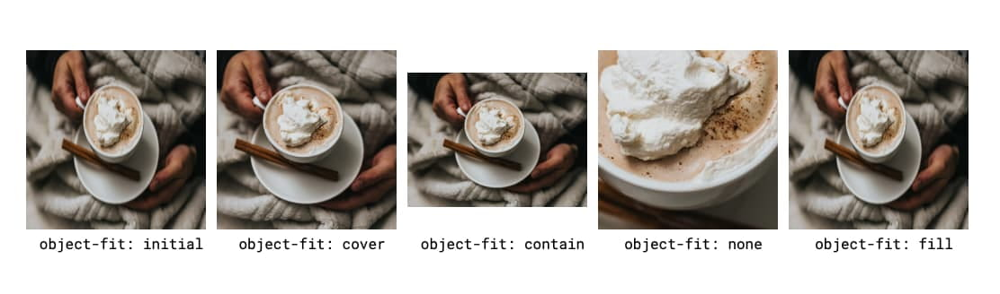
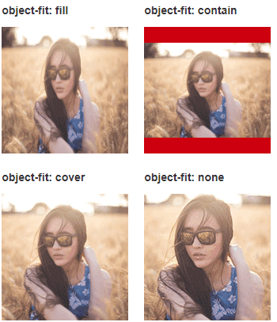
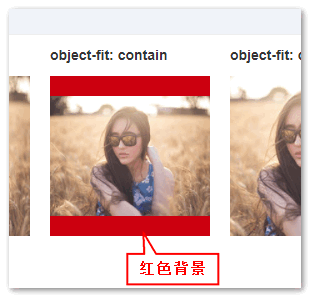

[TOC]

年后开工

## CSS 属性

控制图片` ` 填充满其空间并设置比例

***New aspect-ratio CSS property supported in Chromium*** [web.dev](https://web.dev/aspect-ratio/)

Maintaining a consistent width-to-height ratio, called an *aspect ratio*, is critical in responsive web design and for preventing [cumulative layout shift](https://web.dev/cls/).

保持纵横比变得重要的一些示例包括：

- 创建响应式 iframe，其中 iframe 是父级宽度的 100%，并且高度应保持特定的视口比
- 为图像、视频和嵌入[创建内部占](http://fitvidsjs.com/)位符容器，以防止在项目加载和占用空间时重新布局
- 为交互式数据可视化或 SVG 动画创建统一、响应式的空间
- 为多元素组件（如卡片或日历日期）创建统一、响应式空间
- 为不同尺寸的多个图像创建均匀、响应迅速的空间（可与`object-fit`一起使用)

### object-fit 描述块中的对象（如图像）应如何填充该块



- `initial`和` fill(默认值)`值会重新调整图像以填充空间。在我们的示例中，这会导致图像在重新调整像素时被压扁和模糊。不理想。
- `object-fit: cover`使用图像的最小尺寸填充空间，并裁剪图像以基于此维度适合它。它"放大"在其最低边界。
- `object-fit: contain`确保整个图像始终可见，因此与`cover` 相反，它采用最大边界的大小（在我们的示例中为宽度），并调整图像的大小以保持其固有纵横比，同时拟合空间。
- `object-fit: none`以自然大小显示在其中心（默认对象位置）裁剪的图像。

每个属性值的具体含义如下（自己理解的白话文----zxx）：

- **fill**: 中文释义“填充”。默认值。替换内容拉伸**填满**整个content box, 不保证保持原有的比例。
- **contain**: 中文释义“包含”。保持原有尺寸比例。保证替换内容尺寸一定可以在容器里面放得下。因此，此参数可能会在容器内留下空白。
- **cover**: 中文释义“覆盖”。保持原有尺寸比例。**保证替换内容尺寸一定大于容器尺寸，宽度和高度至少有一个和容器一致**。因此，此参数可能会让替换内容（如图片）部分区域不可见。
- **none**: 中文释义“无”。保持原有尺寸比例。同时保持替换内容原始尺寸大小。
- **scale-down**: 中文释义“降低”。就好像依次设置了**none**或**contain**, 最终呈现的是尺寸比较小的那个。

假设我们使用的原始图片其原本的尺寸是256\*191像素, 容器的尺寸是160*160, 背景色是灰蓝色，同时，测试的图片高宽设置为100%, [实例地址](https://www.zhangxinxu.com/study/201503/css3-object-fit.html)



内容拉伸(`fill`)，内容全部都显示(`contain`)，容器没有留白(`cover`)，该多大就多大(`none`)。


旧时代保持aspect-ratio的兼容方式: padding-top


## [半深入理解CSS3 object-position/object-fit属性](https://www.zhangxinxu.com/wordpress/2015/03/css3-object-position-object-fit/)


## 替换元素

明明图片设置了宽高都是100%, 为何貌似实际效果除了(`fill`)，似乎都无视了这些声明呢？

图片的实际尺寸变小或变大了，而不是根据容器实际尺寸走呢？

```
.box > img { width: 100%; height: 100%; }
```

你有没有这样的疑惑？有木有！！

如果有，恭喜你，来对地方了，这表明你还没有对一些概念认识清楚。

1. `img`是个元素，且是个**替换元素**，这个通过上面的学习应该都知道；

2. 一个图片，如果没有`src`，它依然是个替换元素，它在浏览器中的解析依然是正确的``；

3. `src`指向的图片属于**替换内容**

   这个**替换内容**和这个`img`**替换元素是壳子与内容的关系**，**两者是独立的**。

   在CSS2.1时代，壳子的实际尺寸（如果没有CSS或HTML设置），则是跟随内容的实际尺寸，因此，网页加载的时候，我们会看到图片占据的高度从0到图片实际*高度跳动的过程*；如果壳子，也就是`img`有尺寸限制，则替换内容`fill`拉伸适应于 `img`替换元素的设定尺寸。

   总而言之，壳子与内容的尺寸永远是一样的。于是，我们就会误认为图片就是那个图片，唯一的存在，导致我们理解`object-fit`的特性表现出现了障碍。

4. 在CSS3时代，`object-fit`的世界里，**`object-fit`控制的永远是替换内容的尺寸表现**

   注意，是替换内容的尺寸表现，**不是`img`替换元素**。

   或者这么讲吧，我们对`img`设置：`.box > img { width: 100%; height: 100%; }`, 实际上是控制`img`这个元素的，这个**壳子的尺寸**是100%撑满容器。上面截图的5个示例的图片实际上都是100%拉伸与容器的；之所以**实际的图片内容没有拉伸**，是因为受`object-fit`控制，`object-fit`控制了`src`对应的替换内容的尺寸，或者包含，或者覆盖。

5. 之所以`object-fit:contain`会透明留白，是因为我们没有对壳子`img`设置背景色，假设我们给壳子`img`增加个红色背景，大家就会明白我说的意思了：

   `.box > img { width: 100%; height: 100%; background-color: #cd0000; }`

   效果如下截图，会发现，原来的透明留白现在是红色背景，说明了什么？

   说明`img`替换元素和`src`替换内容是两个独立体。

   `img`替换元素受到了CSS `100%`拉伸控制（所以红色背景充满容器），`src`替换内容也受到了`object-fit`展示控制。大家各司其职，没有什么覆盖冲突！

   


## content 与替换元素 ---- CSS世界P46

什么是替换元素?

替换元素（replaced element）可以说是 CSS 世界中的另外一个派系。 

根据“外在盒子”是内联还是块级我们可以把元素分为内联元素和块级元素，而根据是否 具有可替换内容，我们也可以把元素分为替换元素和非替换元素。那什么是替换元素呢？ 

替换元素，顾名思义，内容可以被替换。举个典型的例子：

` ` ---- 如果我们把 1.jpg 换成 2.jpg，是不是图片就会替换了？

这种通过修改某个属性值呈现的内容就可以被替换的元素就称为“替换元素”。因此， `, <object>, <video>, <iframe>或者表单元素<input>, <select>, <textarea>`都是典型的替换元素

替换元素除了内容可替换这一特性以外，还有以下一些特性。 

1. 内容的外观不受页面上的 CSS 的影响。用专业的话讲就是在样式表现在 CSS 作 用域之外。

   如何更改替换元素本身的外观？需要类似 appearance 属性，或者浏览器自 身暴露的一些样式接口，

   例如`::-ms-check{}`**可以更改**高版本 IE 浏览器下单复选框的内间距、背景色等样式，

   但是直接 `input[type='checkbox']{}`却**无法更改**内间距、背景色等样式。 

2. 有自己的尺寸。

   1. 在 Web 中，很多替换元素在没有明确尺寸设定的情况下，其默认的尺寸（不包括边框）是 300 像素×150 像素，如`<video>, <iframe>, <canvas>`等，
   2. 也有少部分替换元素为 0 像素，如``图片，
   3. 而表单元素的替换元素的尺寸则和浏览器有关，没有明显的规律。

3. 在很多 CSS 属性上有自己的一套表现规则。比较具有代表性的就是 vertical-align 属性，对于替换元素和非替换元素，vertical-align 属性值的解释是不一样的。比方说 vertical-align 的默认值的 baseline，很简单的属性值，基线之意，被定义为字符 x 的 下边缘，在西方语言体系里近乎常识，几乎无人不知，但是到了替换元素那里就不适用了。为 什么呢？因为替换元素的内容往往不可能含有字符 x，于是替换元素的基线就被硬生生定义成 了元素的下边缘。


## SVG 动画制作

### TimelineLite/TimelineMax 工具

Timeline ---- 时间轴初始化及动画管理, 应用为页面元素动画

[Tweenmax](https://www.tweenmax.com.cn/)是GreenSock 动画平台的核心，配合其他插件 可动画CSS属性、滤镜效果、 颜色、 声音、 色彩、 帧、 饱和度、 对比度、 色调、 色系、 亮度、 贝塞尔

[GreenSock Animation Platform（简称GSAP）](https://greensock.com/)


## webpack 打包的文件

你的path放在那里就是在那里，但是如果你用webpack-dev-server，在开发是放在内存中的


## Webpack Bundle Analyzer

Vue内置了, `vue-cli-service build --report`, 然后再 dist/report.html 中查看具体分析情况

```text
用法：vue-cli-service build [options] [entry|pattern]

选项：

  --mode        指定环境模式 (默认值：production)
  --dest        指定输出目录 (默认值：dist)
  --modern      面向现代浏览器带自动回退地构建应用
  --target      app | lib | wc | wc-async (默认值：app)
  --name        库或 Web Components 模式下的名字 (默认值：package.json 中的 "name" 字段或入口文件名)
  --no-clean    在构建项目之前不清除目标目录
  --report      生成 report.html 以帮助分析包内容
  --report-json 生成 report.json 以帮助分析包内容
  --watch       监听文件变化
```

