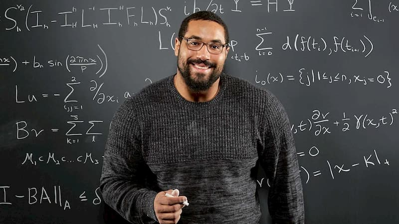

## esbuild [Github](https://github.com/evanw/esbuild)

最近基于ESM的打包很火，除了esbuild，还有Vite, Rollup, Parcer和snowpack。

> 但esbuild不会取代webpack

主要原因有两点：

- esbuild虽然有loader，但是没有插件机制。
- esbuild没有热更新（Hot Module Replacement），对于开发来说会是一件非常痛苦的事情。

> Vite，snowpack使用了esbuild

Vite和snowpack底层都是用了esbuild。从Vite 的README上可以发现esbuild的执行速度非常快，typescript转义成javascript要比官方的tsc快20-30倍。Vite也可选择使用esbuild做压缩，但是默认的是terser。暂时还不清楚为什么没将esbuild作为默认压缩工具。但是esbuild的效率高已经是公认的了。

首先，esbuild 不可能替代 webpack、parcel 等构建工具，因为他们做的事情是不太一样

esbuild 就是和它的名字一样，只负责处理 ts 和 js 的……更适合作为 tsc 和 babel 的对标

## 霍夫曼编码 [huffman-coding](https://www.baseclass.io/huffman-coding/)

示例: 压缩字符串"do or do not"

示例带压缩字符串是12个字符长。它有几个重复的字符，所以它应该压缩得很好。

为了论证，我们将假设存储每个字符需要 8 位（字符编码完全是另一个主题）。

这句话将花费我们96位，但我们用霍夫曼编码可以做得更好！

我们从建造树结构开始。我们数据中**最常见的字符将更接近树根，而离根最远的节点表示不太常见的字符**。

这里是字符串"do or do not"的赫夫曼树：

字符串中最常见的字符是'o's（4次发生）和空格（3次发生）。请注意，这些字符的路径距离根只有两步之遥，而最不常见的字符（'t'）只有三步之遥。

现在，我们可以存储字符**的路径**，而不是存储字符本身。

我们从根节点开始，沿着树向我们要编码的字符前进。如果我们走左边的路，我们会存储一个，如果我们走右边的路。`0 1`

整个编码字符串看起来像这样：

这是29位而不是96位，没有数据丢失。

解码文本，我们只需按照每个（左分支）或（右分支）进行跟踪，直到到达一个字符。**需要相同的霍夫曼树，以正确解码文本**。最简单但效率最低的方法是简单地将树与压缩文本一起发送。

## 今日鸡汤

[约翰·乌歇尔](https://en.wikipedia.org/wiki/John_Urschel)（John Urschel）是一个职业橄榄球运动员。

2017年退役后，他改行研究数学，先在宾夕法尼亚大学拿到数学硕士，现在麻省理工学院攻读数学博士。

约翰·乌歇尔从小就对数学有兴趣，在他还打球的2015年，就在学术杂志上发表过论文《用于计算图拉普拉斯算子的 Fiedler 向量的级联多重网格算法》，这种题目一看就属于专业数学家的范畴，说明那时他的数学水平已经不低了。

因此，外界对这件事情的看法就是，他具有数学天才，所以改行去读数学也很正常。

一次[采访](https://hmmdaily.com/2018/09/28/john-urschel-goes-pro/)中，他回应了这种看法。说得真好，推荐给大家。

> "在别人眼里，数学对于数学家是很容易的。错了， **那是一场斗争，艰苦而孤独，不确定能得到成果，而且需要很长时间的奋斗。数学家是热爱斗争的人。** "

他的意思是，即使他真心热爱数学，依然觉得数学研究非常艰苦。（注意，一个真心热爱的人还说艰苦，如果换成普通人，感受可想而知。）他能够坚持下去，并不是因为他觉得很容易，而是因为他可以忍受这些痛苦。

这段话对我很有启发。大家往往只看到成功时的荣耀，而忽视成功之前那个痛苦的过程。英国著名作家[奥威尔](http://www.ruanyifeng.com/blog/2004/12/post_94.html)就说过："一个人如果将他自己描述得很好的话，他十有八九是在撒谎，因为任何生命从内部审视都只不过是一系列的失败。"

实际上，一个人能够成功，仅有热爱是不够的，还必须有强大的忍受能力，能够吃苦。

很多人建议，寻找人生方向时，你应该听从自己的内心，寻找真正热爱的事情。我现在觉得，更现实的建议应该是，寻找你愿意忍受的痛苦。 **你在哪一个方向上，愿意心甘情愿地、经年累月地吃苦，具有最大的忍耐，"虽九死其尤未悔"，那就是你应该选择的方向。**

你能在某件事上赢过别人，原因很可能不是你比他强，也不是你比他更热爱这个事业，而是你比他更抗打击。生活虐你千百遍，等到别人都放弃的时候，你还没有放弃。

## [我不想再做前端了](https://www.askonomm.com/blog/i-dont-want-to-do-frontend-anymore)（英文）

## github1s

只要在 GitHub 仓库域名后面加上`1s`，比如`github1s.com/facebook/react`，就能在浏览器里面使用 VS Code 环境，浏览这个仓库的代码。
